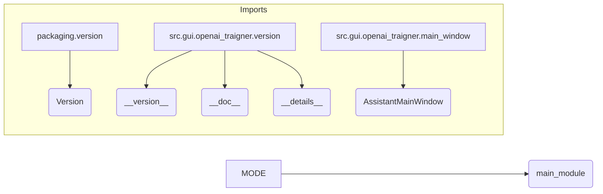

# Code Explanation for hypotez/src/gui/openai_trаigner/__init__.py

## <input code>

```python
## \file hypotez/src/gui/openai_trаigner/__init__.py
# -*- coding: utf-8 -*-\

#! venv/bin/python/python3.12

"""
.. module: src.gui.openai_trаigner 
	:platform: Windows, Unix
	:synopsis:

"""


"""
	:platform: Windows, Unix
	:synopsis:

"""


"""
	:platform: Windows, Unix
	:synopsis:

"""


"""
  :platform: Windows, Unix

"""
"""
  :platform: Windows, Unix
  :platform: Windows, Unix
  :synopsis:
"""
  
""" module: src.gui.openai_trаigner """


""" @namespace src.fast_api """


""" """
...

from packaging.version import Version
from .version import __version__, __doc__, __details__   
from .main_window import AssistantMainWindow
```

## <algorithm>

The algorithm is simple.  It initializes the `MODE` variable and imports necessary modules from sub-modules within the same package (`src.gui.openai_trаigner`).

1. **Initialization:** The `MODE` variable is set to `'dev'`. This likely signifies the current development mode.

2. **Import Statements:** The code imports the `Version` class from `packaging.version` and specific variables (`__version__`, `__doc__`, `__details__`, and `AssistantMainWindow`) from `src.gui.openai_trаigner.version` and `src.gui.openai_trаigner.main_window` respectively. This allows the `__init__.py` file to utilize components from its dependent modules.


## <mermaid>



**Explanation of Dependencies:**

The `packaging.version` module is used for handling versioning information.  Import statements from `.version` and `.main_window` imply a structured module organization.  `AssistantMainWindow` is likely a class responsible for creating the main window UI element of the application (based on naming conventions).

## <explanation>

**Imports:**

- `from packaging.version import Version`: Imports the `Version` class from the `packaging` library, which is used for comparing and working with software version numbers.  This is standard practice for versioning Python packages.  
- `from .version import __version__, __doc__, __details__`: Imports specific variables likely related to the module's version information, documentation, and details.  This is a common pattern for managing version information within Python packages.
- `from .main_window import AssistantMainWindow`: Imports the `AssistantMainWindow` class.  This suggests that `main_window.py` defines a class for managing the main application window, likely within the GUI portion of the project.  This is a crucial component for user interaction and application presentation.

**Classes:**

- `AssistantMainWindow`:  Presumably a class defining a main window for the GUI application, handling UI elements, user input, and interaction with the OpenAI Trainer functionality. This class is likely the core of the application's GUI interface.

**Functions:**

- There are no functions defined directly within this `__init__.py` file.  The file primarily serves as a module import point for components defined in other files.

**Variables:**

- `MODE`: A global string variable that probably represents the application's current mode (e.g., 'dev', 'prod'). This is often used for conditional logic and configurations, adjusting functionalities or behaviors according to the mode.

**Potential Errors/Improvements:**

- **Redundant `MODE` definitions:** The `MODE` variable is defined multiple times within the docstrings. This is redundant; keep only one definition.  The docstrings could be cleaned up to present the variable's purpose more concisely.
- **Missing Docstrings:** While the code includes docstrings, they lack important information like the purpose of the `MODE` variable, which is unclear.  They also seem to be improperly formatted. Add a detailed description.
- **Unnecessary comments:**  Some comments are largely redundant; prioritize comments that add valuable insights.

**Relationship with other parts of the project:**

This file is part of a larger project involving GUI interaction with an OpenAI training component, as indicated by `openai_trаigner` in the file path.  The `.main_window` module in the same folder likely contains logic related to the GUI, whereas `version` module is dedicated to metadata about the package. This suggests a further separation of concerns within the project. The application likely interfaces with the OpenAI API or related libraries to handle training tasks.  There's a dependence on the `packaging` library for version handling.  This `__init__.py` file is fundamental in organizing the imports and classes, thus facilitating the use of the code within the GUI.