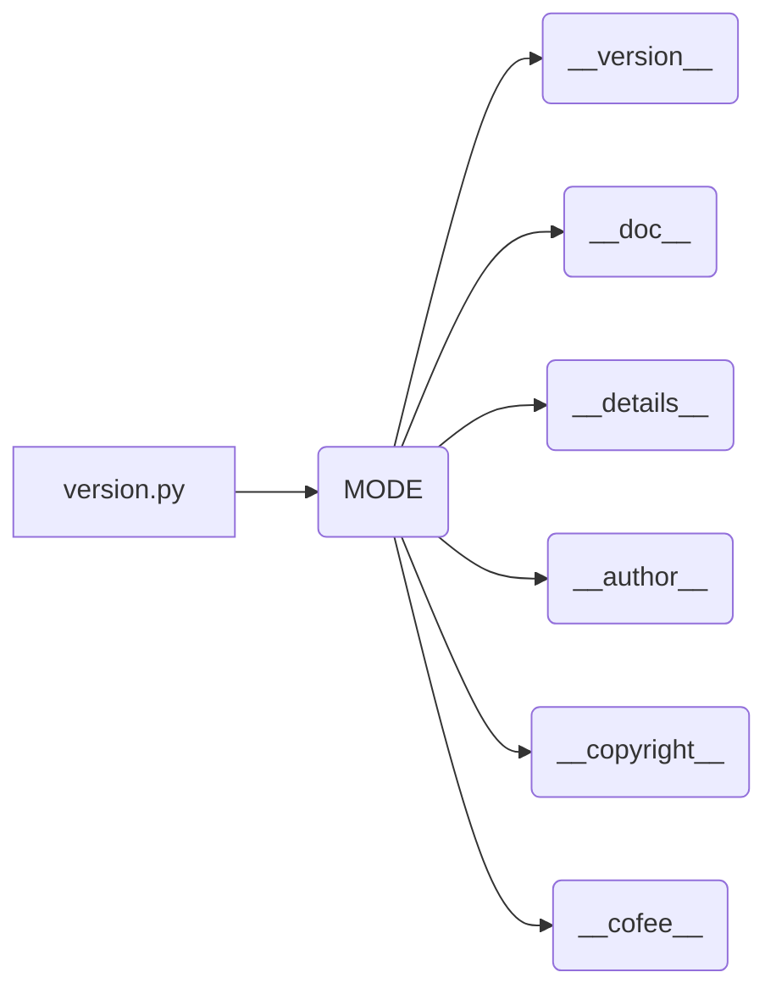

# Code Explanation for hypotez/src/gui/openai_trаigner/version.py

## <input code>

```python
## \file hypotez/src/gui/openai_trаigner/version.py
# -*- coding: utf-8 -*-\n#! venv/Scripts/python.exe\n#! venv/bin/python/python3.12\n\n"""
.. module: src.gui.openai_trаigner 
	:platform: Windows, Unix
	:synopsis:

"""


"""
	:platform: Windows, Unix
	:synopsis:

"""


"""
	:platform: Windows, Unix
	:synopsis:

"""


"""
  :platform: Windows, Unix

"""
"""
  :platform: Windows, Unix
  :platform: Windows, Unix
  :synopsis:
"""
  
""" module: src.gui.openai_trаigner """


__version__: str = 'v1.1'
__doc__: str = ''
__details__: str = ''
__author__: str = 'hypo69'
__copyright__: str = """
## License

Copyright (c) 2024 hypo69

This project is licensed under the MIT License. See the [MIT License](https://opensource.org/licenses/MIT) for details.

Commercial use of the code is prohibited without prior permission from the authors.
"""
__cofee__: str = "Treat the developer to a cup of coffee for boosting enthusiasm in development: https://boosty.to/hypo69"
```

## <algorithm>

This code defines a module, likely a Python file (`version.py`), containing version information and documentation for the `src.gui.openai_trаigner` package.  There is no algorithm in the traditional sense; it's just a collection of constants and strings.

No specific data flow or functions are present to describe in a step-by-step block diagram.

## <mermaid>



**Explanation of Dependencies (Implicit):**

This code file, `version.py`, relies on Python's built-in string and variable handling.  No external libraries or modules are directly imported or used.

## <explanation>

**Imports:**

There are no `import` statements.  The code relies solely on built-in Python features.

**Classes:**

There are no classes defined in this file.

**Functions:**

There are no functions defined. The code consists primarily of variable assignments.

**Variables:**

* `MODE`: A string variable set to 'dev'.  This likely represents the current development mode, which is used for configuration or logging.
* `__version__`, `__doc__`, `__details__`, `__author__`, `__copyright__`, `__cofee__`: These are special variables, commonly used for storing metadata about the module (in this case, the package).  These are conventionally used for documentation purposes.

**Potential Errors/Improvements:**

* **Redundant Comments:**  While documentation strings are useful, many of the docstrings are repeated or redundant, providing no additional value. Consider consolidating and simplifying the documentation to improve clarity.
* **Consistency:** The code uses a mix of single- and multi-line strings for documentation, which isn't consistent. Choosing one style (e.g., multi-line strings for documentation blocks) is generally recommended.
* **`__doc__` and `__details__`:**  While the variables exist, they have empty string values, and it's unclear what use the `__details__` field is intended for.


**Relationship with other parts of the project:**

This file, `version.py`, is likely included within the `src.gui.openai_trаigner` package as a way to define its version, author, copyright, and other information, so other parts of the project can access this information.  It's not directly calling or interacting with other parts of the project in any substantial way, but it provides information which is potentially consumed by other code within the project (e.g., when generating documentation or reports). The presence of `__cofee__` suggests a potential usage in documentation or scripts where the developer might want to support project developers or acknowledge them,  but this again isn't very specific. The rest of the variables could be used by documentation generators or testing utilities.