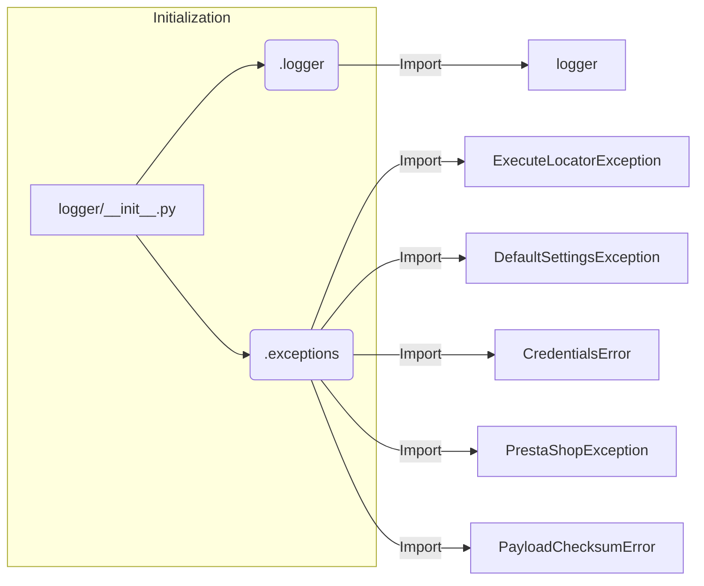

# Code Explanation for hypotez/src/logger/__init__.py

## <input code>

```python
## \file hypotez/src/logger/__init__.py
# -*- coding: utf-8 -*-\

#! venv/bin/python/python3.12

"""
.. module: src.logger 
	:platform: Windows, Unix
	:synopsis:

"""


from .logger import logger
#from .beeper import Beeper
from .exceptions import ( ExecuteLocatorException, 
                         DefaultSettingsException, 
                         CredentialsError, 
                         PrestaShopException, 
                         PayloadChecksumError
                        )
```

## <algorithm>

No algorithm is present in this file. It's an initialization file.  It primarily sets up imports for the `logger` module and exception classes defined within the `hypotez/src/logger` package.  There's no explicit processing or logic flow to visualize in a block diagram.

## <mermaid>



**Explanation of Dependencies:**

*   The `logger/__init__.py` file imports the `logger` object and several exception classes.
*   These imports indicate a dependency between the `logger` and `exceptions` modules within the same package (`src.logger`).
*   The diagram shows the initial file importing components from its submodules, indicating the module's role in providing access to those features.


## <explanation>

*   **Imports:**
    *   `from .logger import logger`: Imports the `logger` object, likely a logging handler or instance, from the `logger.py` module within the same directory. This is essential for using logging functionality defined in the package.  
    *   `from .exceptions import ...`: Imports a set of custom exceptions defined within the `exceptions.py` file, all within the `src.logger` sub-package.  These exceptions are likely specific to the project and help organize errors.   The use of parentheses groups the imports and makes reading easier. This demonStartes a module structure focused on grouping relevant components.

*   **Variables:**
    *   ``: A constant string that likely specifies the current application mode (e.g., 'dev', 'prod'). This is useful for conditional logic and configuration based on the environment.

*   **Potential Errors/Improvements:**

    *   **Missing `__all__`:** While not causing errors in this particular initialization file, considering adding `__all__ = ['logger', 'ExecuteLocatorException', ...]` within the `logger/__init__.py` file.  This would explicitly declare which objects are publicly available for import.


*   **Relationships with other parts of the project:** The `logger` module likely interacts with other parts of the application by providing logging capabilities. The exceptions are intended to be raised and handled by other modules or functions for error management. The `MODE` variable might be used to adjust logging behavior or configure other aspects of the project in a `dev` vs `prod` context.  This points to a dependency chain that likely includes core application logic and configuration files.


**Overall:** This code snippet is a clean and organized initialization file. It establishes imports for logging and custom exception types, setting the stage for their use within the `hypotez` project. It clearly delineates the role of the `logger` module and its dependencies.