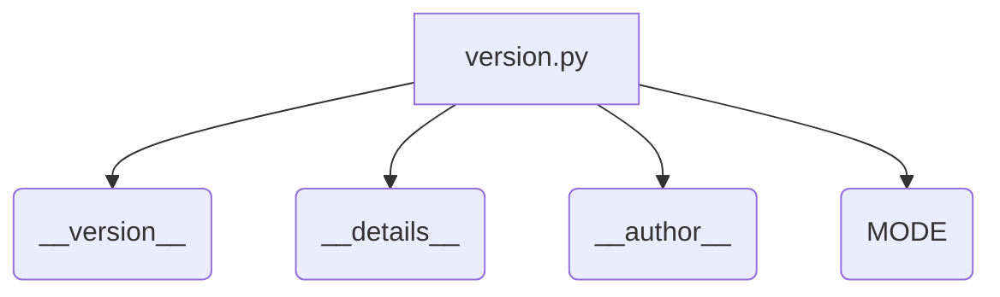

# Code Explanation for hypotez/src/logger/_examples/version.py

## <input code>

```python
## \file hypotez/src/logger/_examples/version.py
# -*- coding: utf-8 -*-
#! venv/Scripts/python.exe
#! venv/bin/python/python3.12

"""
.. module: src.logger._examples 
	:platform: Windows, Unix
	:synopsis:

"""
MODE = 'dev'

"""
	:platform: Windows, Unix
	:synopsis:

"""


"""
	:platform: Windows, Unix
	:synopsis:

"""


"""
  :platform: Windows, Unix

"""
"""
  :platform: Windows, Unix
  :platform: Windows, Unix
  :synopsis:
"""MODE = 'dev'
  
""" module: src.logger._examples """


"""
- `__version__`: This variable holds the version of the module or package.
- `__name__`: Contains the name of the module. If the script is being run directly, the value will be `"__main__"`.
- `__doc__`: The module's documentation string.
- `__details__`: This variable likely contains additional details about the module, but the exact purpose depends on the specific module or package.
- `__annotations__`: Contains type annotations for variables and functions in the module.
- `__author__`: The name(s) of the author(s) of the module.
"""
__name__:str
__version__="3.12.0.0.0.4"
__doc__:str
__details__:str="Details about version for module or class"
__annotations__

__author__='hypotez '
```

## <algorithm>

The code defines a Python module, likely part of a larger project.  The workflow is straightforward: It sets the module-level variables `__version__`, `__details__`, `__author__`, and `MODE`.  No functions or complex logic are present, merely the declaration of module attributes.

```
+-----------------+
| Module Definition|
+-----------------+
|  __version__ = "3.12.0.0.0.4" |
|  __details__ = "Details about version..."|
|  __author__ = "hypotez"|
|  MODE = "dev"|
+-----------------+
```

## <mermaid>



This diagram shows the module as a single box (`version.py`) that sets the attributes `__version__`, `__details__`, `__author__`, and `MODE`. The variables are shown as individual boxes connected to the module, representing data assigned within the module.


## <explanation>

### Imports:

There are no imports in this file.

### Classes:

There are no classes defined.

### Functions:

There are no functions defined.

### Variables:

- `__version__`: String, holding the version number of the module.
- `__details__`: String, likely containing extra information about the version (not used in this simple case, but its presence implies additional attributes in a full implementation).
- `__author__`: String, containing the author's name.
- `MODE`: String, set to 'dev'. This likely controls a development/production mode of the logger, or an equivalent setup.

### Potential Errors or Areas for Improvement:

- **Docstrings:** The docstrings are partially structured but have a lot of redundancy. A better format could be used for a more informative API documentation.

- **Type Hinting**:  While type hinting is started (`__name__:str`) it's not fully implemented.  Adding type hints would make the code more robust.


### Relationships with Other Parts of the Project:

The `MODE` variable is important for setting configurations, suggesting its possible use in a larger project where the logger behavior depends on the mode (`dev`, `testing`, `prod`). The `__version__`, `__details__` and `__author__` are standard Python module attributes, allowing other parts of the project to access metadata related to the logger/module file.  This module seems to be designed primarily for storing version details and possibly configuring a logger for use. The `hypotez/src` location implies this is part of a larger code base, designed to be imported in other files or scripts.
```