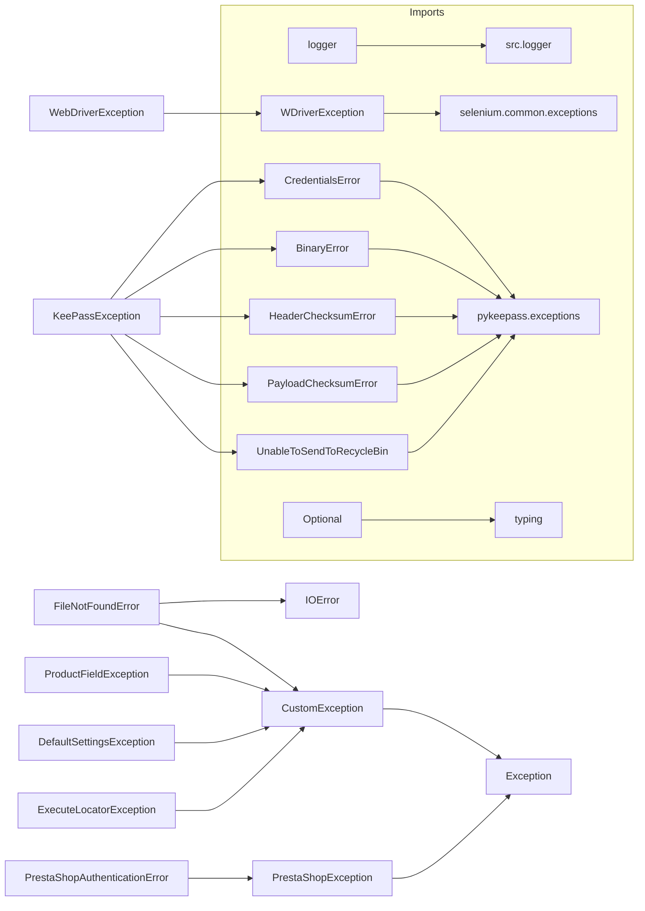

# <input code>

```python
## \file hypotez/src/logger/exceptions.py
# -*- coding: utf-8 -*-\n\n#! venv/bin/python/python3.12\n\n"""
.. module: src.logger.exceptions
    :platform: Windows, Unix
    :synopsis: This module defines custom exceptions used in the application.

Program Exceptions
------------------

This module contains several custom exception classes to handle errors related to various application components, including file operations, product fields, KeePass database connections, and PrestaShop WebService errors.

Classes:
--------
- CustomException: The base custom exception class that handles logging.
- FileNotFoundError: Raised when a file is not found.
- ProductFieldException: Raised for errors related to product fields.
- KeePassException: Raised for errors related to KeePass database connections.
- DefaultSettingsException: Raised when there are issues with default settings.
- WebDriverException: Raised for errors related to WebDriver.
- ExecuteLocatorException: Raised for errors related to locator executors.
- PrestaShopException: Raised for generic PrestaShop WebService errors.
- PrestaShopAuthenticationError: Raised for authentication errors with PrestaShop WebServices.

"""


from typing import Optional
from src.logger import logger
from selenium.common.exceptions import WebDriverException as WDriverException
from pykeepass.exceptions import (CredentialsError, BinaryError,
                                   HeaderChecksumError, PayloadChecksumError,
                                   UnableToSendToRecycleBin)

class CustomException(Exception):
    """Base custom exception class.

    This is the base class for all custom exceptions in the application. It handles logging of the exception
    and provides a mechanism for dealing with the original exception if it exists.

    Attributes:
    ----------
    original_exception : Optional[Exception]
        The original exception that caused this custom exception, if any.
    exc_info : bool
        A flag to indicate if exception information should be logged.
    """

    def __init__(self, message: str, e: Optional[Exception] = None, exc_info: bool = True):
        """Initializes the CustomException with a message and an optional original exception."""
        super().__init__(message)
        self.original_exception = e
        self.exc_info = exc_info
        self.handle_exception()

    def handle_exception(self):
        """Handles the exception by logging the error and original exception, if available."""
        logger.error(f"Exception occurred: {self}")
        if self.original_exception:
            logger.debug(f"Original exception: {self.original_exception}")
        # Add recovery logic, retries, or other handling as necessary.

# ... (rest of the code)
```

# <algorithm>

1. **Import necessary modules:** The script imports modules for logging, Selenium WebDriver exceptions, and KeePass exceptions.

2. **Define base CustomException:**  This class handles logging of exceptions and stores the original exception if available.

3. **Define specific exception classes:** These classes inherit from `CustomException` or other relevant base classes, and specify conditions for their raising.

4. **PrestaShopException:** This class handles PrestaShop WebService errors with detailed attributes.

5. **PrestaShopAuthenticationError:** This is a specific error for authentication problems within the PrestaShop WebService context.


# <mermaid>



**Dependencies Analysis:**

The mermaid diagram shows the dependencies between the defined exception classes and imported modules.
- `src.logger` is imported, indicating a dependency on the `logger` module likely within the same project.
- `selenium.common.exceptions` and `pykeepass.exceptions` are imported, suggesting external libraries/packages, in this case, Selenium and pykeepass, are used for handling different types of exceptions.

# <explanation>

**Imports:**

- `from typing import Optional`: Imports the `Optional` type from the `typing` module, used for specifying optional parameters in function signatures. This is a standard Python type hint.
- `from src.logger import logger`: Imports the `logger` object, likely a logging instance from another module within the project (`src.logger`). This enables the custom exceptions to use the application's logging mechanism.
- `from selenium.common.exceptions import WebDriverException as WDriverException`: Imports the `WebDriverException` from the Selenium library. The `as WDriverException` creates an alias for the class to avoid naming conflicts.
- `from pykeepass.exceptions import ...`: Imports several exception types from the `pykeepass` library, covering various KeePass database interaction error scenarios.  This suggests the application interacts with a KeePass database.

**Classes:**

- `CustomException`: The base class for all application-specific exceptions. It handles logging, potentially using the `logger` instance, and allows for storing the original exception object.  It's important for centralized error handling and logging.
- `FileNotFoundError`: Inherits from `CustomException` and `IOError` to address file not found errors, providing more specific error handling.
- `ProductFieldException`, `KeePassException`, `DefaultSettingsException`, `WebDriverException`, `ExecuteLocatorException`, `PrestaShopException`, `PrestaShopAuthenticationError`: These are all custom exception classes tailored for specific error types within the application domain, providing contextual information.

**Functions:**

- `__init__` (in `CustomException` and `PrestaShopException`):  Constructor methods used to initialize exception instances with error messages and (optionally) original exceptions. The `PrestaShopException` constructor also takes additional error details like codes and messages from the PrestaShop WebService, which is a good practice for debugging.
- `handle_exception` (in `CustomException`): A method to handle the exception. It logs the exception details.  It should be noted that this method currently does not perform any recovery logic but is intended to be expanded.

**Variables:**

- `MODE`: A constant string, likely for configuration purposes (e.g., development/production mode).

**Potential Errors/Improvements:**

- The `handle_exception` method in `CustomException` is a stub.  Consider adding error recovery logic, retries, or alternative handling based on the expected error types.

- Adding specific error codes to the PrestaShopException can significantly aid in debugging issues in PrestaShop context.

- A dedicated error handling middleware layer could be more robust in managing exceptions in the future.


**Chain of Relationships:**

The code depends on `src.logger` for logging capabilities.  The application (not directly shown) likely interacts with Selenium for web automation, and it interacts with a KeePass database.


```