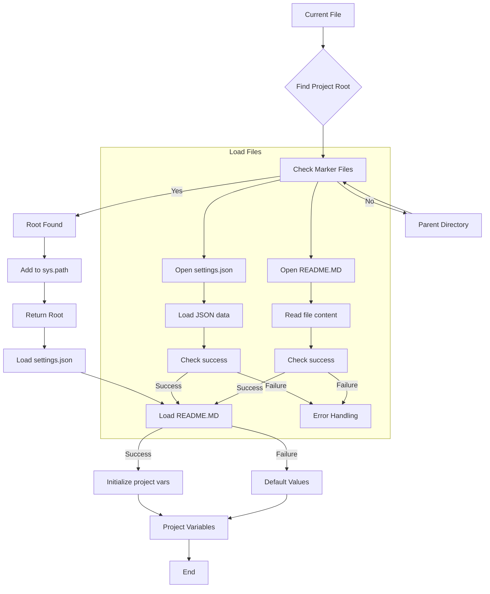
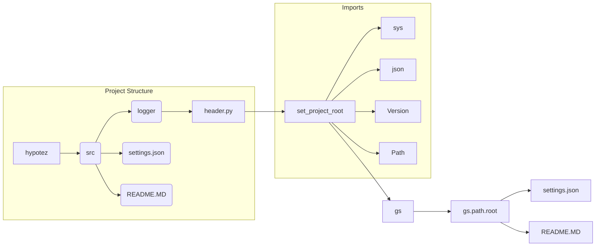

# Code Explanation: hypotez/src/logger/header.py

## <input code>

```python
## \file hypotez/src/logger/header.py
# -*- coding: utf-8 -*-\n#! venv/Scripts/python.exe
#! venv/bin/python/python3.12
"""
.. module: src.logger 
	:platform: Windows, Unix
	:synopsis:

"""


"""
	:platform: Windows, Unix
	:synopsis: Модуль определяющий корневой путь к проекту. Все импорты строятся относительно этого пути.
    :TODO: В дальнейшем перенести в системную переменную"""

import sys
import json
from packaging.version import Version
from pathlib import Path

def set_project_root(marker_files=('__root__','.git')) -> Path:
    """
    Finds the root directory of the project starting from the current file's directory,
    searching upwards and stopping at the first directory containing any of the marker files.

    Args:
        marker_files (tuple): Filenames or directory names to identify the project root.
    
    Returns:
        Path: Path to the root directory if found, otherwise the directory where the script is located.
    """
    __root__:Path
    current_path:Path = Path(__file__).resolve().parent
    __root__ = current_path
    for parent in [current_path] + list(current_path.parents):
        if any((parent / marker).exists() for marker in marker_files):
            __root__ = parent
            break
    if __root__ not in sys.path:
        sys.path.insert(0, str(__root__))
    return __root__


# Get the root directory of the project
__root__ = set_project_root()
"""__root__ (Path): Path to the root directory of the project"""

from src import gs

settings:dict = None
try:
    with open(gs.path.root / 'src' / 'settings.json', 'r') as settings_file:
        settings = json.load(settings_file)
except (FileNotFoundError, json.JSONDecodeError):
    ...

doc_str:str = None
try:
    with open(gs.path.root / 'src' / 'README.MD', 'r') as settings_file:
        doc_str = settings_file.read()
except (FileNotFoundError, json.JSONDecodeError):
    ...


__project_name__ = settings.get("project_name", 'hypotez') if settings  else 'hypotez'
__version__: str = settings.get("version", '')  if settings  else ''
__doc__: str = doc_str if doc_str else ''
__details__: str = ''
__author__: str = settings.get("author", '')  if settings else ''
__copyright__: str = settings.get("copyrihgnt", '')  if settings else ''
__cofee__: str = settings.get("cofee", "Treat the developer to a cup of coffee for boosting enthusiasm in development: https://boosty.to/hypo69")  if settings else "Treat the developer to a cup of coffee for boosting enthusiasm in development: https://boosty.to/hypo69"
```

## <algorithm>



**Example:**

If the current file is located in `hypotez/src/logger/header.py`, the algorithm will search up the directory tree for `pyproject.toml`, `requirements.txt`, or `.git`. If `pyproject.toml` exists in `hypotez`, `__root__` will be set to `hypotez`, added to `sys.path`, and returned.


## <mermaid>



**Dependencies Analysis:**

- `sys`: Provides access to system-specific parameters and functions, crucial for modifying the Python path.
- `json`: Used for loading configuration data from `settings.json`.
- `packaging.version`: Enables handling and comparing software version numbers, potentially useful in project versioning.
- `pathlib`: Enables working with file paths in an object-oriented way, replacing the previous `os.path` usage, and improving code readability and maintainability.

## <explanation>

**Imports:**

- `sys`: Used to modify the Python path, allowing imports from the project root directory.
- `json`: Used to load settings from a JSON file.
- `packaging.version`: Used for version handling.
- `pathlib`: Used for working with file paths in an object-oriented manner, improving code readability.  These imports are common in Python projects handling file system operations and project setup.

**Classes:**

- There are no classes defined in this file.

**Functions:**

- `set_project_root(marker_files)`: This function determines the root directory of the project. It takes a tuple of marker files (like `pyproject.toml`) as input and recursively checks parent directories until one of these marker files is found.  This is a common pattern for finding project roots in Python projects.

**Variables:**

- `MODE`:  A string variable likely representing a development mode.
- `__root__`: A `Path` object representing the project root directory.  Crucially, this variable is dynamically set and potentially used for importing modules later in the project.
- `settings`: A dictionary containing project configuration loaded from `settings.json`.
- `doc_str`: String variable containing the content of `README.MD`.
- `__project_name__`, `__version__`, `__doc__`, etc.: Variables that store metadata about the project, derived from the `settings` dictionary. These are commonly used for project metadata.

**Potential Errors/Improvements:**

- **Error Handling:** The code uses `try...except` blocks to handle `FileNotFoundError` and `json.JSONDecodeError` during file loading. This is good practice, but the `...` in the except blocks should contain more specific error handling logic, such as logging or displaying a warning message.
- **Robustness:**  While `settings.get()` provides a safeguard against missing keys, it's still better to validate the structure and content of the loaded JSON (settings.json).  Validation against expected data types or a schema should be considered if possible.
- **`sys.path.insert(0, str(__root__))`:** Inserting at index 0 modifies the import search path.  Consider if this is the best practice, especially if modules might be installed elsewhere.  Often a dependency management system like `pip` takes care of this automatically.
- **File path consistency:**  Using `gs.path.root` might indicate a dedicated module or library for handling file paths within this project. Carefully review this `gs` module, ensure consistency in file path handling (`src/` vs. `gs.path.root/src/`), and avoid `magic strings` (hardcoded paths like `'settings.json'`) if possible.
- **Type Hinting:**  Type hinting is used extensively throughout the code, which is a significant improvement in terms of code readability, maintainability, and helps IDEs provide better autocomplete and error detection.

**Relationship Chain:**

This file (`header.py`) relies on `src.gs` for locating project files like `settings.json`. It populates metadata variables using the information from settings, and potentially influences modules that rely on these variables. This file is used to initialize crucial project variables from the configuration (`settings.json`) and other project-wide documents.  Further investigations into `gs` and the structure of `src` will be needed to understand the complete relationship chain.