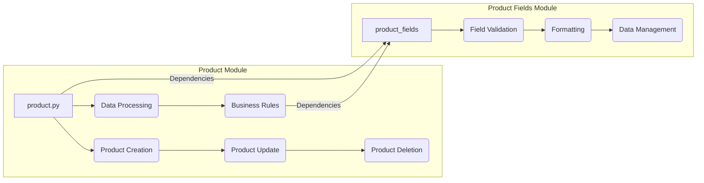

# Code Explanation of the `product` Module

## <input code>

```
### **product Module**: Product Management

The **product** module is responsible for managing all aspects of product data, including processing, validation, and field management. It consists of the following components:

1. **product.py**  
   Manages the core logic for handling products, including operations such as creating, updating, and deleting product records. It provides functions to process product data and ensures compliance with business rules for managing products within the application.

2. **product_fields**  
   Controls the logic related to product fields, handling field validation, formatting, and management. This module ensures that product fields meet the necessary criteria for consistent data entry, enabling accurate and efficient processing of product information.
```

## <algorithm>

No executable code is provided, only a description of the `product` module.  Therefore, a step-by-step algorithm and flowchart cannot be generated.


## <mermaid>



**Explanation of Dependencies:**

The provided description indicates that `product.py` and `product_fields` modules have dependencies.  The diagram shows how `product_py` interacts with functions related to Product Creation, Update, and Deletion, and uses Data Processing and Business Rules.  `product_fields` has functionality related to Field Validation, Formatting, and Data Management.  The `-- Dependencies` lines imply that `product.py` interacts with `product_fields` but a specific type of dependency (e.g., import statements) cannot be determined from the text.


## <explanation>

**Imports:**

No specific import statements are given.  However, based on the description, the `product.py` module will likely import functions and classes from the `product_fields` module to leverage its validation and formatting capabilities.  Similarly, `product.py` will likely import or use functionalities from other parts of the `src` package for database interactions, logging, or other general project utilities.  The `product_fields` module might import validation libraries (e.g., for regular expressions) or other supporting modules.

**Classes:**

The description mentions the presence of functions and operations within `product.py` and `product_fields` which suggests the possibility of classes managing product data and fields, respectively.  The specific structure and the class hierarchies are unknown.  Without code, details are impossible to elaborate.

**Functions:**

The descriptions refer to functions involved in creating, updating, deleting, processing and validating product data. Examples:
   - `create_product(product_data)`: Takes product data as input and creates a new product record, which is likely dependent on the data validation of `product_fields`.
   - `update_product(product_id, updated_data)`: Takes product ID and updated data, updates the relevant product record, and likely uses the `product_fields` module to validate the updates.
   - `delete_product(product_id)`: Deletes the product with the given ID, potentially involving data integrity checks.
   - `process_product_data(raw_data)`: Processes the raw product data.
   - `validate_field(field_value, field_type)`: Validates a single field value.

**Variables:**

Without code, variables' types are unknown. It is likely that `product_data` and similar variables could be dictionaries, lists, or custom objects, depending on the project structure.

**Potential Errors & Improvements:**

- **Error Handling:**  The description lacks detail about error handling.  How do functions and classes handle invalid inputs? Missing data?  Database connection errors?  Robust error handling is vital.
- **Data Validation:**  Validation rules within `product_fields` should be documented for clarity and maintainability.  Rules should be encapsulated in a manner that facilitates testing and future expansion.
- **Scalability:**  How will the module handle a large number of products?  Consider using design patterns like the repository pattern or similar to improve efficiency.
- **Testability:**  The code should be designed to allow for unit and integration tests.  This will help to ensure correctness and stability when making future changes.
- **Clearer Naming Conventions:** Consistent naming conventions (e.g., `getProductById`, `validateProductName`) for functions and classes would improve readability.

**Relationships with Other Parts of the Project:**

The `product` module likely interacts with other parts of the application.  It will probably depend on components to store and retrieve product data from a database (e.g., an ORM or database interaction layer).  It might also use utility functions for logging, data processing, or error handling defined in other modules of the project.  A precise relationship requires code examination.