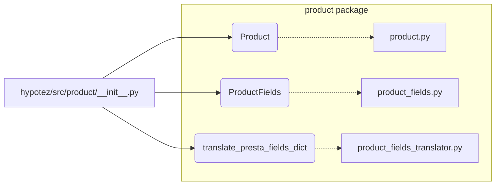

# <input code>

```python
## \file hypotez/src/product/__init__.py
# -*- coding: utf-8 -*-\
#! venv/Scripts/python.exe
#! venv/bin/python/python3.12

"""
.. module: src.product 
	:platform: Windows, Unix
	:synopsis: Product module
External classes and attributes:
- `Product`: Methods and attributes of the product. Detailed description in `product.py`
- `ProductFields`: Product fields. Detailed description in `product_fields.py`
- `record`: A dictionary of product fields in flat format (without nesting)
- `translate_presta_fields_dict`: Function that translates multilingual fields of `ProductFields`

"""


from .product import Product
from .product_fields.product_fields import ProductFields
from .product_fields.product_fields_translator import translate_presta_fields_dict
```

# <algorithm>

The `__init__.py` file acts as a module initializer for the `product` package.  It imports and exposes necessary components from its submodules.  There's no complex algorithm; rather, it establishes a namespace within the project to manage the product-related functionalities.

**Data Flow:**

No explicit data flow is shown as the diagram as this file is mainly about importing and exposing modules and variables.  The data flow would be driven by the functions and classes in the files it imports.


# <mermaid>



**Dependencies Analysis:**

* **`Product`:** Imported from `./product`.  This suggests `product.py` (or a similar file) exists within the `hypotez/src/product` directory defining the `Product` class and related functionality.
* **`ProductFields`:** Imported from `./product_fields/product_fields.py`. This implies the `ProductFields` class and related methods are in a dedicated `product_fields` submodule within `hypotez/src/product`.
* **`translate_presta_fields_dict`:** Imported from `./product_fields/product_fields_translator.py`. The translator likely resides in its own file in the `product_fields` submodule.  The implication is that the core `Product` module relies on functions to handle fields for translation.


# <explanation>

* **Imports:**
    * `from .product import Product`: Imports the `Product` class from the `product.py` module located within the `hypotez/src/product` directory.  This is a standard way of accessing classes defined in child modules. The `.` indicates a relative import.
    * `from .product_fields.product_fields import ProductFields`: Imports the `ProductFields` class from the `product_fields.py` module within the `hypotez/src/product/product_fields` subdirectory. This mirrors the previous import structure.
    * `from .product_fields.product_fields_translator import translate_presta_fields_dict`: Imports the `translate_presta_fields_dict` function from `product_fields_translator.py` which presumably handles translating product fields.


* **Variables:**
    * ``: A string variable likely used for configuration purposes (e.g., to differentiate development mode from production mode). This is a simple example of a configuration variable.

* **Classes (indirectly mentioned):**
    * `Product`: Likely a class that represents a product with properties and methods.  The comment clearly states that its definition exists in `product.py`.
    * `ProductFields`: Likely a class that encapsulates product field information, possibly containing methods for managing and retrieving these fields.  Details are in `product_fields.py`.
* **Functions (indirectly mentioned):**
    * `translate_presta_fields_dict`: A function designed to translate multilingual fields associated with `ProductFields`. Its implementation is likely to involve handling language codes and data structures.


* **Potential Improvements:**

    * **Docstrings:** While the module has docstrings, the specific details of the `Product`, `ProductFields`, and `translate_presta_fields_dict` should have more comprehensive docstrings to describe what each does.  Parameters, return values, and potential errors would enhance readability and maintainability.
    * **Error Handling:**  The code does not demonStarte how the functions will manage potential errors during translations, input validation, or other operations.  Robust error handling should be considered for production-level code.
    * **Constants:** Using constants like `MODE` is a good practice, but consider using Python's `Enum` type for better type safety.  If multiple modes are needed, an `Enum` would enforce better validation than a simple string variable.

**Relationships with other project parts:**

The `product` module likely interacts with other parts of the project that need to access or manipulate product information. These could include inventory management, order processing, user interfaces, etc. The specific relationships would depend on how the application is structured.  There's an obvious dependency on other parts of the `src` directory that access the functions.  However, without more context, it's difficult to describe specific relationships in more detail.