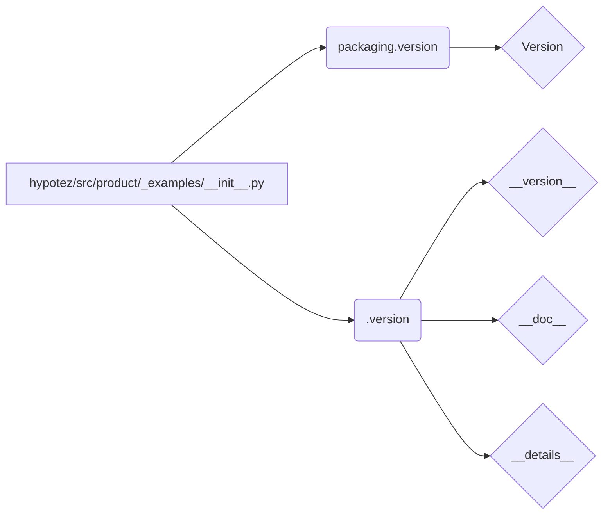

# Code Explanation for hypotez/src/product/_examples/__init__.py

## <input code>

```python
# -*- coding: utf-8 -*-\
#! venv/Scripts/python.exe
#! venv/bin/python/python3.12

"""
.. module: src.product._examples 
	:platform: Windows, Unix
	:synopsis:

"""
MODE = 'dev'

"""
	:platform: Windows, Unix
	:synopsis:

"""


"""
	:platform: Windows, Unix
	:synopsis:

"""


"""
  :platform: Windows, Unix

"""
"""
  :platform: Windows, Unix
  :platform: Windows, Unix
  :synopsis:
"""MODE = 'dev'
  
""" module: src.product._examples """


from packaging.version import Version
from .version import __version__, __doc__, __details__
```

## <algorithm>

There's no significant algorithm or workflow in this file. It's primarily a module initialization file. It defines a constant `MODE` and imports variables (`__version__`, `__doc__`, `__details__`) from the `./version` submodule.


## <mermaid>



**Dependencies Analysis:**

The mermaid code describes the dependencies.
* `packaging.version`: This is imported from the `packaging` library, which is likely used for versioning or manipulating package versions.  It's a standard Python package for interacting with package versions.
* `.version`: This is a relative import, meaning it's looking for a module named `version.py` (or potentially a package containing a `__init__.py`) in the same directory.  This usually defines metadata associated with the project version.

## <explanation>

**Imports:**

* `from packaging.version import Version`: Imports the `Version` class from the `packaging.version` module. This is used for working with software version numbers.  This is a standard Python package and is imported for manipulating versions.
* `from .version import __version__, __doc__, __details__`: Imports `__version__`, `__doc__`, and `__details__` variables.  These are likely version information and documentation strings intended for use within `_examples`. The `.` in `from .version ...`  indicates a relative import, searching for `version.py` or `version/__init__.py` in the same directory.

**Classes:**

There are no classes defined in this file.

**Functions:**

There are no functions defined in this file.

**Variables:**

* `MODE = 'dev'`: A string variable, likely used to specify the current mode of operation (e.g., 'dev' for development, 'prod' for production).


**Potential Errors or Improvements:**

* **Redundant Documentation:**  The large number of docstrings beginning with `""" ... """` and containing nothing but platform details are redundant and can be removed.  If they were meant to contain important documentation or parameters related to specific functionalities, they should be appropriately organized.
* **Consistency:** The use of `MODE = 'dev'` both within and outside of docstrings is confusing.  Maintain consistency in either having it as a global variable or eliminating its definition inside the docstrings.
* **Clarity:** The file name (`_examples/__init__.py`) suggests that this is an example file; it's unclear what the examples are.  Adding a brief, descriptive comment at the top would enhance comprehension.


**Relationships with Other Parts of the Project:**

This file establishes a dependency on the `version.py` (or similar) module within the same directory, which suggests there's likely a `src.product._examples.version` module or file that contains the actual `__version__`, `__doc__`, `__details__` variables, which are commonly used for version metadata.  This structure fits well for maintaining versioning and documentation in a modular fashion.