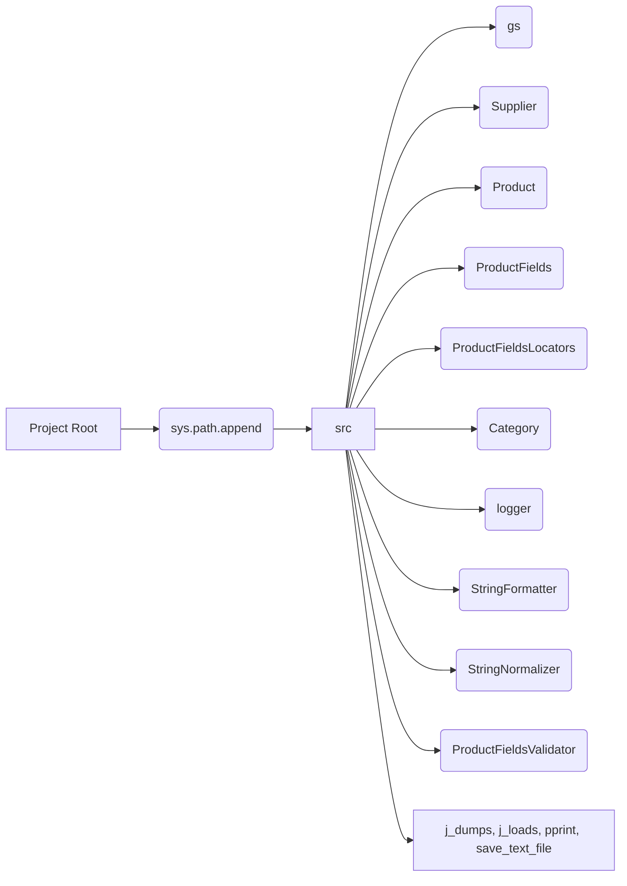

```MD
# Code Explanation for hypotez/src/product/_examples/header.py

## <input code>

```python
## \file hypotez/src/product/_examples/header.py
# -*- coding: utf-8 -*-\

#! venv/bin/python/python3.12

"""
.. module: src.product._examples 
	:platform: Windows, Unix
	:synopsis:

"""


"""
	:platform: Windows, Unix
	:synopsis:

"""


"""
	:platform: Windows, Unix
	:synopsis:

"""


"""
  :platform: Windows, Unix

"""
"""
  :platform: Windows, Unix
  :platform: Windows, Unix
  :synopsis:
"""
  
""" module: src.product._examples """


import sys
import os
from pathlib import Path

dir_root : Path = Path (os.getcwd()[:os.getcwd().rfind('hypotez')+11])
sys.path.append (str (dir_root) )  # Добавляю корневую папку в sys.path
dir_src = Path (dir_root, 'src')
sys.path.append (str (dir_root) ) 
...

print(dir_root)
# ----------------
from pathlib import Path
import json
import re
# ----------------

from src import gs
from src.suppliers import Supplier
from src.product import Product, ProductFields, ProductFieldsLocators
from src.category import Category
from src.utils.jjson import j_dumps, j_loads,   pprint, save_text_file
from src.logger import logger
from src.utils.string import StringFormatter, StringNormalizer, ProductFieldsValidator
...
```

## <algorithm>

This code snippet is a header file likely for a Python project. It sets up the environment by adding the project's root directory to the Python path.  It then imports various modules and classes from the project's `src` directory. There is no clear step-by-step algorithmic workflow, but rather an initialization stage.

* **Step 1: Add project root to sys.path:** The code identifies the project root directory and adds it to Python's module search path (`sys.path`). This allows the Python interpreter to find modules located within the project's `src` folder.
* **Step 2: Imports:** Imports necessary modules and classes for subsequent use in the project. Imports are grouped by modules, potentially for organization.
* **Step 3: Print dir_root (optional):** The code prints the project root directory (for debugging, or to confirm successful path manipulation)
* **Step 4: Additional imports (after the first block):** Additional imports to be used later in the project.


## <mermaid>



**Dependencies Analysis:**

The mermaid diagram shows the relationship between the project root and the imported modules. The modules `gs`, `Supplier`, `Product`, `ProductFields`, `ProductFieldsLocators`, `Category`, `logger`, `StringFormatter`, `StringNormalizer`, and `ProductFieldsValidator` are imported from the `src` directory.

* `j_dumps`, `j_loads`, `pprint`, and `save_text_file` are imported from `src.utils.jjson`.


## <explanation>

**Imports:**

* `sys`, `os`, `pathlib`: Standard Python libraries for system interaction, file operations, and path manipulation.
* `json`, `re`: Used for handling JSON data and regular expressions, likely for data processing.
* `gs`: Likely a custom module from the `src` package, possibly dealing with Google Cloud Storage (or other services).
* `Supplier`, `Product`, `ProductFields`, `ProductFieldsLocators`, `Category`: Custom classes from the `src` package, probably defining models related to products, suppliers, and categories within the project.
* `j_dumps`, `j_loads`, `pprint`, `save_text_file`: Custom functions in the `src.utils.jjson` module, likely used for JSON handling and output formatting.
* `logger`: A custom logger module from `src.logger` for logging events during code execution.
* `StringFormatter`, `StringNormalizer`, `ProductFieldsValidator`: Custom functions from `src.utils.string` for string manipulation, normalization, and validation, relevant to product data.

**Classes (implied):**

* `Supplier`, `Product`, `Category`, `ProductFields`, `ProductFieldsLocators`: These classes likely represent data structures for storing and managing product information, their attributes, and fields, potentially including methods for interactions and data validation.


**Functions (implied):**

* The functions in `jjson` and `string` handle complex processes for data formatting and validation.

**Variables:**

* `MODE`: A string variable likely defining the execution mode (e.g., 'dev', 'prod').
* `dir_root`, `dir_src`: `Path` objects containing paths for the project root and the `src` folder, respectively. These paths are dynamically constructed to provide flexibility in the project's setup.

**Potential Errors/Improvements:**

* **Redundant `sys.path.append`:** The code appends the `dir_root` twice. This could lead to unexpected behavior if there are other modules or packages in `dir_root` that are accessed multiple times. It should be optimized to use `dir_root` once.
* **Missing `...`:** The `...` sections within the code block indicate missing parts. The complete code is required to assess the full context of this file and ensure that it fulfills the requirements. It's essential to fill the missing pieces to analyze the interactions and potential errors.
* **Error Handling:**  The code lacks error handling, which could be improved by wrapping the path manipulation in `try-except` blocks to handle potential `FileNotFoundError` or other errors during directory access.


**Project Relationships:**

This header file establishes a foundational dependency for other files within the `hypotez` project. Modules in `src` will depend on the variables and imports present here, enabling access to tools and structures defined elsewhere in the project. The imports establish a chain of relationships between the current file and the rest of the `hypotez` project structure.