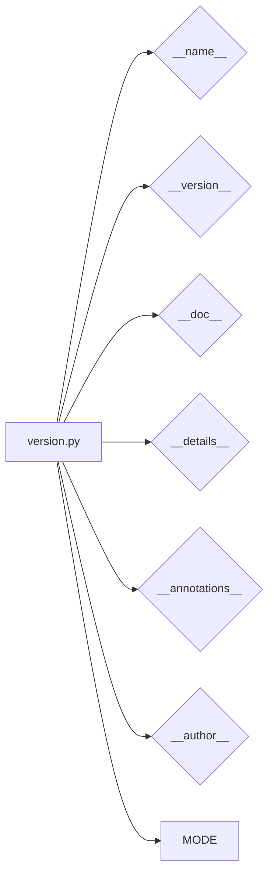

# Code Explanation for hypotez/src/product/_examples/version.py

## <input code>

```python
## \file hypotez/src/product/_examples/version.py
# -*- coding: utf-8 -*-\
#! venv/Scripts/python.exe
#! venv/bin/python/python3.12

"""
.. module: src.product._examples 
	:platform: Windows, Unix
	:synopsis:

"""
MODE = 'dev'

"""
	:platform: Windows, Unix
	:synopsis:

"""


"""
	:platform: Windows, Unix
	:synopsis:

"""


"""
  :platform: Windows, Unix

"""
"""
  :platform: Windows, Unix
  :platform: Windows, Unix
  :synopsis:
"""MODE = 'dev'
  
""" module: src.product._examples """


"""
- `__version__`: This variable holds the version of the module or package.
- `__name__`: Contains the name of the module. If the script is being run directly, the value will be `"__main__"`.
- `__doc__`: The module's documentation string.
- `__details__`: This variable likely contains additional details about the module, but the exact purpose depends on the specific module or package.
- `__annotations__`: Contains type annotations for variables and functions in the module.
- `__author__`: The name(s) of the author(s) of the module.
"""
__name__:str
__version__="3.12.0.0.0.4"
__doc__:str
__details__:str="Details about version for module or class"
__annotations__

__author__='hypotez '
```

## <algorithm>

This code snippet defines module-level variables and strings related to the module's version, name, author and documentation.  There is no algorithm to process in the traditional sense, only variable declaration.

## <mermaid>



**Explanation of Dependencies (Imports):**

There are no imports in this code. The diagram depicts the internal variables and attributes within the module.


## <explanation>

**Imports:**

There are no imports in this file.

**Classes:**

There are no classes defined.

**Functions:**

There are no functions defined.

**Variables:**

- `__name__`, `__version__`, `__doc__`, `__details__`, `__annotations__`, `__author__`, `MODE`: These are module-level variables that hold the name, version, documentation, details, annotations, author, and a mode value for the module.  The types are declared as strings, but `__annotations__` is likely to be a dictionary-like structure.

**Potential Errors or Areas for Improvement:**

- **Docstrings:** While docstrings are present, they lack consistency.  Some have multi-line, while some are single-line. Using a consistent style is beneficial for readability.
- **Type hints:**  `__annotations__` is declared, but it's not used.  Using type hints (`__annotations__`) to define expected data types would help maintainability, but needs to be properly implemented as an actual dictionary or set of annotations.
- **__details__: The use of `__details__` variable is not immediately clear.** It needs to be used in the module or code to be meaningful.


**Chain of Relationships:**

This file is a module that likely forms part of a larger project, `hypotez`. The variable names and docstrings suggest it's meant to be used as part of the package's internal structure. The relationships are primarily related to the metadata and internal data structures of the `hypotez/src/product` package.  Without more context (other files in the project), it is difficult to determine its precise role.