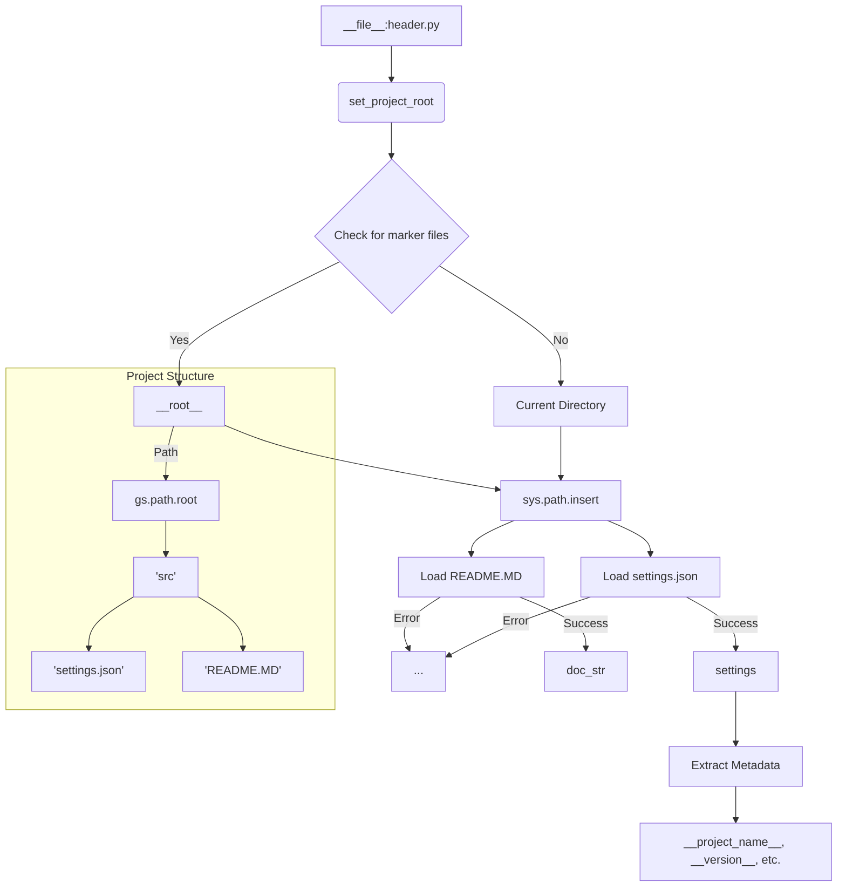

# Code Explanation for hypotez/src/product/header.py

## <input code>

```python
## \file hypotez/src/product/header.py
# -*- coding: utf-8 -*-\
#! venv/Scripts/python.exe
#! venv/bin/python/python3.12

"""
.. module: src.product 
	:platform: Windows, Unix
	:synopsis:

"""


"""
	:platform: Windows, Unix
	:synopsis:

"""


"""
	:platform: Windows, Unix
	:synopsis: Модуль определяющий корневой путь к проекту. Все импорты строятся относительно этого пути.
    :TODO: В дальнейшем перенести в системную переменную

"""


import sys
import json
from packaging.version import Version
from pathlib import Path

def set_project_root(marker_files=('__root__')) -> Path:
    """
    Finds the root directory of the project starting from the current file's directory,
    searching upwards and stopping at the first directory containing any of the marker files.

    Args:
        marker_files (tuple): Filenames or directory names to identify the project root.
    
    Returns:
        Path: Path to the root directory if found, otherwise the directory where the script is located.
    """
    __root__:Path
    current_path:Path = Path(__file__).resolve().parent
    __root__ = current_path
    for parent in [current_path] + list(current_path.parents):
        if any((parent / marker).exists() for marker in marker_files):
            __root__ = parent
            break
    if __root__ not in sys.path:
        sys.path.insert(0, str(__root__))
    return __root__


# Get the root directory of the project
__root__ = set_project_root()
"""__root__ (Path): Path to the root directory of the project"""

from src import gs

settings:dict = None
try:
    with open(gs.path.root / 'src' / 'settings.json', 'r') as settings_file:
        settings = json.load(settings_file)
except (FileNotFoundError, json.JSONDecodeError):
    ...

doc_str:str = None
try:
    with open(gs.path.root / 'src' / 'README.MD', 'r') as settings_file:
        doc_str = settings_file.read()
except (FileNotFoundError, json.JSONDecodeError):
    ...


__project_name__ = settings.get("project_name", 'hypotez') if settings  else 'hypotez'
__version__: str = settings.get("version", '')  if settings  else ''
__doc__: str = doc_str if doc_str else ''
__details__: str = ''
__author__: str = settings.get("author", '')  if settings  else ''
__copyright__: str = settings.get("copyrihgnt", '')  if settings  else ''
__cofee__: str = settings.get("cofee", "Treat the developer to a cup of coffee for boosting enthusiasm in development: https://boosty.to/hypo69")  if settings else "Treat the developer to a cup of coffee for boosting enthusiasm in development: https://boosty.to/hypo69"
```

## <algorithm>

The algorithm defines the project root directory and loads settings from a JSON file.

**Block 1: Finding the Project Root**

* Input: The current file's path.
* Steps:
    1. Obtain the absolute path of the current file.
    2. Iterate through the parent directories starting from the current file's directory.
    3. Check if any of the marker files (e.g., 'pyproject.toml', 'requirements.txt') exist in the parent directory.
    4. If a marker file is found, assign the parent directory as the root directory.
    5. Add the root directory to the Python path (`sys.path`).
* Output: The path to the project root directory.
* Example: If the current file is in `/path/to/project/src/product/header.py`, the algorithm will traverse up the directory tree until it finds `pyproject.toml` in `/path/to/project/`.

**Block 2: Loading Project Settings**

* Input: The project root directory.
* Steps:
    1. Construct the path to `settings.json` relative to the root.
    2. Attempt to open and parse `settings.json`.
    3. If the file exists and is valid JSON, load the JSON data into the `settings` variable.
    4. Handle `FileNotFoundError` or `json.JSONDecodeError` gracefully (using `...`).
* Output: The `settings` dictionary (if loaded successfully).

**Block 3: Loading Documentation**

* Input: The project root directory.
* Steps:
    1. Construct the path to `README.MD` relative to the root.
    2. Attempt to open and read `README.MD`.
    3. If the file exists, store the content in the `doc_str` variable.
    4. Handle `FileNotFoundError` or `json.JSONDecodeError` gracefully (using `...`).
* Output: The content of `README.MD` (if found).

**Block 4: Extracting Metadata**

* Input: The `settings` dictionary (if loaded) and `doc_str` (if loaded).
* Steps:
    1. Extract values from `settings` for project name, version, author, etc., using `settings.get()`.
    2. Assign default values if a key doesn't exist.
    3. Store the extracted data in variables like `__project_name__`, `__version__`, etc.
* Output: Project metadata variables.


## <mermaid>



**Dependencies Analysis:**

* `sys`: Provides access to system-specific parameters and functions, crucial for manipulating the Python path.
* `json`: Enables working with JSON data for project configuration.
* `packaging.version`: Used for handling version strings. This could be important for compatibility checks or version-based logic.
* `pathlib`: Provides a more object-oriented way to work with file paths, making the code cleaner and potentially more platform-independent.
* `src.gs`: Imports from a module named `gs` within the `src` package. This suggests that `gs` likely provides functions and/or data related to file paths and/or configurations, making this code part of a larger application or library.


## <explanation>

**Imports:**

* `sys`: Used to modify the Python path (`sys.path`).
* `json`: For loading `settings.json`.
* `packaging.version`: For working with software version numbers.
* `pathlib`:  Provides a platform-independent way to work with file paths, improving code robustness.
* `src.gs`:  Probably a custom module or package within the application related to file system handling; it's crucial for the path manipulation.


**Classes:**

There are no classes.


**Functions:**

* `set_project_root(marker_files)`: Finds the project root directory by checking parent directories for specified marker files.
    * `Args`: A tuple of files/directories indicating the root.
    * `Returns`: The Path object representing the root directory. This function is crucial for setting up the project structure and path.

**Variables:**

* `MODE`: A string, presumably for deployment mode (e.g., 'dev', 'prod').
* `__root__`:  The calculated Path object for the project root directory, essential for resolving relative paths.
* `settings`: A dictionary loaded from `settings.json`, holding project configuration data.
* `doc_str`: Contains the contents of the `README.MD` file (if found).
* `__project_name__`, `__version__`, `__doc__`, `__author__`, etc.:  Variables derived from `settings` holding project metadata.

**Potential Errors and Improvements:**

* **Error Handling:** The `try...except` blocks for loading `settings.json` and `README.MD` are good for robustness.  Consider adding more informative error messages (e.g., logging).
* **Robustness:**  Adding more defensive checks (like verifying that `gs.path.root` is initialized) to ensure `gs.path.root` is not None could improve error handling.
* **Readability:** Use more descriptive variable names (e.g., `project_root` instead of `__root__`).
* **Project Structure:** The code assumes a specific structure (`src/settings.json`, `src/README.MD`).  A more flexible approach that doesn't depend on this specific directory structure would improve maintainability.
* **Dependencies:** The `gs.path.root` access is critical for this file's operation.  Make sure `gs` module is properly initialized or provide clear error messages if it isn't.


**Relationship with Other Parts:**

This file (`header.py`) acts as a foundational module, setting the project's root directory and loading metadata. Other modules within the `src` package are likely to depend on the project root (`__root__`) to resolve relative paths to data files. The `gs` module's `path.root` likely provides mechanisms for absolute path resolution. The project's overall structure heavily depends on correctly determining the project root for proper file and package import management.