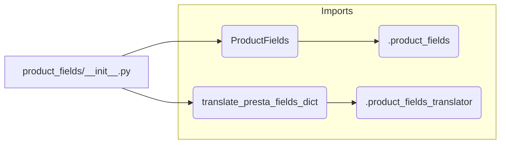

# Code Explanation: hypotez/src/product/product_fields/__init__.py

## <input code>

```python
## \file hypotez/src/product/product_fields/__init__.py
# -*- coding: utf-8 -*-
#! venv/Scripts/python.exe
#! venv/bin/python/python3.12

"""
.. module: src.product.product_fields 
	:platform: Windows, Unix
	:synopsis: Модуль полей товара

"""


from .product_fields import ProductFields
from .product_fields_translator import translate_presta_fields_dict
```

## <algorithm>

This code snippet is an initialization file (`__init__.py`) for a Python module related to product fields.  It doesn't contain complex logic but rather acts as an entry point to other modules within the same package.

**Step-by-step Workflow (Block Diagram):**

1. **Initialization:** The code initializes a variable `MODE` to 'dev'. This likely signifies a development mode for the application.

2. **Import Statements:** It imports necessary classes and functions from submodules within the same package.

   * `ProductFields`: Presumably a class defining the structure and manipulation of product fields.
   * `translate_presta_fields_dict`: A function for translating product field data from a potentially different format (e.g., PrestaShop format).

**Example Data Flow:**

Imagine a scenario where data is loaded from a PrestaShop database. This function would be used to translate that data into the internal format understood by the `ProductFields` class.

```
PrestaShop Data (Dictionary) --> translate_presta_fields_dict() --> Internal Product Fields Object --> ... (used in other parts of the system)
```

## <mermaid>



**Dependencies Analysis:**

The mermaid diagram shows the imports:
* `ProductFields` is imported from `.product_fields`. This implies that `product_fields` is a Python module within the same package.
* `translate_presta_fields_dict` is imported from `.product_fields_translator`.  Similarly, `.product_fields_translator` is a submodule.


## <explanation>

* **Imports:**
    * `from .product_fields import ProductFields`: Imports the `ProductFields` class from the `product_fields` module within the same directory.  This module likely defines the structure and methods for handling product data.
    * `from .product_fields_translator import translate_presta_fields_dict`: Imports the `translate_presta_fields_dict` function from the `product_fields_translator` module, likely responsible for translating product fields from one format (e.g., PrestaShop) to the format expected by the `ProductFields` class.


* **Variables:**
    * ``: A global variable likely used for setting application configuration modes.

* **Classes:**
    * `ProductFields`: (Not defined in this file) Represents a class structure to manage product fields in the application.  Its details are found in `hypotez/src/product/product_fields/product_fields.py`.

* **Functions:**
    * `translate_presta_fields_dict`: (Not defined in this file) Takes a dictionary of PrestaShop product fields as input, and converts them into the format appropriate for the internal data model.  Details are found in `hypotez/src/product/product_fields/product_fields_translator.py`.

* **Potential Errors/Improvements:**

    * **Missing Docstrings:** While the module docstring is present, ideally, each function within `product_fields.py` and `product_fields_translator.py` should also have comprehensive docstrings to clarify input parameters, return values, and use cases.
    * **Type Hinting:** Adding type hints to function parameters and return values could improve code readability and maintainability.
    * **Error Handling:** The `translate_presta_fields_dict` function should include error handling to gracefully manage cases where input data is malformed or missing required keys.

**Relationships with Other Project Parts:**

This module is clearly part of a larger system related to products, potentially interacting with database access, product management, or presentation layers. The specific interaction points are in the logic implemented by `ProductFields` and `translate_presta_fields_dict`.  Import statements are vital for establishing these relationships.
```