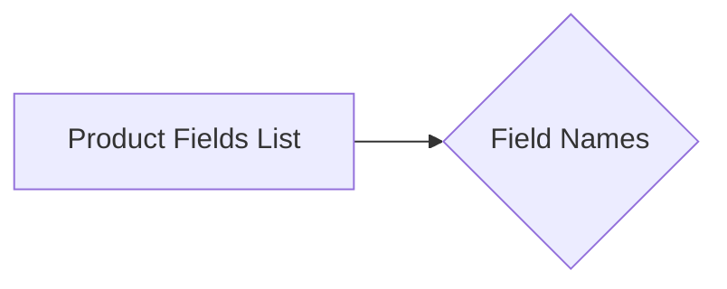

# Code Explanation

```active
additional_delivery_times
additional_shipping_cost
advanced_stock_management
affiliate_short_link
affiliate_summary
affiliate_summary_2
affiliate_text
affiliate_image_large
affiliate_image_medium
affiliate_image_small
associations
available_date
available_for_order
available_later
available_now
cache_default_attribute
cache_has_attachments
cache_is_pack
condition
customizable
date_add
date_upd
delivery_in_stock
delivery_out_stock
depth
description
description_short
ean13
ecotax
height
how_to_use
specification
id_category_default
id_default_combination
id_default_image
locale
id_manufacturer
id_product
id_shop_default
id_shop
id_supplier
id_tax
id_type_redirected
indexed
ingredients
is_virtual
isbn
link_rewrite
location
low_stock_alert
low_stock_threshold
meta_description
meta_keywords
meta_title
minimal_quantity
mpn
name
online_only
on_sale
out_of_stock
pack_stock_type
price
product_type
quantity_discount
redirect_type
reference
show_condition
show_price
state
supplier_reference
text_fields
unit_price_ratio
unity
upc
uploadable_files
visibility
volume
weight
wholesale_price
width
local_saved_image
local_saved_video
```

## <algorithm>

This code appears to be a list of strings.  There is no inherent workflow or algorithm to describe.  It is simply a collection of field names likely used for storing data related to products in a database or a product management system.  The data structures and relationships between these fields need to be defined elsewhere.

## <mermaid>



**Explanation of Diagram Dependencies:**

The diagram is rudimentary because there is no processing or logic in the input code.  The mermaid graph shows a simple relationship between a list of fields and the field names themselves. No specific dependencies or interactions are present to be detailed further.

## <explanation>

The provided code is a list of strings, and there is no algorithm, function, or class to analyze.  These strings are likely field names for product records in a database or similar data storage system.

* **Imports**: There are no imports.
* **Classes**: There are no classes.
* **Functions**: There are no functions.
* **Variables**: There are no variables.
* **Potential Errors or Improvements**:  The absence of context makes any error analysis or suggestions for improvement impossible.  We need more information about the system that uses this data.  Ideally, there should be further documentation regarding the purpose, data types, and permissible values for each of these fields. The string values should be consistently formatted to avoid confusion.


**Relationships to Other Project Parts:**

These field names would be used in conjunction with database schemas, object models, and potentially data access layers (DAO).   For example, a product object in a model would use these field names to store product information.  The list of fields would likely be used by tools that create database tables and data models.


**Summary:** The code represents a list of potential attributes/fields associated with products in a software system.  Without further context (e.g., database schema, object model definition, code using these fields), a more thorough analysis isn't possible.