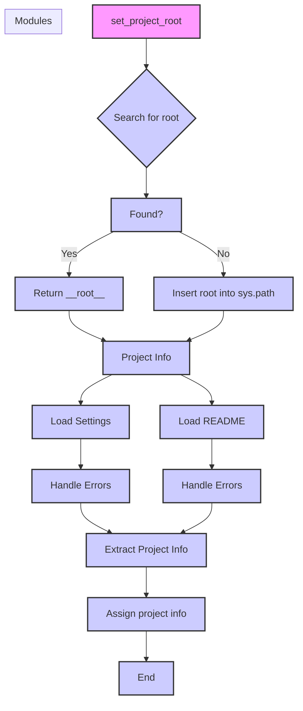

# Code Explanation for hypotez/src/product/product_fields/header.py

## <input code>

```python
## \file hypotez/src/product/product_fields/header.py
# -*- coding: utf-8 -*-\n\n#! venv/bin/python/python3.12\n\n"""
.. module: src.product.product_fields 
	:platform: Windows, Unix
	:synopsis:

"""


"""
	:platform: Windows, Unix
	:synopsis:

"""


"""
	:platform: Windows, Unix
	:synopsis:

"""


"""
  :platform: Windows, Unix

"""
"""
  :platform: Windows, Unix
  :platform: Windows, Unix
  :synopsis:
"""
  
""" module: src.product.product_fields """

import sys
import json
from packaging.version import Version

from pathlib import Path
def set_project_root(marker_files=('__root__','.git')) -> Path:
    """
    Finds the root directory of the project starting from the current file's directory,
    searching upwards and stopping at the first directory containing any of the marker files.

    Args:
        marker_files (tuple): Filenames or directory names to identify the project root.
    
    Returns:
        Path: Path to the root directory if found, otherwise the directory where the script is located.
    """
    __root__:Path
    current_path:Path = Path(__file__).resolve().parent
    __root__ = current_path
    for parent in [current_path] + list(current_path.parents):
        if any((parent / marker).exists() for marker in marker_files):
            __root__ = parent
            break
    if __root__ not in sys.path:
        sys.path.insert(0, str(__root__))
    return __root__


# Get the root directory of the project
__root__ = set_project_root()
"""__root__ (Path): Path to the root directory of the project"""


from src import gs

settings:dict = None
try:
    with open(gs.path.root / 'src' / 'settings.json', 'r') as settings_file:
        settings = json.load(settings_file)
except (FileNotFoundError, json.JSONDecodeError):
    ...


doc_str:str = None
try:
    with open(gs.path.root / 'src' / 'README.MD', 'r') as settings_file:
        doc_str = settings_file.read()
except (FileNotFoundError, json.JSONDecodeError):
    ...


__project_name__ = settings.get("project_name", 'hypotez') if settings  else 'hypotez'
__version__: str = settings.get("version", '')  if settings  else ''
__doc__: str = doc_str if doc_str else ''
__details__: str = ''
__author__: str = settings.get("author", '')  if settings else ''
__copyright__: str = settings.get("copyrihgnt", '')  if settings else ''
__cofee__: str = settings.get("cofee", "Treat the developer to a cup of coffee for boosting enthusiasm in development: https://boosty.to/hypo69")  if settings else "Treat the developer to a cup of coffee for boosting enthusiasm in development: https://boosty.to/hypo69"
```

## <algorithm>

1. **Initialization:**
    * Defines a constant `MODE` with the value 'dev'.
    * Imports necessary modules (`sys`, `json`, `packaging.version`, `pathlib`).


2. **Project Root Determination:**
    * Calls `set_project_root` function to locate the project's root directory.
    * The function searches upwards from the current file's directory for directories containing specified marker files ('pyproject.toml', 'requirements.txt', '.git').


3. **Settings Loading:**
    * Attempts to load settings from 'src/settings.json' using `json.load`.
    * Handles potential `FileNotFoundError` and `json.JSONDecodeError` during file reading.

4. **Documentation Loading:**
    * Attempts to load documentation from 'src/README.MD'.
    * Handles potential `FileNotFoundError` and `json.JSONDecodeError` during file reading.

5. **Project Information Extraction:**
    * Extracts project name, version, documentation, author, copyright, and coffee link from the loaded settings.
    * Uses `settings.get` for safe extraction, defaulting to values if entries are missing.


## <mermaid>



**Dependencies Analysis:**

* `sys`: Provides access to system-specific parameters and functions.
* `json`: Used for encoding and decoding JSON data, to read/write settings file.
* `packaging.version`: Used for handling and comparing software versions.
* `pathlib`: Offers a more object-oriented way to work with files and paths.
* `gs`:  Implied dependency, probably from a custom module or package (`src.gs`) within the project. This module (`gs`) likely handles file system paths and related operations.


## <explanation>

**Imports:**

* `sys`: Used to manipulate the Python interpreter's path, specifically to add the project root to the import path.
* `json`: Used to load the project settings from `settings.json`.
* `packaging.version`: Handles versions. While not used directly in this file, it might be used elsewhere in the project.
* `pathlib`: Provides object-oriented file system paths.
* `gs`: Custom module (likely a `src` package), likely provides a `gs.path` object with root directory methods for accessing project paths in a unified manner.


**Classes:**

* No classes defined, only functions and variables.


**Functions:**

* `set_project_root(marker_files)`: 
    * **Args:** A tuple of file/directory names used to locate the project root.
    * **Returns:** The `Path` object to the project root.
    * **Functionality:** Traverses up the directory tree from the current file's location, checking each parent directory for the presence of the specified marker files.  If found, the function returns the parent directory.
    * **Example:** If `__file__` is `hypotez/src/product/product_fields/header.py` and `pyproject.toml` exists in the `hypotez` directory, then `__root__` will hold the path to the `hypotez` directory.
    * **Error Handling:** None.

**Variables:**

* `__root__`:  Path object, stores the path to the project root.


**Potential Errors/Improvements:**

* **Error Handling:** While the code uses `try...except` blocks for file loading, more specific error handling might be beneficial (e.g., checking for invalid JSON structure).
* **`gs` Module:** The code heavily relies on `gs` for paths. Making sure `gs` is well documented and tested is crucial for maintainability and avoiding inconsistencies.
* **`MODE` Variable:**  `MODE` is defined but not used;  it's unclear why it's included. If it's used elsewhere in the project it needs to be documented and used consistently.


**Relationship with Other Parts of the Project:**

This file heavily depends on the `gs` module (located within a `src` package). It leverages `gs.path.root` to locate the project root and read the `settings.json` and `README.MD` files.  It also uses `src`, suggesting other parts of the `src` package are being imported to provide configuration or other utilities.  The extraction of project information likely affects how other parts of the project work.


**In summary:** The file sets up essential project information retrieval in a way that might enable the reuse of this information in other parts of the project, such as initializing configuration data, extracting version details, or making it possible to properly use `gs` functions.  It prioritizes the retrieval of the project root, important project settings, and descriptive documentation for use by the rest of the project.