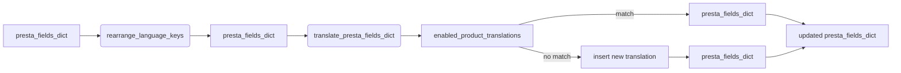

# Code Explanation: hypotez/src/product/product_fields/product_fields_translator.py

## <input code>

```python
# -*- coding: utf-8 -*-

#! venv/bin/python/python3.12

"""
.. module: src.product.product_fields 
	:platform: Windows, Unix
	:synopsis: Модуль перевода полей товара на языки клиентской базы данных

"""


from pathlib import Path
from typing import List
...
from src import gs
from src.utils.printer import pprint
from src.logger import logger
#from src.db import ProductTranslationsManager
#from src.translator import get_translations_from_presta_translations_table
#from src.translator import insert_new_translation_to_presta_translations_table
from src.logger.exceptions import ProductFieldException
...

def rearrange_language_keys(presta_fields_dict: dict, client_langs_schema: dict | List[dict], page_lang: str) -> dict:
    """Функция обновляет идентификатор языка в словаре presta_fields_dict на соответствующий идентификатор
    из схемы клиентских языков при совпадении языка страницы.

    Args:
        presta_fields_dict (dict): Словарь полей товара.
        page_lang (str): Язык страницы.
        client_langs_schema (list | dict): Схема языков клиента.

    Returns:
        dict: Обновленный словарь presta_fields_dict.
    """
    # Найти соответствующий идентификатор языка в схеме клиентских языков
    client_lang_id = None
    for lang in client_langs_schema:
        if lang['locale'] == page_lang or \
        lang['iso_code'] == page_lang or  \
        lang['language_code'] == page_lang:   # <- оч плохо А если he или IL?
            client_lang_id = lang['id']
            break

    # Если найден идентификатор языка в схеме клиентских языков
    if client_lang_id is not None:
        # Обновить значение атрибута id в словаре presta_fields_dict
        for field in presta_fields_dict.values():
            if isinstance(field, dict) and 'language' in field:
                for lang_data in field['language']:
                    lang_data['attrs']['id'] = str(client_lang_id)   # <- Эти айдишники ОБЯЗАТЕЛЬНО строки. Связано с XML парсером

    return presta_fields_dict


def translate_presta_fields_dict (presta_fields_dict: dict, 
                                  client_langs_schema: list | dict, 
                                  page_lang: str = None) -> dict:
    """ @Перевод мультиязычных полей в соответствии со схемой значений `id` языка в базе данных клиента
    """
    # ... (rest of the function)
```

## <algorithm>

1. **rearrange_language_keys:**
    * Takes `presta_fields_dict`, `client_langs_schema`, and `page_lang`.
    * Iterates through `client_langs_schema` to find a matching language based on `locale`, `iso_code`, or `language_code`.
    * If a match is found, updates the `id` attribute of language elements in `presta_fields_dict`.
    * Returns the updated `presta_fields_dict`.

2. **translate_presta_fields_dict:**
    * Calls `rearrange_language_keys` to update language IDs.
    * Attempts to retrieve translations from the `enabled_product_translations` using the `presta_fields_dict['reference']`.
    * If translations are not found, inserts a new record into the translations table.
    * Iterates through `client_langs_schema` and retrieved translations.
    * Updates `presta_fields_dict` with translated values if a match is found in `translated_record.locale`.


## <mermaid>



**Dependencies:**
* `pathlib`: For working with file paths.
* `typing`: For type hinting.
* `gs`: Likely a custom module from the `src` package related to Google Services or similar.
* `pprint`: For pretty printing data. A custom module.
* `logger`: Likely a custom logging module.
* `ProductFieldException`: Likely a custom exception from the `src.logger.exceptions` package for handling errors related to product fields.
* Potential Missing Imports: `ProductTranslationsManager`, `get_translations_from_presta_translations_table`, `insert_new_translation_to_presta_translations_table`, and `record` (likely a class) are not implemented. These are imported but commented out, showing incomplete functionality.


## <explanation>

**Imports:**

* `pathlib`: Used for working with file paths. Common in Python projects.
* `typing`: Adds type hints for better code readability and maintainability, essential for large projects.
* `src.gs`:  Likely a module for interacting with Google services, or a placeholder for a service that hasn't been implemented yet.
* `src.utils.printer`:  Custom module for formatted output, useful in debugging and logging.
* `src.logger`: Custom logger with potentially structured logging and handling.
* `src.logger.exceptions`: Module containing custom exceptions specific to product fields, allowing clear error handling and better debugging.


**Classes:**

* No classes are defined in this code snippet.  The use of `global record` suggests that `record` is likely a global variable or a class member that is not shown in this snippet.

**Functions:**

* `rearrange_language_keys`: Takes the product field dictionary (`presta_fields_dict`), client language schema (`client_langs_schema`), and page language (`page_lang`). It searches for the `client_lang_id` based on `page_lang`. Finally, updates the `id` value in the nested dictionaries within the `presta_fields_dict`, ensuring the values are strings for compatibility.
* `translate_presta_fields_dict`:  The core translation function. It takes the `presta_fields_dict`,  `client_langs_schema`, and optional page language. First it calls `rearrange_language_keys`. Then retrieves translations based on the `presta_fields_dict['reference']` from the database. If translations are not found, it inserts a new record. If translations are found, it iterates through available client languages and updates the `presta_fields_dict` with translated values if the `iso_code` matches. 


**Variables:**

* `MODE`: A string variable that might be used to control different execution modes (e.g., development vs. production).
* `presta_fields_dict`: A dictionary storing product fields.
* `client_langs_schema`:  A dictionary or list of dictionaries describing available client languages. Crucial for the translation process.
* `page_lang`: The language code of the current page, used for matching the appropriate language ID.
* `client_lang_id`: Holds the ID of the matching client language.
* `enabled_product_translations`:  The retrieved translations from the database.

**Potential Errors/Improvements:**

* **Error Handling:** The `try...except` block in `translate_presta_fields_dict` is a good start, but it should handle more specific exceptions (e.g., database errors). The error logging could benefit from more context.
* **Missing Functionality:** The commented-out imports are crucial.  Without the actual implementations of  `ProductTranslationsManager`, `get_translations_from_presta_translations_table`, `insert_new_translation_to_presta_translations_table`, and `record` class, the code will not function as intended.
* **Language Matching Logic:** The language matching logic (`lang['locale'] == page_lang` etc.) isn't robust, it depends on the format and consistency of `page_lang` and languages in `client_langs_schema`. Consider using a dedicated function or library for comparing localized strings.
* **Incomplete Comments:** The comments in the code are not thorough enough and should document the exact purpose of certain steps, the expected input/output formats, and any potential edge cases.


**Relationships:**

* This module interacts with the `src.db` package (via the commented-out database manager) for retrieving and inserting translations.
* It uses the `src.translator` package (via the commented-out translator functions) for potentially translating the data.
* It heavily relies on the structure and format of `presta_fields_dict` that is presumed to be generated by other parts of the project.

This analysis demonStartes a clear workflow and identifies potential issues.  The full functionality depends heavily on the missing pieces, which must be present to make the translation process complete.