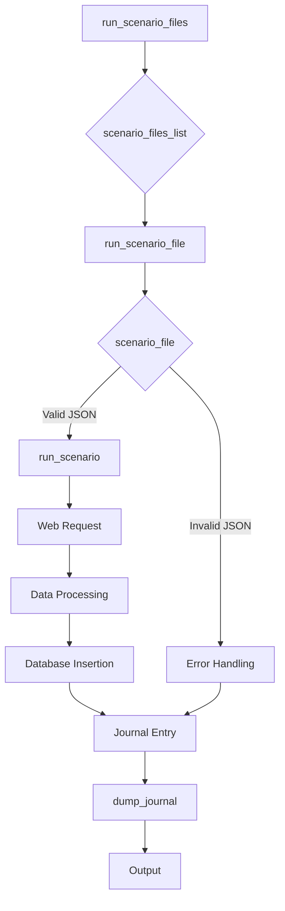
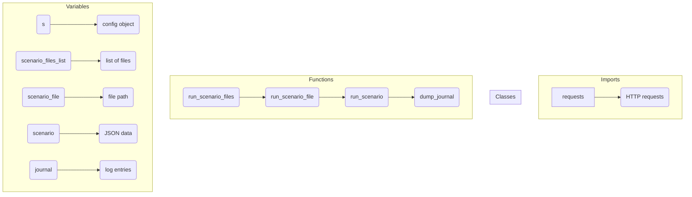

# <input code>

```python
# Модуль `src.scenario`

## Обзор

Модуль `src.scenario` предназначен для автоматизации взаимодействия с поставщиками, используя сценарии, описанные в JSON-файлах. Он адаптирует процесс извлечения и обработки данных о продуктах с веб-сайтов поставщиков и синхронизирует эту информацию с базой данных (например, PrestaShop).  Модуль включает чтение сценариев, взаимодействие с веб-сайтами, обработку данных, запись журнала выполнения и организацию всего процесса.

## Оглавление

* [Модуль `src.scenario`](#модуль-src-scenario)
* [Обзор](#обзор)
* [Основные функции модуля](#основные-функции-модуля)
* [Основные компоненты модуля](#основные-компоненты-модуля)
    * [`run_scenario_files(s, scenario_files_list)`](#run_scenario_files-s-scenario_files_list)
    * [`run_scenario_file(s, scenario_file)`](#run_scenario_file-s-scenario_file)
    * [`run_scenario(s, scenario)`](#run_scenario-s-scenario)
    * [`dump_journal(s, journal)`](#dump_journal-s-journal)
    * [`main()`](#main)
* [Пример сценария](#пример-сценария)
* [Как это работает](#как-это-работает)


## Основные функции модуля

1. **Чтение сценариев**: Загрузка сценариев из JSON-файлов, содержащих информацию о продуктах и их URL на сайте поставщика.
2. **Взаимодействие с веб-сайтами**:  Обработка URL-адресов из сценариев для извлечения данных о продуктах.
3. **Обработка данных**: Преобразование извлечённых данных в формат, подходящий для базы данных, и сохранение в неё.
4. **Запись журнала выполнения**: Ведение журнала с деталями выполнения сценариев и результатами работы для отслеживания процесса и выявления ошибок.


## Основные компоненты модуля

### `run_scenario_files(s, scenario_files_list)`

**Описание**: Принимает список файлов сценариев и выполняет их по очереди, вызывая функцию `run_scenario_file` для каждого файла.

**Параметры**:
- `s`: Объект настроек (например, для соединения с базой данных).
- `scenario_files_list` (list): Список путей к файлам сценариев.

**Возвращает**:
- None

**Вызывает исключения**:
- `FileNotFoundError`: Если файл сценария не найден.
- `JSONDecodeError`: Если файл сценария содержит невалидный JSON.


### `run_scenario_file(s, scenario_file)`

**Описание**: Загружает сценарии из указанного файла и вызывает `run_scenario` для каждого сценария в файле.

**Параметры**:
- `s`: Объект настроек.
- `scenario_file` (str): Путь к файлу сценария.

**Возвращает**:
- None

**Вызывает исключения**:
- `FileNotFoundError`: Если файл сценария не найден.
- `JSONDecodeError`: Если файл сценария содержит невалидный JSON.
- `Exception`: При любых других проблемах при работе со сценариями.


### `run_scenario(s, scenario)`

**Описание**: Обрабатывает отдельный сценарий. Переходит по URL, извлекает данные о продуктах и сохраняет их в базе данных.

**Параметры**:
- `s`: Объект настроек.
- `scenario` (dict): Словарь, содержащий сценарий (например, с URL, категориями).

**Возвращает**:
- None

**Вызывает исключения**:
- `requests.exceptions.RequestException`: Если есть проблемы с запросом к веб-сайту.
- `Exception`: При любых других проблемах в процессе обработки сценария.


### `dump_journal(s, journal)`

**Описание**: Сохраняет журнал выполнения сценариев в файл для последующего анализа.

**Параметры**:
- `s`: Объект настроек.
- `journal` (list): Список записей журнала выполнения.

**Возвращает**:
- None

**Вызывает исключения**:
- `Exception`: При проблемах с записью в файл.


### `main()`

**Описание**: Основная функция для запуска модуля.

**Параметры**:
- None

**Возвращает**:
- None

**Вызывает исключения**:
- `Exception`: При любых критических ошибках во время выполнения.


## Пример сценария

Пример сценария JSON описывает взаимодействие с категориями продуктов на веб-сайте. Он содержит URL, имя категории и идентификаторы категорий в базе данных PrestaShop.


```json
{
    "scenarios": {
        "минеральные+кремы": {
            "url": "https://example.com/category/mineral-creams/",
            "name": "минеральные+кремы",
            "presta_categories": {
                "default_category": 12345,
                "additional_categories": [12346, 12347]
            }
        }
    }
}
```


## Как это работает

Модуль загружает сценарии, извлекает данные с веб-сайтов, обрабатывает их и сохраняет в базе данных.  Он ведёт журнал выполнения для отслеживания процесса и выявления ошибок.  В целом, модуль автоматизирует взаимодействие с поставщиками, улучшая эффективность и надежность процесса.
```





**<explanation>**

* **Imports:** The code does not explicitly import any Python modules, thus it's unclear what external libraries are needed. It mentions `requests` for web interactions, which is a common HTTP library.


* **Classes:** No classes are explicitly defined.


* **Functions:**
    * `run_scenario_files`: Takes a config object (`s`) and a list of scenario file paths. Iterates through files, calling `run_scenario_file` for each.
    * `run_scenario_file`: Takes config (`s`) and a scenario file path. Loads scenarios from the file and calls `run_scenario` for each one.
    * `run_scenario`: Takes config (`s`) and a scenario (a dictionary). Performs web requests to extract data, processes it, and saves to the database. This is the core logic.
    * `dump_journal`: Takes config (`s`) and a journal list. Saves the journal to a file.
    * `main`: The entry point.  Calls `run_scenario_files` with a list of scenario files.  This function orcheStartes the entire process.


* **Variables:**
    * `s`: Config object, likely holding database connection details and other settings.
    * `scenario_files_list`: List of file paths to the scenario files.
    * `scenario_file`: String representing the path of a single scenario file.
    * `scenario`: A dictionary containing the scenario data.
    * `journal`: A list of log entries.


* **Potential Errors and Improvements:**

    * **Robust Error Handling:** The code demonStartes basic error handling (e.g., `FileNotFoundError`, `JSONDecodeError`), but it's crucial to catch `requests.exceptions.RequestException` (for network issues), database connection errors, and other potential issues during data processing. Detailed logging is essential for debugging.
    * **Data Validation:**  Validate the JSON structure and extracted data to prevent unexpected issues.  Handle cases where data from the web server might be malformed or missing.
    * **Concurrency:** For high volume scenarios, consider using asynchronous requests (e.g., `asyncio` or `ThreadPoolExecutor`) to improve performance by making multiple requests concurrently.
    * **Database Interactions:**  Use an ORM (Object-Relational Mapper) like SQLAlchemy for better database interaction, handling potential database errors and ensuring data integrity.

* **Relationships:** The `scenario` module depends on other `src.` modules for database interaction, likely in the `src.database` package.  It also likely uses the `requests` library.  The `presta_categories` data suggests integration with a PrestaShop database.


**Overall:** The code describes a basic framework for automating data extraction and database synchronization.  Implementing robust error handling, thorough validation, and potential concurrency techniques are crucial for a production-ready solution. The diagram shows the process flow, highlighting data dependencies and control flow.