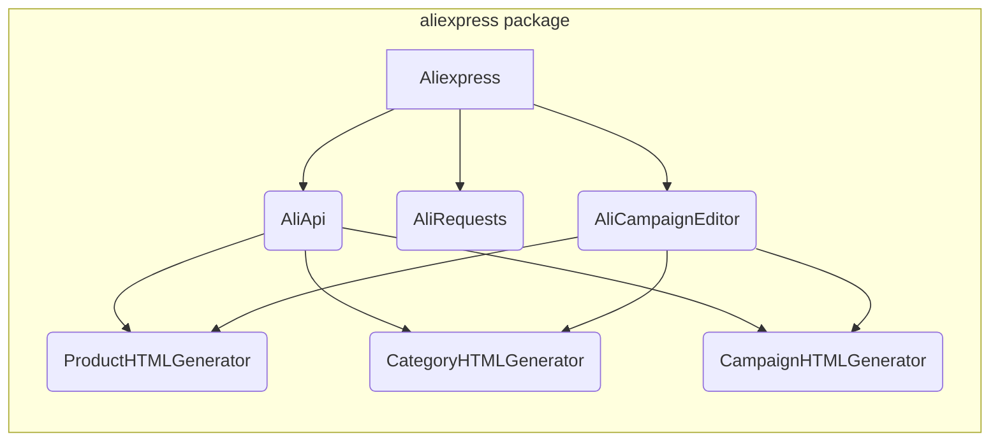

```MD
# Code Explanation for hypotez/src/suppliers/aliexpress/__init__.py

## <input code>

```python
## \file hypotez/src/suppliers/aliexpress/__init__.py
# -*- coding: utf-8 -*-\
#! venv/Scripts/python.exe
#! venv/bin/python/python3.12

"""
.. module: src.suppliers.aliexpress 
	:platform: Windows, Unix
	:synopsis:

"""


from .aliexpress import Aliexpress
from .aliapi import AliApi
from .alirequests import AliRequests
from .campaign import AliCampaignEditor
from .campaign.html_generators import ProductHTMLGenerator, CategoryHTMLGenerator, CampaignHTMLGenerator 
```

## <algorithm>

This file acts as an entry point for the `aliexpress` supplier module.  It imports necessary classes and modules from subdirectories. There's no complex algorithm or data flow beyond importing, as this `__init__.py` file simply declares the module's contents.

## <mermaid>



**Dependencies Analysis:**

The diagram shows the imports within the `aliexpress` package.  Crucially, it illuStartes the relationships between the core `Aliexpress` class, `AliApi`, `AliRequests`, and the `AliCampaignEditor` and the HTML generators for various entities (products, categories, campaigns).  This suggests a logical structure where `Aliexpress` is the main class, relying on `AliApi` for API interactions, `AliRequests` for HTTP requests, and `AliCampaignEditor` for campaign management.  The HTML generators are likely used for generating dynamic content associated with these campaigns.

## <explanation>

* **Imports:**
    * `from .aliexpress import Aliexpress`: Imports the `Aliexpress` class from the `aliexpress` submodule. This likely represents the primary class for interacting with the AliExpress platform.
    * `from .aliapi import AliApi`: Imports the `AliApi` class.  This is expected to handle communication with the AliExpress API.
    * `from .alirequests import AliRequests`: Imports the `AliRequests` class. It's highly likely to manage HTTP requests and responses to the AliExpress API.
    * `from .campaign import AliCampaignEditor`: Imports the `AliCampaignEditor` class. This points to functionality related to managing campaigns within the AliExpress ecosystem.
    * `from .campaign.html_generators import ProductHTMLGenerator, CategoryHTMLGenerator, CampaignHTMLGenerator`: Imports classes for generating HTML representations of products, categories, and campaigns. This implies these items are involved in the process of displaying and presenting campaign data.

    The `.` prefix in the import statements indicates that the imported modules are located within the `aliexpress` package.

* **Variables:**
    * ``: A global variable likely setting the operational mode (e.g., development, testing, production) for the `aliexpress` supplier.  This is a good practice for configuration.

* **Classes:**
    * `Aliexpress`:  Represents the primary interface for interaction with AliExpress.
    * `AliApi`: Manages interactions with the AliExpress API (e.g., authentication, data fetching).
    * `AliRequests`: Handles all HTTP communication.
    * `AliCampaignEditor`: Focuses on campaign-related operations, potentially interacting with `AliApi`.
    * `ProductHTMLGenerator`, `CategoryHTMLGenerator`, `CampaignHTMLGenerator`:  Responsible for generating HTML representations of various campaign entities.

* **Potential Improvements:**

    * **Error Handling:** The code lacks explicit error handling.  Adding `try...except` blocks in methods within `AliApi` and `AliRequests` will significantly improve the robustness of the code.
    * **Logging:** Incorporating logging would make debugging and monitoring much easier.
    * **Docstrings:** Improving the docstrings for the classes and methods would significantly improve the documentation and make the code more understandable.


* **Relationship with Other Parts of the Project:**

    This `aliexpress` module is likely part of a larger project that handles various suppliers.  The `Aliexpress` class and its methods will be utilized elsewhere in the codebase to access and manipulate data from the AliExpress platform.  The exact nature of this relationship depends on the other modules and functionalities within the project.