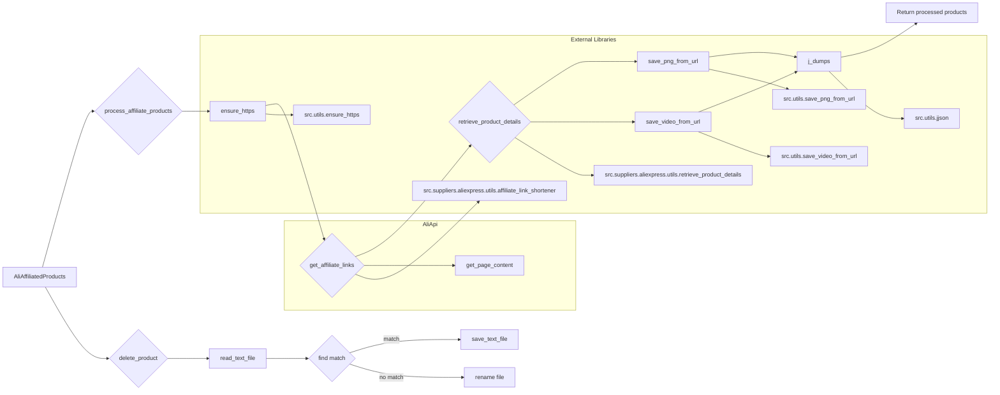

# affiliated_products_generator.py Analysis

## <input code>

```python
import asyncio
from itertools import count
from math import log
from pathlib import Path
from typing import List, Union, Optional
from types import SimpleNamespace
from urllib.parse import urlparse, parse_qs

from src import gs
from src.suppliers.aliexpress import AliApi
from src.suppliers.aliexpress import Aliexpress
from src.suppliers.aliexpress.affiliate_links_shortener_via_webdriver import AffiliateLinksShortener
from src.suppliers.aliexpress.utils.extract_product_id import extract_prod_ids
from src.suppliers.aliexpress.utils.set_full_https import ensure_https
from src.utils.convertor.csv2json import csv2dict 
from src.utils.jjson import j_dumps
from src.utils import save_png_from_url, save_video_from_url
from src.utils.printer import pprint 
from src.utils.file import read_text_file, save_text_file

from src.logger import logger
```

```python
class AliAffiliatedProducts(AliApi):
    """ Class to collect full product data from URLs or product IDs
    locator_description For more details on how to create templates for ad campaigns, see the section `Managing Aliexpress Ad Campaigns`
    @code
    # Example usage:
    prod_urls = ['123','456',...]
    prod_urls = ['https://www.aliexpress.com/item/123.html','456',...]

    parser = AliAffiliatedProducts(
                                campaign_name,
                                campaign_category,
                                language,
                                currency)

    products = parser._affiliate_product(prod_urls)
    @endcode
    """
    campaign_name: str
    campaign_category: Optional[str]
    campaign_path: Path
    language: str
    currency: str

    def __init__(self,
             campaign_name: str,
             campaign_category: Optional[str] = None,
             language: str = 'EN',
             currency: str = 'USD',
             *args, **kwargs):
        """
        @param campaign_name `str`: Name of the advertising campaign. The directory with the prepared material is taken by name.
        @param campaign_category `Optional[str]`: Category for the campaign (default None).
        @param language `str`: Language for the campaign (default 'EN').
        @param currency `str`: Currency for the campaign (default 'USD').
        @param tracking_id `str`: Tracking ID for Aliexpress API.
        """
        super().__init__(language, currency)

        self.campaign_name = campaign_name
        self.campaign_category = campaign_category
        self.language = language
        self.currency = currency
        self.locale = f"{self.language}_{self.currency}"
        self.campaign_path = gs.path.google_drive / 'aliexpress' / 'campaigns' / self.campaign_name / 'categories' / self.campaign_category
        
    def process_affiliate_products(self, prod_urls: List[str]) -> List[SimpleNamespace]:
        """
        Processes a list of URLs and returns a list of products with affiliate links and saved images.

        :param prod_urls: List of product URLs or IDs.
        :return: List of processed products.
        """
        # ... (implementation details) ...
    
    def delete_product(self, product_id: str, exc_info: bool = False):
        """ Delete a product that does not have an affiliate link"""
        # ... (implementation details) ...
```

## <algorithm>

**Step 1:** Initialization (`__init__`)
* Input: `campaign_name`, `campaign_category`, `language`, `currency`.
* Output: `self.campaign_path`, initializes `AliApi` properties.
* Example: `campaign_name='Summer_Sale', campaign_category='Clothing'`
* Data flow: Input parameters are used to construct the path for campaign data storage.


**Step 2:** `process_affiliate_products`
* Input: `prod_urls` (list of product URLs or IDs).
* Output: `_affiliate_products` (list of `SimpleNamespace` objects).
* Example: `prod_urls = ['https://example.com/prod1', 'https://example.com/prod2']`
* Workflow:
    * Ensures URLs are HTTPS.
    * Retrieves affiliate links for each URL using `get_affiliate_links`.
    * Retrieves product details using `retrieve_product_details`.
    * Saves product images (`save_png_from_url`) and videos (`save_video_from_url`).
    * Saves product data to JSON (`j_dumps`).


**Step 3:** `delete_product`
* Input: `product_id`
* Output: Updated `products_list` and file systems if product ID is invalid
* Workflow: Reads products from source, finds matching product ID, and removes it from the list. If no `products_list`, it renames the related source file.


## <mermaid>



**Dependencies Explanation:**

* `gs`: Likely a module for Google Drive file system interaction.
* `AliApi`: Base class for AliExpress API interaction.
* `Aliexpress`: Possibly a module defining constants or configurations for AliExpress.
* `AffiliateLinksShortener`: Module for shorting affiliate links.
* `extract_prod_ids`, `ensure_https`: Utility functions for extracting product IDs and ensuring HTTPS.
* `csv2dict`, `j_dumps`: Functions for converting CSV to dictionaries and saving JSON data.
* `save_png_from_url`, `save_video_from_url`:  Functions for downloading and saving images/videos.
* `pprint`, `read_text_file`, `save_text_file`: Utility functions for printing, reading, and saving text files.
* `logger`: Logging module for managing application logs.


## <explanation>

**Imports:**

* Standard libraries are used for general functionalities (e.g., asynchronous operations, iterators, mathematical functions, paths, types, URL parsing).
* `src` package imports are used for internal project modules, indicating a modular architecture for the application. These imports suggest a project structure organized into packages for general utilities, specific suppliers (e.g., AliExpress), and logging.

**Classes:**

* `AliAffiliatedProducts`: Inherits from `AliApi`, handling AliExpress-specific affiliate product data retrieval, saving images/videos, and JSON data storage.
* `AliApi`:  Likely an abstract base class or a utility class that contains essential methods and functions to interact with the AliExpress API.  Missing details prevent exact analysis.

**Functions:**

* `__init__`: Initializes the `AliAffiliatedProducts` instance, storing campaign details and building the local storage path.
* `process_affiliate_products`: Main function for retrieving and processing product data, handling affiliate links, saving media, and storing the collected data locally.


**Variables:**

* `campaign_name`, `campaign_category`, `language`, `currency`: String variables defining campaign parameters.
* `prod_urls`: List of product URLs or IDs for processing.
* `_affiliate_products`: List storing the processed product data.


**Potential Errors/Improvements:**

* **Error Handling**:  The provided code includes basic error handling, but robust error handling (e.g., catching specific exceptions, providing informative error messages, retry mechanisms) would improve reliability.
* **Asynchronous Operations**: Processing multiple product URLs could be sped up using `asyncio` for concurrent requests.
* **Data Validation**: Input validation on URLs or IDs would prevent unexpected behavior.
* **Logging Enhancements**: More informative logs to help identify errors and bottlenecks.
* **Input Validation**: Add checks to ensure that input data is valid. For example, that the URL are valid product URLs.
* **Resource Management**:  Ensure that resources like network connections and files are properly closed.

**Relationships with other parts of the project:**

The code relies heavily on functions and classes within the `src` project, demonStarting a cohesive system. `gs`, `AliApi`, `logger`, and other modules are likely part of a larger project framework.