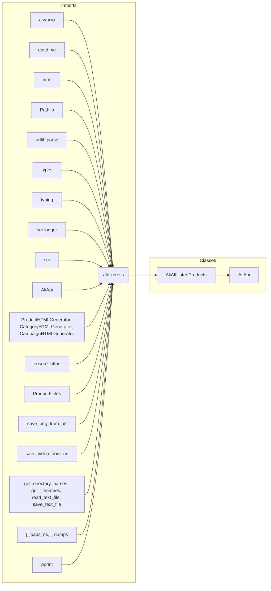

# Analysis of `affiliated_products_generator.py`

## <input code>

```python
## \file hypotez/src/suppliers/aliexpress/affiliated_products_generator.py
# -*- coding: utf-8 -*-
#! venv/Scripts/python.exe
#! venv/bin/python/python3.12

"""
.. module: src.suppliers.aliexpress 
	:platform: Windows, Unix
	:synopsis:

"""


import asyncio
from datetime import datetime
import html
from pathlib import Path
from urllib.parse import urlparse
from types import SimpleNamespace
from typing import List

from src.logger import logger
from src import gs
from src.suppliers.aliexpress import AliApi
from src.suppliers.aliexpress.campaign.html_generators import ProductHTMLGenerator, CategoryHTMLGenerator, CampaignHTMLGenerator 
from src.suppliers.aliexpress.utils.ensure_https import ensure_https
from src.product.product_fields import ProductFields as f
from src.utils.image import save_png_from_url 
from src.utils.video import save_video_from_url
from src.utils.file import get_directory_names, get_filenames, read_text_file, save_text_file
from src.utils.jjson import j_loads_ns, j_dumps
from src.utils.printer import pprint
from src.logger import logger


class AliAffiliatedProducts(AliApi):
    """ Class to collect full product data from URLs or product IDs.
    For more details on how to create templates for ad campaigns, see the section `Managing Aliexpress Ad Campaigns`.
    """
    ...
    language:str = None
    currency:str = None
    def __init__(self,
                 language: str | dict = 'EN',
                 currency: str = 'USD',
                 *args, **kwargs):
        """
        Initializes the AliAffiliatedProducts class.
        Args:
            language: Language for the campaign (default 'EN').
            currency: Currency for the campaign (default 'USD').
        """
        ...
        if not language or not currency:
            logger.critical(f"No language, currency !")
            return
        super().__init__(language, currency)
        self.language, self.currency = language, currency


    async def process_affiliate_products(self, prod_ids: list[str], category_root: Path | str) -> list[SimpleNamespace]:
        # ... (rest of the code)
```

## <algorithm>

```mermaid
graph TD
    A[Start] --> B{Get Category};
    B -- Category Found --> C[Init Paths, URLs, Process Products];
    B -- Category Not Found --> D[Default Category, Init Paths, URLs, Process Products];
    C --> E[Initialize Data Structures];
    E --> F[Normalize Prod IDs (ensure_https)];
    F --> G[Iterate Prod URLs];
    G --> H{Affiliate Links Exist?};
    H -- Yes --> I[Get Affiliate Links];
    I --> J[Append to Promotion Links & Prod URLs];
    J --> K[Retrieve Product Details];
    H -- No --> L[Log Warning];
    L --> K;
    K --> M[Iterate Products & Promotion Links];
    M --> N[Save Image];
    M --> O[Save Video (if exists)];
    M --> P[Save Product Data (JSON)];
    N --> Q{Video Exists?};
    Q -- Yes --> O;
    Q -- No --> O;
    M --> R[Append to Affiliated Products List];
    R --> S[Save Product Titles];
    S --> T[Return Affiliated Products List];
    T --> U[End];
```

## <mermaid>



**Dependencies Analysis:**

The mermaid diagram shows the import dependencies within the `affiliated_products_generator.py` file.  Crucially, it highlights the dependency on `src.suppliers.aliexpress.AliApi` which implies this file leverages functionalities from `AliApi` for Aliexpress-specific API interactions (e.g., potentially for getting product data or affiliate links). The import of `src.logger` and other utility functions like `save_png_from_url` shows the integration with the logging and file handling components of the project.

## <explanation>

**Imports:**

The imports are largely standard library modules and utility functions from the project (`src` package).  Their roles are apparent from their names:

* `asyncio`: For asynchronous operations.
* `datetime`: For handling dates and times (though not directly used in this snippet).
* `html`: For handling HTML content (likely for parsing or cleaning).
* `pathlib`: For working with file paths.
* `urllib.parse`: For parsing URLs.
* `types`: For working with `SimpleNamespace`
* `typing`: For type hinting.
* `src.logger`: For logging messages (vital for debugging and monitoring).
* `src.suppliers.aliexpress.AliApi`: The core class for interacting with the AliExpress API.
* `src.suppliers.aliexpress.campaign.html_generators`: Likely contains classes to generate HTML for campaigns.
* `src.suppliers.aliexpress.utils.ensure_https`: Likely for ensuring URLs are HTTPS.
* `src.product.product_fields`: Contains constants or definitions for product fields.
* `src.utils.image`, `src.utils.video`, `src.utils.file`, `src.utils.jjson`, `src.utils.printer`: Various utility functions for image/video saving, file handling, JSON processing, and printing.

**Classes:**

* `AliAffiliatedProducts`: This class extends `AliApi` (a core class for interacting with the AliExpress API). It's specifically designed to collect product data, including affiliate links and associated images/videos,  for promotional campaigns.
    * `__init__`: Initializes the class, setting language and currency, and validating those parameters are set. It's important to note the error handling with `logger.critical` for missing data.
    * `process_affiliate_products`: The core method for fetching affiliate links, retrieving product details, saving images and videos, and generating output JSON files. It takes a list of product IDs/URLs and a category root directory as input. The method correctly handles cases where no affiliate links are found, preventing errors. It's well-documented with examples and helpful notes.

**Functions:**

* `ensure_https`: Takes a list of URLs as input and converts them to HTTPS if necessary. This is a crucial step for security and consistent handling of URLs.
* `get_affiliate_links`: This is (likely) an inherited method, but from `AliApi`, likely responsible for extracting affiliate links given an Aliexpress product URL.
* `retrieve_product_details`:  (Implied) A method within `AliAffiliatedProducts` responsible for fetching detailed product information based on a list of URLs.
* `save_png_from_url`: Saves images from URLs to a given file path.
* `save_video_from_url`: Saves videos from URLs to a given file path.
* `j_dumps`, `j_loads_ns`: Useful functions for working with JSON data.

**Variables:**

* `MODE`, `language`, `currency`: These variables likely control the program's behavior and desired output (e.g., dev mode vs. production mode).


**Potential Errors/Improvements:**

* **Error Handling:** The code includes `logger.critical` checks for missing language and currency, which is good practice. However, more robust error handling (e.g., specific exceptions) could be added to handle cases where `get_affiliate_links` or `retrieve_product_details` return an error.
* **Robustness of `get_affiliate_links`:** If the `super().get_affiliate_links` method returns a non-list or a list of incorrect format, the code might have unexpected behavior.  Adding checks to ensure `_links` is correctly formatted would enhance robustness.
* **Concurrency:** The `process_affiliate_products` method is asynchronous, but it iterates through the products sequentially.  If the retrieval of affiliate links or product details is slow, consider using concurrency or asyncio tasks to improve processing time, especially for large lists of products.


**Relationship Chain:**

* `AliAffiliatedProducts` leverages `AliApi` (Aliexpress API interaction).
* The data obtained from `AliApi` is used to generate affiliate links, images, videos, and JSON outputs.
* Output files (JSON and text files) are stored under a specified category root, which implies the system is likely part of a larger campaign management or data collection pipeline.

The code appears well-structured, designed with clarity, and incorporating best practices like asynchronous operations and comprehensive logging.  The workflow is well-defined and easy to follow.