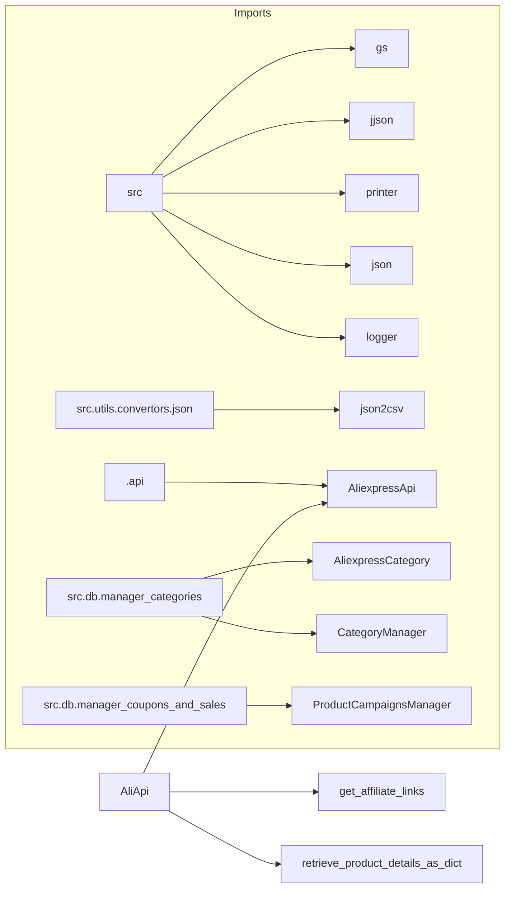

# Code Explanation: hypotez/src/suppliers/aliexpress/aliapi.py

## <input code>

```python
## \file hypotez/src/suppliers/aliexpress/aliapi.py
# -*- coding: utf-8 -*-\
#! venv/Scripts/python.exe
#! venv/bin/python/python3.12

"""
.. module: src.suppliers.aliexpress 
	:platform: Windows, Unix
	:synopsis:

"""
MODE = 'dev'


import re
import json
import asyncio
from pathlib import Path
from typing import List, Dict
from types import SimpleNamespace
from requests import get, post

from src import gs
from src.utils.jjson import j_loads_ns, j_loads, j_dumps
from src.utils.printer import pprint
from src.utils.convertors.json import json2csv
from src.logger import logger
from .api import AliexpressApi

from src.db.manager_categories import AliexpressCategory, CategoryManager
from src.db.manager_coupons_and_sales import ProductCampaignsManager

class AliApi(AliexpressApi):
    """
    Custom API class for AliExpress operations.
    """

    # Database managers
    manager_categories: CategoryManager = None
    manager_campaigns: ProductCampaignsManager = None

    def __init__(self, language: str = 'en', currency: str = 'usd', *args, **kwargs):
        """ Initializes an instance of the AliApi class.

        Args:
            language (str): The language to use for API requests. Defaults to 'en'.
            currency (str): The currency to use for API requests. Defaults to 'usd'.
        """
        credentials = gs.credentials.aliexpress
        api_key = credentials.api_key
        secret = credentials.secret
        tracking_id = credentials.tracking_id
        super().__init__(api_key, secret, language, currency, tracking_id)
        # Initialize database managers if needed
        # self.manager_categories = CategoryManager()
        # self.manager_campaigns = ProductCampaignsManager(gs.presta_credentials[0])
        ...

    # def collect_deals_from_url():
    #     """ Given a URL, retrieve deals, coupons, and other offers received from AliExpress"""
    #     ...

    def retrieve_product_details_as_dict(self, product_ids: list) -> dict | dict | None:
        """ Sends a list of product IDs to AliExpress and receives a list of SimpleNamespace objects with product descriptions.

        Args:
            product_ids (list): List of product IDs.

        Returns:
            dict | None: List of product data as dictionaries.
        """
        prod_details_ns = self.retrieve_product_details(product_ids)
        prod_details_dict = [vars(ns) for ns in prod_details_ns]
        return prod_details_dict

    def get_affiliate_links(self, links: str | list, link_type: int = 0, **kwargs) -> List[SimpleNamespace]:
        """ 
        Retrieves affiliate links for the specified products.

        Args:
            links (str | list): The product links to be processed.
            link_type (int, optional): The type of affiliate link to be generated. Defaults to 0.

        Returns:
            List[SimpleNamespace]: A list of SimpleNamespace objects containing affiliate links.
        """
        return super().get_affiliate_links(links, link_type, **kwargs)
```

## <algorithm>

```mermaid
graph TD
    A[Input: product_ids (list)] --> B{retrieve_product_details};
    B --> C[prod_details_ns (list of SimpleNamespace)];
    C --> D{Convert to dict};
    D --> E[prod_details_dict (list of dict)];
    E --> F[Output: prod_details_dict];

    subgraph "AliexpressApi"
        G[super().get_affiliate_links(links, link_type, **kwargs)] --> H[Output: affiliate links (List[SimpleNamespace])];
    end
```

The code retrieves product details from AliExpress and converts them into a format suitable for further processing.  It also has a method to generate affiliate links.

## <mermaid>



**Dependencies Analysis:**

The `mermaid` diagram shows the import relationships within the code.  `AliApi` inherits from `AliexpressApi`, which implies a dependency on `src.suppliers.aliexpress.api`. The `gs`, `jjson`, `printer`, `json`, `logger`, `json2csv` modules from the `src` package are used for various functionalities like accessing configuration data, handling JSON, printing output, and converting between JSON and CSV formats. Moreover, database interaction is handled by `CategoryManager`, `ProductCampaignsManager`, and `AliexpressCategory` which are part of the `src.db` package, showcasing a modular and layered design.


## <explanation>

* **Imports:**
    * `re`, `json`, `asyncio`, `Path`, `List`, `Dict`, `SimpleNamespace`, `get`, `post`: Standard Python libraries for regular expressions, JSON handling, asynchronous operations, path manipulation, data types, and HTTP requests.
    * `gs`: Likely a custom module for accessing global settings or configurations (e.g., API keys).
    * `j_loads_ns`, `j_loads`, `j_dumps`: Custom JSON loading functions from `src.utils.jjson`. They likely provide specialized handling of JSON data, such as deserializing into `SimpleNamespace` objects.
    * `pprint`: Custom pretty printing function from `src.utils.printer`.
    * `json2csv`: Function for converting JSON to CSV format from `src.utils.convertors.json`.
    * `logger`: Logging module from `src.logger`.
    * `AliexpressApi`: Likely an API base class for handling API requests specific to AliExpress, located in `src.suppliers.aliexpress.api`.
    * `AliexpressCategory`, `CategoryManager`, `ProductCampaignsManager`: Classes related to database interactions for AliExpress categories and products.
    * `from src.db.manager_categories import ...`: Imports the necessary classes for managing AliExpress categories.
    * `from src.db.manager_coupons_and_sales import ...`: Imports the necessary classes for managing coupons and sales campaigns.

* **Classes:**
    * `AliApi`: Inherits from `AliexpressApi`. It customizes the API calls for AliExpress, likely adding functionalities specific to AliExpress products, and interacts with database managers.
    * `AliexpressApi`: This is a base class providing basic operations for AliExpress APIs.


* **Functions:**
    * `__init__`: Initializes an instance of `AliApi`, sets up the necessary credentials, and initializes database managers (if needed).
    * `retrieve_product_details_as_dict`: Retrieves product details, converts them from `SimpleNamespace` objects into dictionaries, and returns the result. This is a crucial part of the data processing pipeline.
    * `get_affiliate_links`: Retrieves affiliate links.

* **Variables:**
    * `MODE`: Likely a string specifying the current application mode ('dev' in this case).
    * `manager_categories`, `manager_campaigns`: Attributes of `AliApi` for managing database interactions.
    * `credentials`: Represents credentials for the AliExpress API (likely another class or object from the `gs` module).
    * `product_ids`, `links`, `link_type`: Parameters in `retrieve_product_details_as_dict`, and `get_affiliate_links` functions, representing input data.

* **Potential Errors/Improvements:**
    * The code includes commented-out initialization of database managers. This suggests that the managers are not always initialized.  Adding checks to ensure they are properly initialized or using a factory pattern to manage instantiation would improve robustness.
    * The `collect_deals_from_url` method is commented out.  Adding the implementation would improve functionality.
    * The return type annotation `dict | None` could be improved to be more specific depending on the expected return data structure.


* **Relationships with other parts of the project:**
    * The `gs.credentials.aliexpress` object implies a dependency on the `gs` module.
    * Interactions with `src` modules (e.g., `logger`, `jjson`) and `src.db` are evident, indicating a well-structured project with modular components.