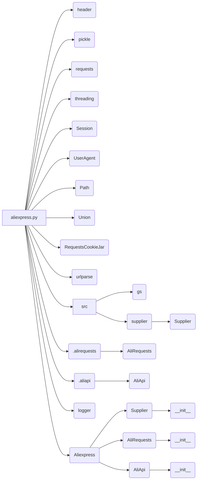

# Code Explanation for aliexpress.py

## <input code>

```python
## \file hypotez/src/suppliers/aliexpress/aliexpress.py
# -*- coding: utf-8 -*-\
#! venv/Scripts/python.exe
#! venv/bin/python/python3.12

"""
.. module: src.suppliers.aliexpress 
	:platform: Windows, Unix
	:synopsis: module provides the `Aliexpress` class, which integrates functionality
from `Supplier`, `AliRequests`, and `AliApi` for working with AliExpress.

"""
MODE = 'dev'


import header
import pickle
import requests
import threading
from requests.sessions import Session
from fake_useragent import UserAgent
from pathlib import Path
from typing import Union
from requests.cookies import RequestsCookieJar
from urllib.parse import urlparse

from src import gs  
from src.suppliers.supplier import Supplier
from .alirequests import AliRequests
from .aliapi import AliApi
from src.logger import logger  

class Aliexpress(Supplier, AliRequests, AliApi):
    """
    Base class for AliExpress.

    This class combines features of the `Supplier`, `AliRequests`, and `AliApi`
    classes to facilitate interaction with AliExpress.

    **Usage examples**:

    .. code-block:: python

        # Run without a webdriver
        a = Aliexpress()

        # Webdriver `Chrome`
        a = Aliexpress('chrome')

        # Requests mode
        a = Aliexpress(requests=True)
    """
    ...

    def __init__(self, 
                 webdriver: bool | str = False, 
                 locale: str | dict = {'EN': 'USD'},
                 *args, **kwargs):
        """
        Initialize the Aliexpress class.

        :param webdriver: Webdriver mode. Supported values are:
            - `False` (default): No webdriver.
            - `'chrome'`: Use the Chrome webdriver.
            - `'mozilla'`: Use the Mozilla webdriver.
            - `'edge'`: Use the Edge webdriver.
            - `'default'`: Use the system's default webdriver.
        :type webdriver: bool | str

        :param locale: The language and currency settings for the script.
        :type locale: str | dict

        :param args: Additional positional arguments.
        :param kwargs: Additional keyword arguments.

        **Examples**:

        .. code-block:: python

            # Run without a webdriver
            a = Aliexpress()

            # Webdriver `Chrome`
            a = Aliexpress('chrome')

        """
        ...
        super().__init__(supplier_prefix = 'aliexpress', 
                         locale = locale, 
                         webdriver = webdriver, 
                         *args, **kwargs)
```

## <algorithm>

```
[Start] --> [Import Modules] --> [Class Aliexpress Definition] --> [__init__ method] --> [Initialization of Parent Classes] --> [End]

// Example data flow:
// User wants to scrape AliExpress products.
//  Input: webdriver = 'chrome', locale = {'EN': 'USD'}
//  Output: Initialized Aliexpress object ready for interaction.
```

## <mermaid>



**Dependency Analysis:**

The mermaid diagram shows the imports and their relationships.  `aliexpress.py` imports various modules and classes from other files and packages within the project.  For example, `header` (likely configuration/utils), `requests` (for HTTP requests), `threading` (for multi-threading), `Supplier`, `AliRequests`, `AliApi`, and `logger`. It also imports the `src` package, indicating that the codebase has a clear structure with well-defined modules and packages.  The use of `from src import gs` and similar import statements suggests a hierarchical organization where `src` is a core package holding sub-modules for various functionalities.


## <explanation>

**Imports:**

- `header`: Likely a custom module for configuration and utility functions, specific to the project.
- `pickle`: Used for serializing and deserializing Python objects, though its direct role in this particular file isn't immediately clear from the provided snippet.
- `requests`: For making HTTP requests to websites. Crucial for interacting with AliExpress's API.
- `threading`: To execute operations concurrently. This is potentially for handling multiple requests or background tasks, but the implementation details are missing.
- `requests.sessions`: Provides `Session` objects for managing HTTP sessions and reusing connections for better performance.
- `fake_useragent`: To generate realistic user agents for web scraping, to avoid getting blocked.
- `pathlib`: For working with file paths in a platform-independent way.
- `typing`: The `Union` type hint clarifies that `webdriver` can be either a boolean or a string.
- `requests.cookies`: Handles HTTP cookies.
- `urllib.parse`: For parsing URLs.
- `src`: This is a custom package likely containing the project's core modules, including `gs`, `suppliers`, `logger`.  `gs` (likely global settings) or other modules specific to the company.
- `src.suppliers.supplier`: A base class for suppliers in general.
- `.alirequests`, `.aliapi`: Submodules/classes dedicated to AliExpress specific functionalities, likely containing methods for handling API requests and data parsing.
- `src.logger`: A custom logging module, used to record events and debug information.

**Classes:**

- `Aliexpress`: This is the core class for interacting with AliExpress. It inherits from `Supplier`, `AliRequests`, and `AliApi`, combining functionalities from different parts of the project. The `__init__` method takes arguments like `webdriver` and `locale`, initializing the appropriate components within the child classes.

**Functions:**

- `__init__`: The constructor of the `Aliexpress` class, taking arguments for webdriver and locale. Its main task is to initialize and configure the object. The `super().__init__` call is crucial; it delegates the initialisation of the parent classes `Supplier`, `AliRequests`, and `AliApi` which is necessary for initializing the class properly.

**Variables:**

- `MODE`: A global variable likely representing the current operation mode (e.g., 'dev', 'prod').

**Potential Errors/Improvements:**

- **Missing `...`:** The `...` placeholders in the `Aliexpress` class and `__init__` indicate that some methods are not fully defined in the snippet. This suggests that a significant portion of the code is missing, which would be important to the complete functionality of this class. The lack of a complete `__init__` is concerning and makes evaluating the code's robustness difficult.
- **Error Handling:** The code lacks specific error handling blocks.  It is essential to add `try...except` blocks to catch potential exceptions during API calls, file operations, or other operations.


**Relationships:**

The `Aliexpress` class relies heavily on the functionality provided by `Supplier`, `AliRequests`, and `AliApi`. This demonstrates a clear modular design. The `src` package likely houses other crucial components, such as data processing or configuration modules, that the `Aliexpress` class interacts with.  This is a typical structure for well-organized Python projects.