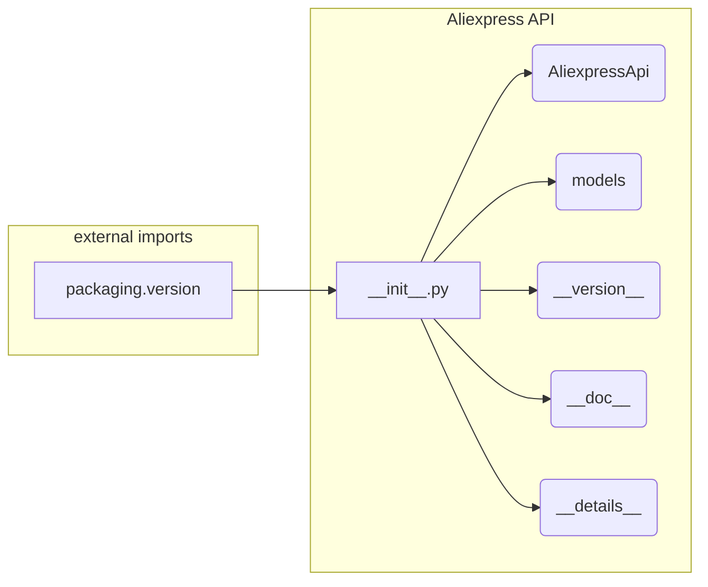

# Code Explanation for hypotez/src/suppliers/aliexpress/api/__init__.py

## <input code>

```python
## \file hypotez/src/suppliers/aliexpress/api/__init__.py
# -*- coding: utf-8 -*-\
 # <- venv win
## ~~~~~~~~~~~~~\
""" module: src.suppliers.aliexpress.api """
""" Aliexpress API wrapper"""
...

...
from packaging.version import Version
from .version import __version__, __doc__, __details__  

from .api import AliexpressApi
from . import models
```

## <algorithm>

There's no executable code for an algorithm to describe.  This file is an initialization module.  It's primarily used to import and expose components (classes, functions, variables) within the `aliexpress` API module.  There's no procedural or logical step-by-step execution.

## <mermaid>



## <explanation>

**Imports:**

* **`from packaging.version import Version`**: This imports the `Version` class from the `packaging.version` package. This is likely used for handling and comparing software versions, potentially crucial for API interaction. The `packaging` package is frequently used for handling version numbers.  The relationship to other `src` packages would depend on the specific role of this module; its presence usually indicates a requirement for version checking or managing.

* **`from .version import __version__, __doc__, __details__`**: This line imports variables (`__version__`, `__doc__`, `__details__`) from a module named `version.py` within the same directory (`./version`).  This is a common Python practice to define metadata for a module or package.  This suggests the existence of `version.py` containing module metadata likely for documentation or version control purposes within the `aliexpress` API package.

* **`from .api import AliexpressApi`**:  This imports the `AliexpressApi` class from a module named `api.py` within the same directory (`./api`). This class is likely the core class that interacts with the Aliexpress API.  The relationship signifies the primary interaction logic defined within `api.py`.

* **`from . import models`**: Imports the `models` module, which implies a set of models representing the data structures used by the Aliexpress API.  This module likely contains classes or structures needed to represent the data returned or required by the API, making it a vital component in a broader data handling context.

**Classes (Implied):**

* **`AliexpressApi`**: This class is likely to contain methods for interacting with the Aliexpress API (e.g., making requests, handling responses). This class likely interacts with the models defined within the `models` module. It is fundamental for the API wrapper functionality.

**Functions (Implied):**

* No functions are explicitly declared in this file. The file is an import module, hence functions, classes, and variables are defined elsewhere (presumably within `api.py` and `models` modules)


**Variables (Implied):**

* `__version__`, `__doc__`, `__details__`: These variables are likely holding important information (version, documentation string, details about the API wrapper). This information may be crucial for tracking, documentation, and other organizational needs.

**Potential Errors/Improvements:**

* **Missing `__all__`**: For better organization and control, it would be beneficial to include a `__all__` variable in this module that lists the public symbols it provides.  This improves maintainability.

* **Docstrings**: Adding comprehensive docstrings to the imported classes and functions is highly recommended to provide clear documentation.

* **Error Handling:** Consider adding robust error handling (e.g., `try...except` blocks) within `AliexpressApi` methods to manage potential exceptions during API interactions.


**Relationships with other parts of the project:**

The `aliexpress` API module likely interacts with other modules (e.g., those in `hypotez/src`) through the use of models defined in the `models` module. Further investigation into other relevant files in the project is necessary to fully understand those dependencies.