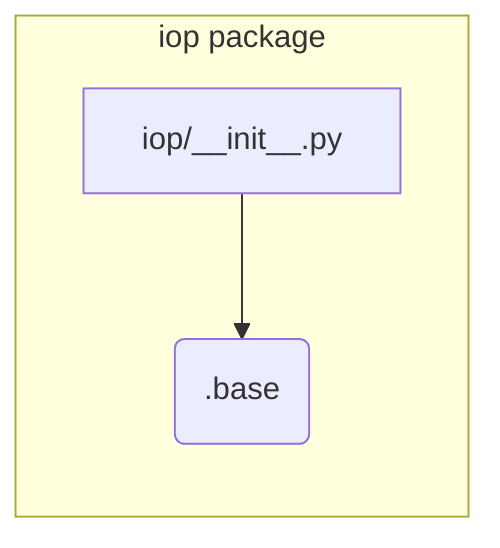

# Code Explanation for hypotez/src/suppliers/aliexpress/api/_examples/iop/__init__.py

## <input code>

```python
# -*- coding: utf-8 -*-\
 # <- venv win
## ~~~~~~~~~~~~~\
""" module: src.suppliers.aliexpress.api._examples.iop """
from .base import 
```

## <algorithm>

This code snippet is incomplete and does not contain any executable logic. It only imports functionality from a submodule named `base`.  A step-by-step algorithm cannot be generated.  There's no data flow to describe.


## <mermaid>



**Explanation of Mermaid Diagram:**

The diagram shows a single module `iop/__init__.py` that imports a module/package named `.base`. This implies a hierarchical structure where `iop` likely contains other submodules or classes and the `base` module potentially provides common functionalities.  No specifics can be derived regarding `base`'s contents from this snippet alone.


## <explanation>

**Imports:**

The code imports from `./base`.  This implies that `./base` is a module or package located in the same directory (`_examples/iop`) as `__init__.py`.  Without the content of `./base`, we can't determine the exact functionality of the imported elements.

**Classes:**

No classes are defined.

**Functions:**

No functions are defined.

**Variables:**

No variables are defined.

**Potential Errors or Areas for Improvement:**

The code is extremely rudimentary and incomplete.  Without the content of `.base`, any further analysis or error detection is impossible. It's a missing import statement.  The `# -*- coding: utf-8 -*-\` comment is standard but not essential in a Python file.  The `` shebang is Windows-specific and should be avoided for portability in a library.


**Relationships with other parts of the project:**

The `from .base import` statement suggests a dependency on the `base` module which likely contains classes and/or functions relevant to the AliExpress API interaction and handling data from the e-commerce platform. The exact nature of this dependency isn't detailed enough to show how `iop` and `base` integrate within the larger project (`hypotez`).  Further code review of `.base` is needed to fully understand the dependency chain.