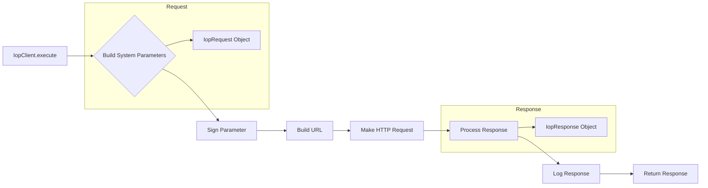

# Code Explanation for `hypotez/src/suppliers/aliexpress/api/_examples/iop/base.py`

## <input code>

```python
## \file hypotez/src/suppliers/aliexpress/api/_examples/iop/base.py
# -*- coding: utf-8 -*-\
 # <- venv win
## ~~~~~~~~~~~~~\
""" module: src.suppliers.aliexpress.api._examples.iop """
'Created on 2018-03-21

@author: xuteng.xt
'

import requests
import time
import hmac
import hashlib
import json
import mimetypes
import itertools
import random
import logging
import os
from os.path import expanduser
import socket
import platform

# dir = os.getenv('HOME')
dir = expanduser("~")
isExists = os.path.exists(dir + "/logs")
if not isExists:
    os.makedirs(dir + "/logs")
logger = logging.getLogger(__name__)
logger.setLevel(level = logging.ERROR)
handler = logging.FileHandler(dir + "/logs/iopsdk.log." + time.strftime("%Y-%m-%d", time.localtime()))
handler.setLevel(logging.ERROR)
# formatter = logging.Formatter('%(asctime)s - %(name)s - %(levelname)s - %(message)s')
formatter = logging.Formatter('%(message)s')
handler.setFormatter(formatter)
logger.addHandler(handler)

P_SDK_VERSION = "iop-sdk-python-20220609"

P_APPKEY = "app_key"
P_ACCESS_TOKEN = "session"
P_TIMESTAMP = "timestamp"
P_SIGN = "sign"
P_SIGN_METHOD = "sign_method"
P_PARTNER_ID = "partner_id"
P_METHOD = "method"
P_DEBUG = "debug"
P_SIMPLIFY = "simplify"
P_FORMAT = "format"

P_CODE = 'code'
P_TYPE = 'type'
P_MESSAGE = 'message'
P_REQUEST_ID = 'request_id'

# P_API_GATEWAY_URL_TW = 'https://api.taobao.tw/rest'
# P_API_AUTHORIZATION_URL = 'https://auth.taobao.tw/rest'

P_LOG_LEVEL_DEBUG = "DEBUG"
P_LOG_LEVEL_INFO = "INFO"
P_LOG_LEVEL_ERROR = "ERROR"


def sign(secret,api,parameters):
    sort_dict = sorted(parameters)
    if("/" in api):
        parameters_str = "%s%s" % (api,str().join('%s%s' % (key, parameters[key]) for key in sort_dict))
    else:
        parameters_str = str().join('%s%s' % (key, parameters[key]) for key in sort_dict)

    h = hmac.new(secret.encode(encoding="utf-8"), parameters_str.encode(encoding="utf-8"), digestmod=hashlib.sha256)
    return h.hexdigest().upper()


def mixStr(pstr):
    if(isinstance(pstr, str)):
        return pstr
    elif(isinstance(pstr, unicode)):
        return pstr.encode('utf-8')
    else:
        return str(pstr)


def logApiError(appkey, sdkVersion, requestUrl, code, message):
    localIp = socket.gethostbyname(socket.gethostname())
    platformType = platform.platform()
    logger.error("%s^_^%s^_^%s^_^%s^_^%s^_^%s^_^%s^_^%s" % (
        appkey, sdkVersion,
        time.strftime("%Y-%m-%d %H:%M:%S", time.localtime()),
        localIp, platformType, requestUrl, code, message))


class IopRequest(object):
    def __init__(self,api_pame,http_method = 'POST'):
        self._api_params = {}
        self._file_params = {}
        self._api_pame = api_pame
        self._http_method = http_method
        self._simplify = "false"
        self._format = "json"

    def add_api_param(self,key,value):
        self._api_params[key] = value
    def add_file_param(self,key,value):
        self._file_params[key] = value
    def set_simplify(self):
        self._simplify = "true"
    def set_format(self,value):
        self._format = value;


class IopResponse(object):
    def __init__(self):
        self.type = None
        self.code = None
        self.message = None
        self.request_id = None
        self.body = None

    def __str__(self, *args, **kwargs):
        sb = "type=" + mixStr(self.type) + \
            " code=" + mixStr(self.code) + \
            " message=" + mixStr(self.message) + \
            " requestId=" + mixStr(self.request_id)
        return sb


class IopClient(object):
    log_level = P_LOG_LEVEL_ERROR
    def __init__(self, server_url,app_key,app_secret,timeout=30):
        self._server_url = server_url
        self._app_key = app_key
        self._app_secret = app_secret
        self._timeout = timeout

    def execute(self, request,access_token = None):
        # ... (rest of the code)
```

## <algorithm>

```
[Start] --> [Build System Parameters] --> [Sign Parameter] --> [Build URL] --> [Make HTTP Request] --> [Process Response] --> [Log Response] --> [Return Response] --> [End]

Example:
- Build System Parameters: timestamp=1678886400000, app_key=your_app_key, partner_id=iop-sdk-python-20220609, method=your_method, simplify=false, format=json
- Sign Parameter:  Add API parameters and the calculated signature.
- Build URL: Construct the full API request URL.  example:  api.example.com?timestamp=1678886400000&app_key=your_app_key ...
- Make HTTP Request: Send POST or GET request to the API.
- Process Response: Parse JSON response, extract relevant fields.
- Log Response: Log relevant information. Log errors if response code is not 0.
```

## <mermaid>



**Dependencies and Analysis:**

The code imports numerous standard Python libraries: `requests`, `time`, `hmac`, `hashlib`, `json`, `mimetypes`, `itertools`, `random`, `logging`, `os`, `socket`, `platform`.  These are standard Python packages for making HTTP requests, working with time, cryptography, data structures, and logging.


## <explanation>

**Imports:**

- `requests`: Used for making HTTP requests to the API.  Crucial for interacting with external services.
- `time`, `hmac`, `hashlib`: Used for time management, message signing, and hashing, essential for security and API interaction.
- `json`: Handling JSON data exchange with the API.
- `logging`:  For logging API errors and other information.  `os` is used to create a log file.  `time` is used to name the log file.
- `os`: Needed for interacting with the operating system.  Crucial for file system operations.
- `socket` and `platform`: Used for getting the local IP address and system platform.

**Classes:**

- `IopRequest`: Represents an API request.  Holds parameters and methods for adding API parameters, file parameters, simplifying, and setting the request format.
- `IopResponse`: Represents an API response. Stores the response code, type, message, request ID, and the entire JSON response body. `__str__` method adds a readable string representation of response.
- `IopClient`: The core class managing the API interaction.  Accepts the server URL, application key, secret, and timeout.  `execute` method constructs the API call, handles requests (GET, POST), and processes responses.  The `log_level` attribute controls the level of logging.

**Functions:**

- `sign(secret, api, parameters)`: Calculates the signature for the API request based on the secret key, API method, and parameters. This is crucial for API security.
- `mixStr(pstr)`: Ensures that input string data is in the correct format, handles both strings and unicode.
- `logApiError(appkey, sdkVersion, requestUrl, code, message)`: Logs errors encountered during API requests, including the application key, SDK version, timestamp, IP address, platform, request URL, error code, and error message.

**Variables:**

- `P_*` variables: Constants for API parameters and logging levels.

**Potential Errors/Improvements:**

- Error handling could be improved by providing more specific error messages in `logApiError`.
- The use of `mixStr` to handle string types seems redundant as `requests` library should handle different string types.
- The code lacks validation of the API response.  Checking if the response is actually JSON and contains the expected keys would prevent unexpected crashes.
- Using f-strings (formatted string literals) would improve code readability for constructing URLs.
- Using a more structured exception handling approach (e.g., try-except blocks with specific exceptions) might make debugging easier.

**Relationships:**

The code interacts with the external API (using the `requests` library). The `IopRequest` and `IopResponse` classes act as intermediaries between the client code (and potentially other project parts) and the actual API calls.  `logging` handles error reporting to files, potentially providing logs for troubleshooting later on.