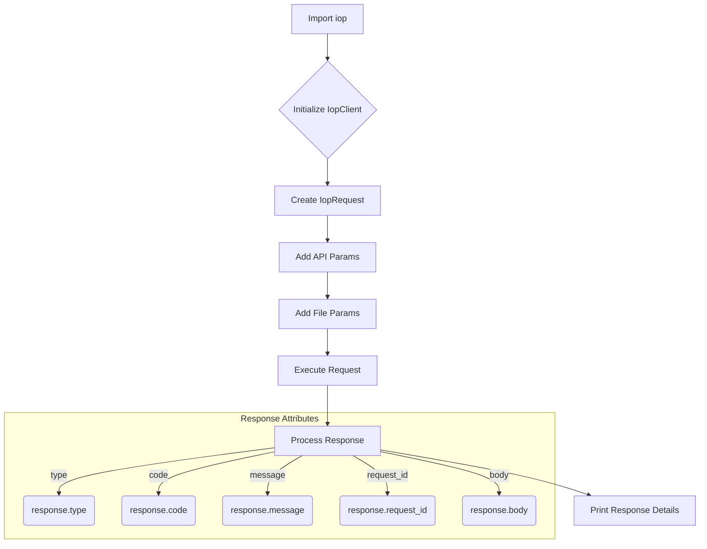

# <input code>

```python
## \file hypotez/src/suppliers/aliexpress/api/_examples/iop/test_upload.py
# -*- coding: utf-8 -*-
#! venv/Scripts/python.exe # <- venv win
## ~~~~~~~~~~~~~
""" module: src.suppliers.aliexpress.api._examples.iop """
# # -*- coding: utf-8 -*-
#
# import iop
#
# # params 1 : gateway url
# # params 2 : appkey
# # params 3 : appSecret
# client = iop.IopClient('https://api.taobao.tw/rest', '${appKey}', '${appSecret}')
#
# # create a api request
# request = iop.IopRequest('/xiaoxuan/mockfileupload')
#
# # simple type params ,Number ,String
# request.add_api_param('file_name','pom.xml')
#
# # file params, value should be file content
# request.add_file_param('file_bytes',open('/Users/xt/Documents/work/tasp/tasp/pom.xml').read())
#
# response = client.execute(request)
# #response = client.execute(request,access_token)
#
#
# # response type nil,ISP,ISV,SYSTEM
# # nil ：no error
# # ISP : API Service Provider Error
# # ISV : API Request Client Error
# # SYSTEM : Iop platform Error
# print(response.type)
#
# # response code, 0 is no error
# print(response.code)
#
# # response error message
# print(response.message)
#
# # response unique id
# print(response.request_id)
#
# # full response
# print(response.body)
```

# <algorithm>

1. **Import iop:**  Import the `iop` module, presumably containing classes and functions for interacting with an API.
2. **Initialize IopClient:** Create an instance of the `IopClient` class, passing the API gateway URL, app key, and app secret.  This establishes a connection to the API.  Example: `client = iop.IopClient('https://api.taobao.tw/rest', 'YOUR_APP_KEY', 'YOUR_APP_SECRET')`
3. **Create IopRequest:**  Create an `IopRequest` object specifying the API endpoint for file upload.  Example: `request = iop.IopRequest('/xiaoxuan/mockfileupload')`
4. **Add API Parameters:** Add simple parameters like `file_name` using `add_api_param`.  Example: `request.add_api_param('file_name', 'pom.xml')`
5. **Add File Parameter:** Add the file content as a parameter using `add_file_param`.  Example: `request.add_file_param('file_bytes', open('/path/to/file.txt').read())`
6. **Execute Request:** Call `client.execute(request)` to send the request to the API.
7. **Process Response:**  Parse the response (`response`) from the API.  The response object contains attributes like `type`, `code`, `message`, `request_id`, and `body`, which provide information about the success/failure of the request and the API's response.
8. **Print Response Details:** Print the response type, code, message, ID, and full body to the console to display the result of the API call.

# <mermaid>



**Dependencies Analysis:**

The mermaid diagram relies on the assumption that `iop` is a module (likely a Python package) containing the `IopClient` and `IopRequest` classes, along with methods such as `execute`, `add_api_param`, and `add_file_param`.  The diagram reflects the workflow of interacting with an API using these classes and methods.  No external dependencies beyond the assumed `iop` package are visible in this code snippet.


# <explanation>

**Imports:**

* `iop`: This is a custom module, likely a part of the project, containing classes and functions for interacting with a specific API (likely a third-party API). The code heavily depends on the functionality provided by this `iop` module.  The `import iop` statement imports the necessary classes and functions from the `iop` module.

**Classes:**

* **`IopClient`:** This class is used to interact with the API.  It likely handles the connection, authentication, and sending of requests.  In this case, it's initialized with the API endpoint, app key, and secret, representing an API client setup.
* **`IopRequest`:** This class represents an API request.  Methods like `add_api_param` and `add_file_param` allow setting parameters and file content for the request.


**Functions:**

* **`IopClient.execute(request)`:**  This function sends the `request` object to the API.  It's a crucial part of the interaction process. The return value is a `response` object.
* **`IopRequest.add_api_param(param_name, param_value)`:** Sets a simple parameter for the request.
* **`IopRequest.add_file_param(param_name, file_content)`:** Sets a file parameter; `file_content` should be the raw data of the file.

**Variables:**

* **`client`:** An instance of the `IopClient` class, representing the API client.
* **`request`:** An instance of the `IopRequest` class, holding the request details.
* **`response`:** The result of the API call, containing information about the success or failure of the request.

**Potential Errors/Improvements:**

* **Hardcoded paths:** The path `/Users/xt/Documents/work/tasp/tasp/pom.xml` is hardcoded. This is problematic if the code is moved to a different environment (different user, different file location) or if you want to use different files. Consider using a configuration file or environment variables to store these paths.
* **Error Handling:** The code lacks robust error handling.  While it prints the response type, code, and message, it doesn't explicitly handle different error scenarios.  It would be beneficial to add checks for different error codes or responses and handle them appropriately. Example: if `response.type == 'ISP'`, take a specific action to notify or retry.
* **Missing Authentication Context:** The example code uses placeholder values for `appKey` and `appSecret`. In a real-world application, these values should be retrieved securely from environment variables or a configuration file, not hardcoded directly in the script.
* **File Handling:** The `open(...)`.read() method loads the entire file content into memory. This can be problematic for very large files. Consider using `io.BytesIO` or other streaming approaches for handling large files more efficiently.


**Relationships with other parts of the project:**

The code depends on the `iop` module, which is likely part of the larger project structure (`src.suppliers.aliexpress.api`).   The code also relies on external APIs. The exact chain of relationships depends on the context of the larger project architecture.