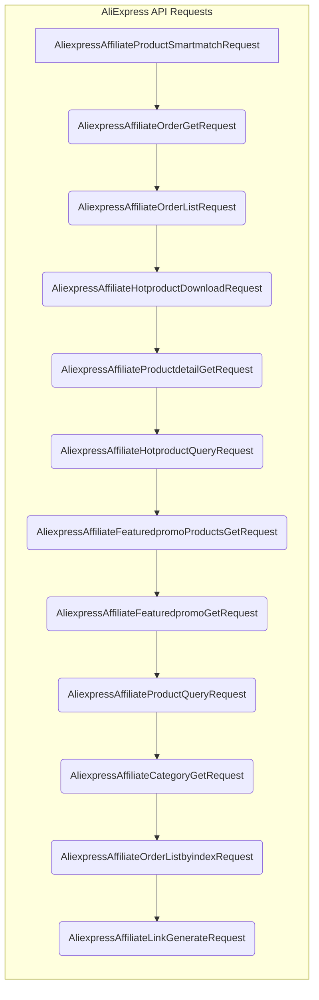

# Code Explanation for hypotez/src/suppliers/aliexpress/api/_examples/rest/__init__.py

## <input code>

```python
## \file hypotez/src/suppliers/aliexpress/api/_examples/rest/__init__.py
# -*- coding: utf-8 -*-\
#! venv/Scripts/python.exe # <- venv win
## ~~~~~~~~~~~~~\
""" module: src.suppliers.aliexpress.api._examples.rest """
from .AliexpressAffiliateProductSmartmatchRequest import AliexpressAffiliateProductSmartmatchRequest
from .AliexpressAffiliateOrderGetRequest import AliexpressAffiliateOrderGetRequest
from .AliexpressAffiliateOrderListRequest import AliexpressAffiliateOrderListRequest
from .AliexpressAffiliateHotproductDownloadRequest import AliexpressAffiliateHotproductDownloadRequest
from .AliexpressAffiliateProductdetailGetRequest import AliexpressAffiliateProductdetailGetRequest
from .AliexpressAffiliateHotproductQueryRequest import AliexpressAffiliateHotproductQueryRequest
from .AliexpressAffiliateFeaturedpromoProductsGetRequest import AliexpressAffiliateFeaturedpromoProductsGetRequest
from .AliexpressAffiliateFeaturedpromoGetRequest import AliexpressAffiliateFeaturedpromoGetRequest
from .AliexpressAffiliateProductQueryRequest import AliexpressAffiliateProductQueryRequest
from .AliexpressAffiliateCategoryGetRequest import AliexpressAffiliateCategoryGetRequest
from .AliexpressAffiliateOrderListbyindexRequest import AliexpressAffiliateOrderListbyindexRequest
from .AliexpressAffiliateLinkGenerateRequest import AliexpressAffiliateLinkGenerateRequest
```

## <algorithm>

This Python file acts as an **initializer** for a module related to AliExpress API interactions.  It primarily exports various classes related to different AliExpress REST API requests.  There's no discernible workflow within this file itself; it simply imports and makes available other modules.

Data Flow: The file does not involve any data processing or transformation; it only facilitates access to the defined API request classes.

## <mermaid>



**Explanation:** The mermaid diagram shows how the various request classes related to the AliExpress API are interconnected in terms of their potential dependencies. However, the absence of data flow arrows within this particular `__init__.py` file demonstrates that this file is fundamentally serving as a module exporter.

## <explanation>

**Imports:**

The file imports several modules from the `.` (current directory) sub-folder. This structure suggests a package (likely part of a larger project) dedicated to AliExpress API interaction. Each imported module likely defines a class representing a specific API request (e.g., `AliexpressAffiliateProductSmartmatchRequest`).  The use of the `. ` prefix indicates that these imported modules are directly within the same directory (`hypotez/src/suppliers/aliexpress/api/_examples/rest`) as this `__init__.py` file.  This is a standard Python package structure.

**Classes (Implied):**

While the file itself doesn't define classes, it imports numerous class definitions from the modules listed within the `.`.  Each imported class is assumed to represent a specific API request, containing methods for constructing the request, sending it, handling the response, and potentially handling any error conditions.

**Functions (Implied):**

There are no functions defined within this particular `__init__.py`. The functions likely exist in the modules imported from `.`, handling the construction and execution of the requests represented by the respective classes.

**Variables (None):**

There are no variables defined in this `__init__.py` file.

**Potential Errors/Improvements:**

* **Missing Docstrings:**  While the `""" module: ... """` docstring exists, adding more detailed docstrings to the classes imported from the sub-modules would be highly beneficial for understanding their usage.  The lack of detailed docstrings would be crucial for any maintainability or extensibility in the future.
* **Error Handling:**  Error handling for API requests (e.g., handling potential `requests` module exceptions) could be greatly improved in the respective API classes.
* **Type Hinting:** Using type hints (e.g., `from typing import ...`) within the imported modules will improve readability and robustness of the code, especially with the anticipated complexity of working with various types of API responses.
* **Dependency management (Implicit):** It's implied that the entire `aliexpress` package relies on libraries like the `requests` module for making HTTP requests.  Ensuring that the proper dependencies are managed is crucial for external compatibility.


**Relationships with other parts of the project:**

This module is part of a larger project related to data acquisition.  It presumably interacts with other parts of the `hypotez` project to receive/process/store AliExpress data, such as through a function call or by using `data` objects in the data source.