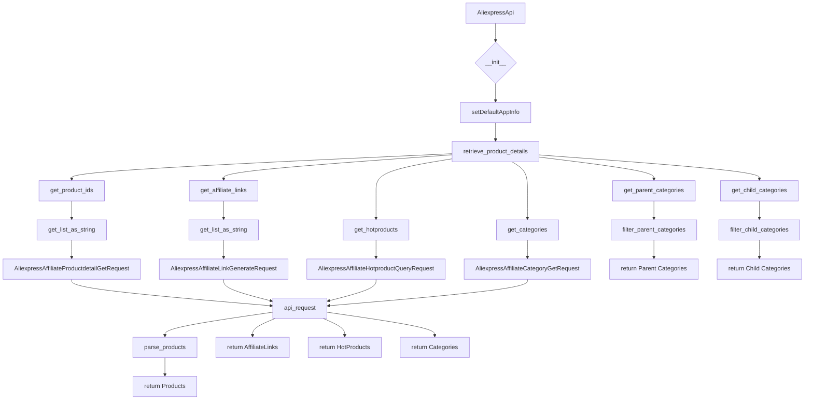
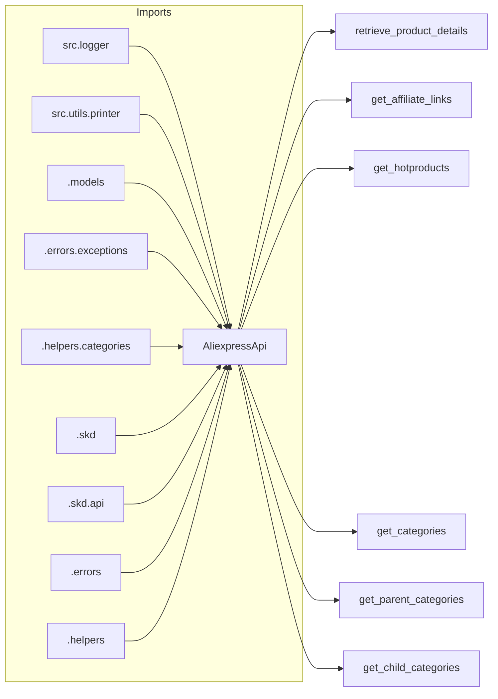

# AliExpress API Wrapper for Python

## <input code>

```python
# -*- coding: utf-8 -*-\
#! venv/Scripts/python.exe # <- venv win
## ~~~~~~~~~~~~~\
""" module: src.suppliers.aliexpress.api """
""" AliExpress API wrapper for Python
A simple Python wrapper for the AliExpress Open Platform API. This module allows
to get product information and affiliate links from AliExpress using the official
API in an easier way.
"""
from typing import List, Union

from src.logger import logger
from src.utils.printer import pprint

from .models import (
                    AffiliateLink as model_AffiliateLink,
                    Category as model_Category,
                    ChildCategory as model_ChildCategory,
                    Currency as model_Currency,
                    HotProductsResponse as model_HotProductsResponse,
                    Language as model_Language,
                    LinkType as model_LinkType,
                    Product as model_Product,
                    ProductType as model_ProductType,
                    SortBy as model_SortBy)

from .errors.exceptions import CategoriesNotFoudException
from .helpers.categories import filter_child_categories, filter_parent_categories
from .skd import setDefaultAppInfo
from .skd import api as aliapi
from .errors import ProductsNotFoudException, InvalidTrackingIdException
from .helpers import api_request, parse_products, get_list_as_string, get_product_ids
class AliexpressApi:
    """Provides methods to get information from AliExpress using your API credentials."""
    def __init__(self,
        key: str,
        secret: str,
        language: model_Language,
        currency: model_Currency,
        tracking_id: str = None,
        app_signature: str = None,
        **kwargs):
        self._key = key
        self._secret = secret
        self._tracking_id = tracking_id
        self._language = language
        self._currency = currency
        self._app_signature = app_signature
        self.categories = None
        setDefaultAppInfo(self._key, self._secret)
    # ... (other methods)
```

## <algorithm>



**Example:**
* `__init__`: Initializes the `AliexpressApi` object with API key, secret, language, currency, and optional tracking ID.
* `retrieve_product_details`: Retrieves product details based on product IDs, filters, and parameters.
* `get_affiliate_links`: Generates affiliate links for given URLs.
* `get_hotproducts`: Finds hot products based on various filters.
* `get_categories`, `get_parent_categories`, `get_child_categories`: Retrieves categories and sub-categories.


## <mermaid>



**Dependencies Analysis:**

The mermaid code visualizes the import relationships. The `AliexpressApi` class in `hypotez/src/suppliers/aliexpress/api/api.py` depends on modules from `src.logger`, `src.utils.printer`, various modules from `.models`, `.errors`, `.helpers`, and `.skd` within the same `aliexpress` package. This indicates a structured dependency within the project, where AliExpress-specific functionalities are grouped.


## <explanation>

**Imports:**

*   `from typing import List, Union`: Provides type hints for better code readability and maintainability, defining `List` and `Union` types.
*   `from src.logger import logger`: Imports a logging facility for handling and recording events. This suggests the existence of a logging framework (`src.logger`) for centralized logging throughout the project.
*   `from src.utils.printer import pprint`: Imports a function for pretty printing data. Likely for debugging or displaying structured output.
*   `from .models import ...`: Imports various models defining data structures specific to AliExpress API interactions.
*   `from .errors.exceptions import ...`: Imports custom exceptions related to categories.
*   `from .helpers.categories import ...`: Imports helper functions for managing categories.
*   `from .skd import setDefaultAppInfo, api as aliapi`: Imports functions and the `api` module for communication with the AliExpress API. The `setDefaultAppInfo` likely configures the API client.  Import `api` as `aliapi` suggesting the `api` module provides the necessary AliExpress API interaction functions.
*   `from .errors import ...`: Imports exceptions related to AliExpress API responses, such as `ProductsNotFoudException` and `InvalidTrackingIdException`.
*   `from .helpers import ...`: Imports general helper functions (`api_request`, `parse_products`, `get_list_as_string`, `get_product_ids`) used throughout the AliExpress API interactions.

**Classes:**

*   `AliexpressApi`: This is the core class providing methods for interacting with the AliExpress API. Attributes include API key, secret, language, currency, and a `categories` attribute (potentially caching category data). Methods handle different API calls like retrieving product details, affiliate links, hot products, and categories.

**Functions:**

*   `__init__`: Initializes the `AliexpressApi` object with essential information and sets up the API client.  It takes the API key, secret, and settings for language, currency, and tracking ID as input.

*   `retrieve_product_details`, `get_affiliate_links`, `get_hotproducts`, `get_categories`, `get_parent_categories`, `get_child_categories`: These are the primary methods for different API requests. They accept various parameters (product IDs, categories, filters), construct API requests using `aliapi`, and return the parsed results or raise exceptions as appropriate.

**Variables:**

*   `_key`, `_secret`, `_tracking_id`, `_language`, `_currency`, `_app_signature`:  Store API credentials and settings.

**Potential Errors and Improvements:**

*   **Exception Handling:** While the code has `try...except` blocks, the error handling can be more specific and informative.  Detailed logging messages are helpful for debugging.  More descriptive exception messages would be more helpful for the calling applications.
*   **Input Validation:**  Input validation (e.g., checking the type and format of `product_ids`, `links`, etc.) could prevent unexpected behavior.  The API might return inconsistent results for invalid inputs.
*   **Rate Limiting:**  The code does not handle rate limits imposed by the AliExpress API. Implementing mechanisms for handling and retrying requests would be essential for production use.
*   **Caching:** The `get_categories`, `get_parent_categories`, `get_child_categories` methods use a cache for categories.  This is excellent.


**Relationship Chain:**

The code clearly demonstrates a modular design.  The `AliexpressApi` interacts with functions in `.helpers`, which in turn interact with `ali-api` functions.  The `src.logger` and `src.utils.printer` are external to the `aliexpress` package, indicating a generalized structure for logging and output handling that applies to other parts of the project. The dependency chain follows a hierarchical structure, with general utilities separated from the specific API interactions.