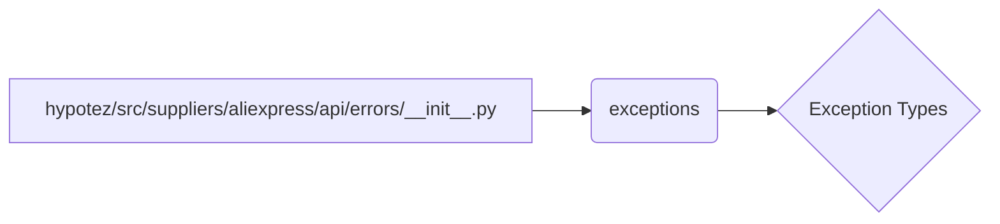

# <input code>

```python
## \file hypotez/src/suppliers/aliexpress/api/errors/__init__.py
# -*- coding: utf-8 -*-\
 # <- venv win
## ~~~~~~~~~~~~~\
""" module: src.suppliers.aliexpress.api.errors """
from .exceptions import *
```

# <algorithm>

The code is a Python module file (`__init__.py`) which likely belongs to a larger project structure. It's within a directory hierarchy (`hypotez/src/suppliers/aliexpress/api/errors`) suggesting it's responsible for handling exceptions related to the AliExpress API.

The workflow is simple: it imports all the classes and functions defined within the `exceptions` submodule. This allows other modules (and potentially code in other files within the same project directory) to use those error types without needing to import them directly from the submodule.

**Block Diagram (Simplified):**

```
+-----------------+
|  __init__.py    |
+-----------------+
     |
     V
+-----------------+
|  exceptions.py |
+-----------------+
     | (Import)
     V
+-----------------+
| Exception Types |
+-----------------+
```

**Example Data Flow:**

The `__init__.py` file does not perform any actions or calculations itself; its only function is to make the functionality of `exceptions.py` available for use in other modules.


# <mermaid>



**Dependencies Analysis:**

The only dependency is the `exceptions` submodule, which the `__init__.py` file is importing. This indicates that the `exceptions.py` file (not shown in this snippet) defines the actual exception classes and potentially related functions for the AliExpress API errors.


# <explanation>

* **Imports:**
    * `from .exceptions import *`: This statement imports all symbols (classes, functions, etc.) from the `exceptions` submodule within the same directory (`hypotez/src/suppliers/aliexpress/api/errors/`).   The `.` is used for relative imports. This is a common practice to avoid needing explicit path specifications within the `exceptions` module.


* **Classes (Implicit):**
    * The code implicitly relies on exception classes defined in `exceptions.py`.  These will likely be custom exception types (e.g., `AliExpressAPIError`, `InvalidCredentialsError`, `RateLimitExceededError`) specific to the AliExpress API interactions, allowing for specific error handling in the calling code.


* **Functions (None):**
    * The file itself does not contain any functions. Its sole purpose is to make the error classes from `exceptions.py` available as imports.


* **Variables (None):**
    * There are no variables defined in this file.


* **Potential Errors/Improvements:**

    * **Lack of explicit exceptions:** It imports all from the `exceptions` submodule. Although concise, it's considered a style-related less-preferred approach to importing for large `exceptions` files, especially when specific exceptions need to be used directly.  Consider a more selective import if there are many error classes.
    * **Docstrings:** Adding docstrings to the classes (or a module docstring in the exceptions file) would significantly improve code documentation.


* **Relationship to other parts of the project:**

    * This file is part of a larger system related to API interactions (e.g., handling AliExpress-specific API errors, integrating with other modules in the `hypotez` project that call AliExpress's API).  Error handling in `hypotez/src/suppliers` may be common to other APIs (such as `amazon`, `ebay`), where custom exceptions are crucial for debugging and maintainability. The structure suggests other parts of the project interact with the AliExpress API and expect error handling based on the classes imported in this file.

```