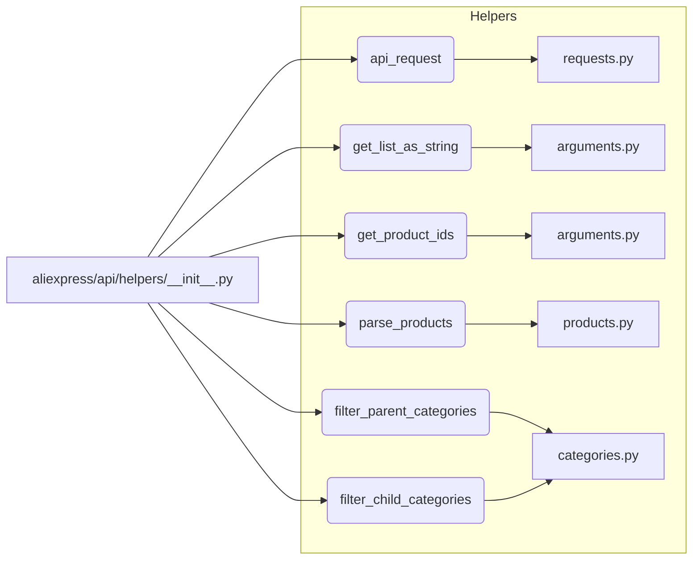

# Code Explanation for hypotez/src/suppliers/aliexpress/api/helpers/__init__.py

## <input code>

```python
## \file hypotez/src/suppliers/aliexpress/api/helpers/__init__.py
# -*- coding: utf-8 -*-\
#! venv/Scripts/python.exe # <- venv win
## ~~~~~~~~~~~~~\
""" module: src.suppliers.aliexpress.api.helpers """
from .requests import api_request
from .arguments import get_list_as_string, get_product_ids
from .products import parse_products
from .categories import filter_parent_categories, filter_child_categories
```

## <algorithm>

This file appears to be an initialization module for a set of helper functions and classes related to interacting with the AliExpress API.  It acts as an entry point for using the various helpers.

There's no explicit algorithm workflow in the code shown, as it only imports modules. The workflow would depend on how the modules in `aliexpress/api/helpers` are used in a larger application.  The import statements indicate the modules they want to pull in.


## <mermaid>



**Dependencies Analysis:**

The `graph LR` diagram shows that the `__init__.py` file imports functions and classes from its submodules (`requests.py`, `arguments.py`, `products.py`, `categories.py`).  These submodules likely contain the actual implementations of the helper functions.  The diagram depicts these dependencies in a straightforward fashion.

## <explanation>

### Imports:

* `from .requests import api_request`: Imports the `api_request` function, presumably for making API calls to AliExpress. The `.requests` likely contains the necessary code to handle API communication.
* `from .arguments import get_list_as_string, get_product_ids`: Imports functions for parsing and preparing data for API calls, probably handling input arguments for queries.  The `.arguments` module deals with data preprocessing steps.
* `from .products import parse_products`: Imports a function to parse product data retrieved from the API.  This module (`products.py`) would likely be handling the actual parsing of the API responses.
* `from .categories import filter_parent_categories, filter_child_categories`: Imports functions for filtering product categories, which is a common task in e-commerce APIs.  The `.categories` module probably contains logic for filtering the categories.

The imports all come from subdirectories within the `aliexpress/api/helpers` directory, which suggests a modular design to facilitate organization and reusability of the helper functions.

### Classes (None explicitly shown):

No classes are defined in the provided code.

### Functions (Implied):

The imports suggest the existence of functions (`api_request`, `get_list_as_string`, `get_product_ids`, `parse_products`, `filter_parent_categories`, `filter_child_categories`) within the respective submodules.  Their functionality will need to be inspected in their respective files for a comprehensive understanding.  Without those, it is impossible to fully explain them.


### Variables (None explicitly shown):

No variables are declared in the code.

### Potential Errors/Improvements:

* **Error Handling:** The code lacks error handling.  The absence of `try...except` blocks means that exceptions raised by the imported functions would propagate without being caught, potentially leading to crashes.  Robust error handling is crucial in production-level code.
* **Missing Docstrings:**  No docstrings are present in the code.  Adding docstrings to clarify the purpose, arguments, and return values of the functions would significantly improve code readability and maintainability.
* **Venv Specificity:** The `#! venv/Scripts/python.exe # <- venv win` line is highly platform-specific (Windows). It's generally better practice to make code as platform-agnostic as possible.


### Relationships with Other Parts of the Project:

This file acts as a module that likely aids in various parts of a project involving AliExpress API interaction.  The code that utilizes the `api_request`, `get_list_as_string`, and other functions within `aliexpress/api/helpers` will be responsible for combining and calling the functions and classes defined within its respective submodules.  The exact use cases are not shown in this example code.