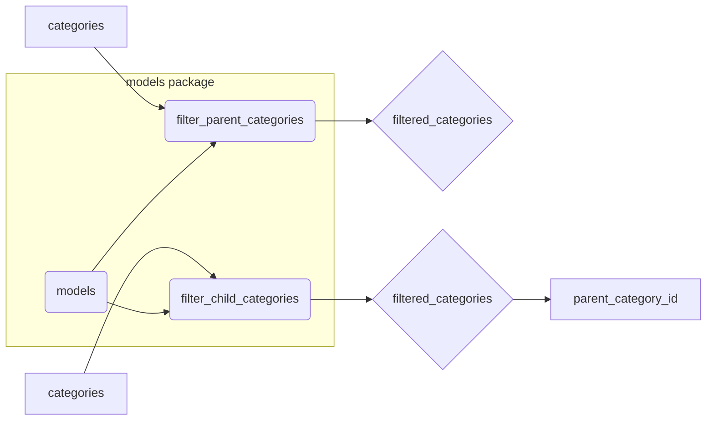

# Code Explanation for `hypotez/src/suppliers/aliexpress/api/helpers/categories.py`

## <input code>

```python
## \file hypotez/src/suppliers/aliexpress/api/helpers/categories.py
# -*- coding: utf-8 -*-\
 # <- venv win
## ~~~~~~~~~~~~~\
""" module: src.suppliers.aliexpress.api.helpers """

"""  функции для фильтрации категорий и подкатегорий API Aliexpress"""
from typing import List, Union
from .. import models
#from src.suppliers.aliexpress.api.api import models

def filter_parent_categories(categories: List[models.Category | models.ChildCategory]) -> List[models.Category]:
    """
    Filters and returns a list of categories that do not have a parent category.

    @param categories: List of category or child category objects.
    @return: List of category objects without a parent category.
    """
    filtered_categories = []
    
    if isinstance(categories, (str, int, float)):
        categories = [categories]  # Convert to list if a single non-category value is passed.

    for category in categories:
        if not hasattr(category, 'parent_category_id'):
            filtered_categories.append(category)

    return filtered_categories

def filter_child_categories(categories: List[models.Category | models.ChildCategory],
                            parent_category_id: int) -> List[models.ChildCategory]:
    """
    Filters and returns a list of child categories that belong to the specified parent category.

    @param categories: List of category or child category objects.
    @param parent_category_id: The ID of the parent category to filter child categories by.
    @return: List of child category objects with the specified parent category ID.
    """
    filtered_categories = []
    
    if isinstance(categories, (str, int, float)):
        categories = [categories]  # Convert to list if a single non-category value is passed.

    for category in categories:
        if hasattr(category, 'parent_category_id') and category.parent_category_id == parent_category_id:
            filtered_categories.append(category)

    return filtered_categories
```

## <algorithm>

**filter_parent_categories:**

1. Takes a list of `Category` or `ChildCategory` objects.
2. If input `categories` is not a list (but a string, int, or float), converts it to a single-element list.
3. Iterates through each `category` in the input list.
4. Checks if the `category` object has a `parent_category_id` attribute.
5. If the `parent_category_id` attribute is absent, appends the `category` to `filtered_categories`.
6. Returns the `filtered_categories` list, containing only the categories without a parent.


**Example:**

Input: `categories = [Category(id=1, parent_category_id=None), ChildCategory(id=2, parent_category_id=1), Category(id=3, parent_category_id=4)]`

Output: `[Category(id=1, parent_category_id=None), Category(id=3, parent_category_id=4)]`


**filter_child_categories:**

1. Takes a list of `Category` or `ChildCategory` objects and a `parent_category_id`.
2. If input `categories` is not a list (but a string, int, or float), converts it to a single-element list.
3. Iterates through each `category` in the input list.
4. Checks if the `category` object has a `parent_category_id` attribute.
5. Checks if the `category`'s `parent_category_id` matches the input `parent_category_id`.
6. If both conditions are true, appends the `category` to `filtered_categories`.
7. Returns the `filtered_categories` list, containing only the child categories with the matching parent ID.


**Example:**

Input: `categories = [Category(id=1, parent_category_id=None), ChildCategory(id=2, parent_category_id=1), ChildCategory(id=3, parent_category_id=4), ChildCategory(id=4, parent_category_id=1)], parent_category_id=1`

Output: `[ChildCategory(id=2, parent_category_id=1), ChildCategory(id=4, parent_category_id=1)]`


## <mermaid>



**Explanation of Dependencies and Diagram:**

The diagram shows the relationship between input data (`categories`) and the functions `filter_parent_categories` and `filter_child_categories`. The dependencies are handled through import statements in the python code. The `models` package is the dependency that provides objects (classes) `Category` and `ChildCategory`.


## <explanation>

**Imports:**

- `from typing import List, Union`: Imports necessary typing information for type hinting. `List` defines that the function expects a list of category objects and `Union` defines that the function expects a list of `models.Category` or `models.ChildCategory` objects. This improves code readability and maintainability by explicitly defining the expected types of parameters and return values.
- `from .. import models`: Imports the `models` module from the parent's parent directory (`src.suppliers.aliexpress.api.models`). This is a relative import, indicating that the `models` module is located in the parent directory.  The `..` indicates moving up two levels in the directory structure. This is a good way to structure code for maintainability and to avoid absolute import paths that become brittle when code is moved. This also shows the dependency of this file on `models` package.


**Classes (implied):**

The code interacts with `models.Category` and `models.ChildCategory` classes, which are assumed to be defined elsewhere in the project (`src/suppliers/aliexpress/api/models`). These classes likely define the structure and attributes (like `id`, `parent_category_id`) of categories and child categories, enabling the filters to work.  

**Functions:**

- `filter_parent_categories(categories: List[models.Category | models.ChildCategory]) -> List[models.Category]`:
    - Takes a list of category or child category objects.
    - Handles cases where the input is not a list (string, int, or float) by converting it to a single-element list.
    - Filters the input list to return only the categories that don't have a parent category.
    - **Example Usage:** `filtered_categories = filter_parent_categories([category1, category2, category3])`
- `filter_child_categories(categories: List[models.Category | models.ChildCategory], parent_category_id: int) -> List[models.ChildCategory]`:
    - Takes a list of category or child category objects and a parent category ID.
    - Handles cases where the input is not a list (string, int, or float) by converting it to a single-element list.
    - Filters the input list to return only the child categories that belong to the specified parent category.
    - **Example Usage:** `filtered_categories = filter_child_categories([category1, category2, category3], 123)`


**Variables:**

- `filtered_categories`: A list to store the filtered categories.

**Potential Errors/Improvements:**

- **Robustness:** The code handles cases where the input `categories` is not a list. However, it could be made even more robust by checking if the input is actually a list of `Category` or `ChildCategory` objects, preventing unexpected behavior if a completely unrelated object is passed.
- **Type Checking:** While type hinting is used, the code could benefit from more comprehensive type checking to ensure that the input data conforms to the expected types.
- **Error Handling:**  Consider adding error handling to gracefully manage situations where a `category` object might not have the expected attributes, preventing cryptic errors later in the code.  For instance, a `TypeError` might occur if a `category` lacks the `parent_category_id`.


**Relationships with other parts of the project:**

This file heavily relies on the `models` module, which likely defines the `Category` and `ChildCategory` classes.  This relationship is clearly indicated in the imports and the code's functionality.  The `filter_` functions are part of the API helper layer and would be called by other components of the Aliexpress supplier module to process the data from the API.