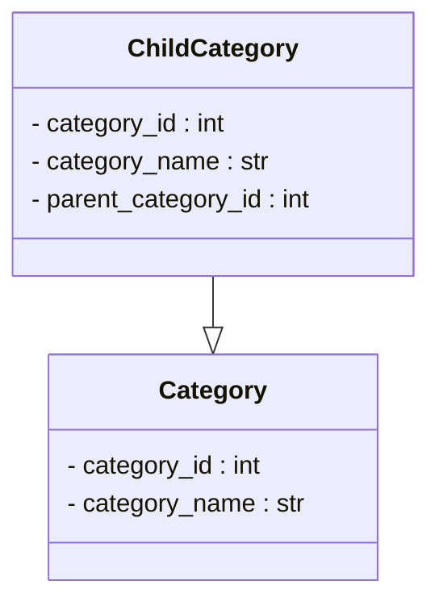

## <input code>

```python
## \file hypotez/src/suppliers/aliexpress/api/models/category.py
# -*- coding: utf-8 -*-\
 # <- venv win
## ~~~~~~~~~~~~~\
""" module: src.suppliers.aliexpress.api.models """
class Category:
    category_id: int
    category_name: str


class ChildCategory(Category):
    parent_category_id: int
```

## <algorithm>

This code defines two classes, `Category` and `ChildCategory`, likely representing categories and sub-categories on AliExpress.  There's no logic or data manipulation within the classes themselves; they only define the structure of the data.  A `ChildCategory` is a specialized `Category`, inheriting from it and adding an attribute for the parent category ID.

**Step-by-Step Workflow Diagram:**

1. **`Category` Class Definition:** Defines the structure for a basic category.
2. **`ChildCategory` Class Definition:** Defines the structure for a child category, which inherits from `Category` and adds a `parent_category_id` attribute.

**Data Flow:**

There is no specific data flow as there are no methods or functions within the classes.  The classes simply describe the structure for storing data about categories.  Data will likely be populated by other parts of the code (e.g., methods loading data from APIs) and used elsewhere in the project.

## <mermaid>



**Dependencies Analysis:**

The mermaid code only shows the relationship between classes and doesn't describe import dependencies.  This code directly defines these classes and doesn't import any external libraries or modules.


## <explanation>

* **Imports:** There are no imports.  This file defines classes related to AliExpress categories.  Import statements will likely exist elsewhere in the project to handle data retrieval and manipulation (e.g., from APIs).

* **Classes:**
    * **`Category`:**  Represents a general category.  It has two attributes:
        * `category_id`: An integer representing the unique identifier of the category.
        * `category_name`: A string representing the name of the category.

    * **`ChildCategory`:** Represents a category that is a sub-category of another category.
        * `category_id`: An integer representing the unique identifier of the category.
        * `category_name`: A string representing the name of the category.
        * `parent_category_id`: An integer representing the ID of the parent category.  It inherits all attributes of `Category`.

* **Functions:** There are no functions.

* **Variables:** There are no variables.  The `category_id`, `category_name`, and `parent_category_id` are attributes of the classes and are implicitly variables.


* **Potential Errors/Improvements:**
    * **Missing Data Loading/Usage:**  This code only defines data structures.  There's no code to populate these categories with actual data from an AliExpress API or other source. Methods to load, fetch, and handle these categories are essential.
    * **Missing Data Validation:** No validation (e.g., checking data types, ensuring `category_id` is positive, and handling potential `None` values) is implemented.
    * **Type Hinting:** The use of type hinting (`category_id: int`, `category_name: str`) is good practice. However, type hinting itself won't enforce validation or data constraints.

**Relationship Chain:**

This file (`hypotez/src/suppliers/aliexpress/api/models/category.py`) defines the data structures for representing AliExpress categories.  Other parts of the project (e.g., functions in `src.suppliers.aliexpress.api.controllers`) will likely use these classes to work with AliExpress API data, potentially storing and retrieving category information.


**Example Usage (IlluStartive, not in the code):**


```python
# Example (IlluStartive)
from hypotez.src.suppliers.aliexpress.api.models.category import Category, ChildCategory


# Creating Category instances
electronics = Category(category_id=1, category_name="Electronics")
smartphones = ChildCategory(category_id=2, category_name="Smartphones", parent_category_id=1)


print(smartphones.category_name)
```
This example demonStartes how these classes might be instantiated and used in a larger project.  The `from` statement would need the correct path to the file, and methods for loading the `category_id` and `category_name` data from an API or database are missing.