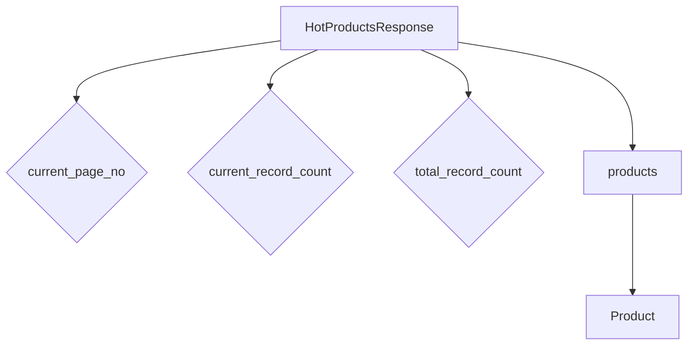

# <input code>

```python
## \file hypotez/src/suppliers/aliexpress/api/models/hotproducts.py
# -*- coding: utf-8 -*-
#! venv/Scripts/python.exe # <- venv win
## ~~~~~~~~~~~~~\
""" module: src.suppliers.aliexpress.api.models """
from .product import Product
from typing import List


class HotProductsResponse:
    current_page_no: int
    current_record_count: int
    total_record_count: int
    products: List[Product]
```

# <algorithm>



**Example Data Flow:**

1. `HotProductsResponse` object is created.
2. `current_page_no`, `current_record_count`, `total_record_count` are assigned integer values. For example:
   ```python
   response = HotProductsResponse(current_page_no=1, current_record_count=10, total_record_count=100, products=[...])
   ```
3. The `products` attribute is populated with a list of `Product` objects.  Each `Product` object contains details like `id`, `name`, `price`, etc.


# <mermaid>

```mermaid
graph LR
    subgraph "HotProductsResponse Class"
        A[HotProductsResponse] --> B(current_page_no);
        A --> C(current_record_count);
        A --> D(total_record_count);
        A --> E(products);
    end
    subgraph "Dependencies"
        E --> F[Product];
        F -- "from .product import Product" --> G[Product class];
        G -- "src.suppliers.aliexpress.api.models" --> H[Package];
        "from typing import List" --> I[typing module];
    end
```

**Explanation of Dependencies:**

* **`from .product import Product`**: This imports the `Product` class from a file named `product.py` located within the same directory (`./product.py`).  Crucially, the `.` indicates a relative import, which means `product.py` is part of the `aliexpress` api model folder structure.  This demonStartes a clear dependency relationship within the `aliexpress` API model package.
* **`from typing import List`**: This imports the `List` type from the Python standard library's `typing` module. This is used for type hinting and is critical for code clarity and maintainability within this project.


# <explanation>

* **Imports:**
    * `from .product import Product`: This line imports the `Product` class from a sibling file (likely `product.py`) within the same directory.  It's a relative import, which keeps the code organized and avoids naming conflicts.  It's an essential part of the package structure.
    * `from typing import List`: This imports the `List` type from the `typing` module, allowing the use of type hints for the `products` attribute of the `HotProductsResponse` class, improving code readability and maintainability.

* **Classes:**
    * `HotProductsResponse`: This class represents a response from the AliExpress API, containing information about a list of hot products.  It has attributes to store the current page number (`current_page_no`), the number of products on the current page (`current_record_count`), the total number of products (`total_record_count`), and a list of `Product` objects (`products`).  This class structure directly reflects the expected data format from the API calls, making the code maintainable and readable.

* **Functions (None):**  There are no functions defined in this file.

* **Variables (None):** There are no variables defined outside of the class structure.

* **Potential Errors/Improvements:**
    * **Missing Initialization:** The code lacks a `__init__` method.  A `__init__` method should be included to properly initialize the attributes of the `HotProductsResponse` class when an object is created (e.g., `response = HotProductsResponse(...)`). This is crucial to avoid unexpected behavior.
    * **Type Validation:** Adding checks to ensure that the assigned values for `current_page_no`, `current_record_count`, and `total_record_count` are valid integers is a good practice to prevent unexpected behavior.


**Relationship with other parts of the project:**

The `HotProductsResponse` class relies on the `Product` class, demonStarting a clear dependency.  The `Product` class, not present in this code snippet, would likely define attributes representing product data such as ID, name, price, etc.  This structure implies a deeper project structure, where `Product` is defined elsewhere, possibly in the same folder or a nested subfolder. The `HotProductsResponse` class acts as a container for data retrieved from AliExpress, and its role is to structure and present that data in a reusable format within the project.