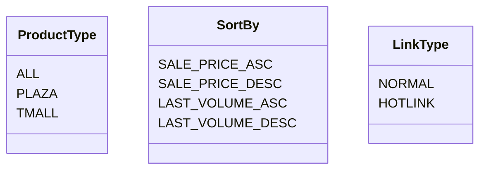

# <input code>

```python
## \file hypotez/src/suppliers/aliexpress/api/models/request_parameters.py
# -*- coding: utf-8 -*-
 # <- venv win
## ~~~~~~~~~~~~~\
""" module: src.suppliers.aliexpress.api.models """
class ProductType:
    ALL = 'ALL'
    PLAZA = 'PLAZA'
    TMALL = 'TMALL'

class SortBy:
    SALE_PRICE_ASC = 'SALE_PRICE_ASC'
    SALE_PRICE_DESC = 'SALE_PRICE_DESC'
    LAST_VOLUME_ASC = 'LAST_VOLUME_ASC'
    LAST_VOLUME_DESC = 'LAST_VOLUME_DESC'

class LinkType:
    NORMAL = 0
    HOTLINK = 2
```

# <algorithm>

The code defines three classes, `ProductType`, `SortBy`, and `LinkType`, each containing constant values.  No data flow or processing occurs within these classes themselves. They are simply containers for defining constants that are likely to be used in other parts of the codebase for specifying product types, sorting criteria, and link types within the AliExpress API interactions.

**Flow Diagram:**

```
+-----------------+
|   ProductType   |
+-----------------+
|   ALL           |  
|   PLAZA         |
|   TMALL         |
+-----------------+
         ^
         |
+-----------------+
|     SortBy      |
+-----------------+
| SALE_PRICE_ASC |
| SALE_PRICE_DESC |
| LAST_VOLUME_ASC |
| LAST_VOLUME_DESC |
+-----------------+
         ^
         |
+-----------------+
|   LinkType     |
+-----------------+
|   NORMAL        |
|   HOTLINK       |
+-----------------+
```

# <mermaid>



# <explanation>

* **Imports:** There are no imports in this code.  This is a file containing constants which other parts of the program can refer to.

* **Classes:**
    * **`ProductType`:** Represents possible product types (e.g., ALL, PLAZA, TMALL).  Each constant value is a string.  These likely correspond to filtering options available within the AliExpress API.

    * **`SortBy`:** Specifies possible sorting criteria for product lists (e.g., price ascending/descending, volume ascending/descending).  These constant string values are used to order results from the API.

    * **`LinkType`:** Defines types of links.  This is likely used for different types of product listings or API results.

* **Functions:** There are no functions.  Only classes and constants are defined.

* **Variables:** No variables are declared.

* **Potential Errors/Improvements:**
    * **Clarity:** The docstring for each constant could be enhanced to provide a more detailed description of each constant's intended use in the system.
    * **Type Hinting:** For robust type checking, consider using type hints.  Adding type hints will increase readability and maintainability, as it conveys the type expected by each class attribute, further improving clarity.

* **Relationships:** This file acts as a definition of important constants for the `aliexpress` API module. The contents of this file will be used by other modules in the project (e.g., for making API requests and filtering results) to specify the desired attributes to the API calls.  It's part of the "data model" of the `aliexpress` supplier module.