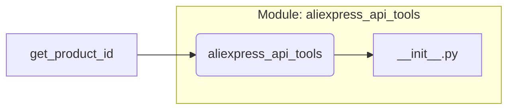

# <input code>

```python
## \file hypotez/src/suppliers/aliexpress/api/tools/__init__.py
# -*- coding: utf-8 -*-
#! venv/Scripts/python.exe # <- venv win
## ~~~~~~~~~~~~~
""" module: src.suppliers.aliexpress.api.tools """
from .get_product_id import get_product_id
```

# <algorithm>

This file appears to be an initialization file for a module within a larger Python project.  It primarily serves to expose functionality from other modules within the `hypotez/src/suppliers/aliexpress/api/tools` package.


There's no complex algorithm or workflow depicted in this `__init__.py` file. It only imports a function from a submodule.

**Data Flow:**

There is no explicit data flow in this file. It acts as a simple namespace import.

**Example:**

None applicable (No significant data manipulation in this file).


# <mermaid>



**Explanation of Dependencies:**

The mermaid diagram shows a single dependency: `get_product_id` from the `aliexpress_api_tools` package. This `__init__.py` file simply makes this function available for import in other parts of the application, using relative import.  There are no external dependencies beyond the direct import.


# <explanation>

* **Imports**:

   - `from .get_product_id import get_product_id`: This line imports the `get_product_id` function from the `get_product_id.py` file within the `aliexpress_api_tools` submodule. The `.get_product_id` part indicates a relative import, meaning it searches for the `get_product_id` module within the same package/directory hierarchy.

* **Classes**:

   - There are no classes defined in this file.

* **Functions**:

   - This file does not define any new functions. It simply imports a function.

* **Variables**:

   - There are no variables defined in this file.


* **Potential Errors/Improvements:**

   - The `#! venv/Scripts/python.exe` line is a shebang, often used to specify an interpreter when the script is run from a shell. It appears to be a Windows-specific shebang.  It's generally good practice to verify that this shebang points to the correct python executable in the virtual environment.

   -  While this code is functionally correct, a brief docstring would enhance clarity by explaining why this module imports that function (`get_product_id`), and what it is designed to provide (ex: to be a utility for providing product ids).


* **Relationships with other parts of the project:**

   - This `__init__.py` file acts as an entry point for the `get_product_id` function, allowing other parts of the `hypotez` project (potentially within the `aliexpress` module or other submodules) to access and use it.  It facilitates the modular structure of the project.  There will almost certainly be more `.py` files (e.g., `get_product_id.py`, likely containing the `get_product_id` function and dependent libraries) in the specified `aliexpress/api/tools` directory.


In summary, this `__init__.py` file is a basic, well-formed Python module initialization file. It sets the stage for using the `get_product_id` function.  The shebang comment is likely only needed for running the file from a shell/command prompt in Windows.