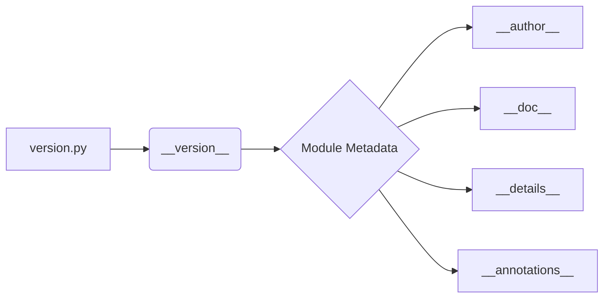

# Code Explanation for hypotez/src/suppliers/aliexpress/api/version.py

## <input code>

```python
## \file hypotez/src/suppliers/aliexpress/api/version.py
# -*- coding: utf-8 -*-\
 # <- venv win
## ~~~~~~~~~~~~~\
""" module: src.suppliers.aliexpress.api """

"""
- `__version__`: This variable holds the version of the module or package.
- `__name__`: Contains the name of the module. If the script is being run directly, the value will be `"__main__"`.
- `__doc__`: The module's documentation string.
- `__details__`: This variable likely contains additional details about the module, but the exact purpose depends on the specific module or package.
- `__annotations__`: Contains type annotations for variables and functions in the module.
- `__author__`: The name(s) of the author(s) of the module.
"""
__name__:str
__version__="3.12.0.0.0.4"
__doc__:str
__details__:str="Details about version for module or class"
__annotations__

__author__='hypotez '
```

## <algorithm>

This code snippet defines a Python module, likely part of a larger project structure.  It sets variables related to the module's metadata, such as version, author, and a docstring.  There's no discernible algorithm or workflow as there are no functions or complex logic.  The data flow is static, consisting of assigning strings to the metadata variables.


## <mermaid>



**Dependencies:**

The mermaid diagram depicts the fundamental metadata variables within the file. No external dependencies are apparent from the code snippet.

## <explanation>

**Imports:**

There are no imports in this code.  This is a module definition, setting attributes of the module rather than using functions or classes from other modules.

**Classes:**

There are no classes defined.

**Functions:**

There are no functions defined.

**Variables:**

* `__version__`: A string literal representing the version of the module (e.g., "3.12.0.0.0.4").
* `__name__`: A string variable which will have value `__main__` when run directly, though the code itself doesn't show this usage, only declaration.  The declaration is a variable annotation, stating it is of string type.
* `__doc__`: A string variable that holds the docstring or documentation for the module.
* `__details__`: A string variable containing more descriptive detail (likely about the version).
* `__annotations__`: Variable declared for annotations, but not assigned any value.
* `__author__`: A string variable containing the author's name or names.


**Potential Errors or Areas for Improvement:**

* **Missing `__init__.py`:**  This code snippet is missing a required `__init__.py` file in the `hypotez/src/suppliers/aliexpress/api` directory. If this file isn't there, Python won't recognize this directory as a package.  To rectify this, a file named `__init__.py` (usually empty) would be needed within the specified directory.
* **Docstring improvements:** While the docstrings are present, they could be more comprehensive, explaining the purpose and usage of the module/class.
* **Type hinting:**  The `__annotations__` variable is declared but not used.  Using type hints (`__version__: str`) would make the code more readable and robust, and allow for static analysis tools to check the types during development.


**Relationships with Other Project Components:**

This module likely serves as part of a larger project dealing with AliExpress API interactions. It defines the versioning for a potential API client or related functionality.  The specific relationship will depend on how this `version.py` module is imported and used in other files within the `aliexpress` package, and the `hypotez` project as a whole.  This project likely makes use of a versioning scheme for components and perhaps uses this `version.py` module for dependency management or metadata retrieval.

```