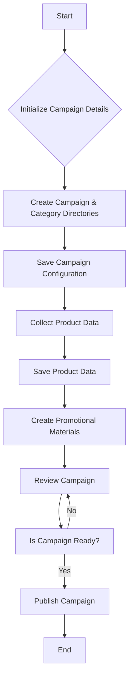

# AliExpress Campaign Creation

## <input code>

```
<pre>
+-------------------------+
| Start                   |
| Создание рекламной      |
| кампании                |
+-----------+-------------+
            |
            v
+-----------+---------------+
| Initialize Campaign Name, |
| Language, and Currency    |
+-----------+---------------+
            |
            v
+-----------+-------------+
| Create Campaign and     |
| Category Directories    |
+-----------+-------------+
            |
            v
+-----------+-----------------+\n
| Save Campaign Configuration |
+-----------+-----------------+\n
            |
            v
+-----------+-------------+
| Collect Product Data    |
+-----------+-------------+
            |
            v
+-----------+-------------+
| Save Product Data       |
+-----------+-------------+
            |
            v
+-----------+------------------+
| Create Promotional Materials |
+-----------+------------------+
            |
            v
+-----------+-------------+
| Review Campaign         |
+-----------+-------------+
            |
            v
+-----------+-------------+
| Is Campaign Ready?      |
+-----------+-------------+
   | Yes / No
   v      v
+-----------+-------------+
| Publish Campaign        |
+-----------+-------------+
   |
   v
+-----------+-------------+
| End                     |
| Создание рекламной      |
| кампании                |
+-------------------------+
</pre>
```

## <algorithm>

This flowchart outlines the process of creating an AliExpress advertising campaign.  It's a high-level overview and doesn't specify the exact implementation details.

**Step 1: Start** - The process begins.

**Step 2: Initialize Campaign Details** -  The campaign name, language, and currency are defined.  Example:  `Campaign Name: "Summer Sale," Language: "English," Currency: "USD"`

**Step 3: Create Campaign and Category Directories** -  The necessary directories or files for the campaign are established. Example:  A folder structure is created on the file system to hold campaign assets.

**Step 4: Save Campaign Configuration** - The initialized campaign details are saved. Example: Data is written to a database or configuration file.

**Step 5: Collect Product Data** -  Data related to the products to be promoted within the campaign is gathered. Example:  Product IDs, descriptions, images, and prices are fetched from an inventory system.

**Step 6: Save Product Data** - The collected product data is stored. Example: Data is written to a database table dedicated to campaign products.

**Step 7: Create Promotional Materials** -  Graphics, banners, and other promotional assets are generated or selected. Example: Images and descriptions are tailored to attract customers.

**Step 8: Review Campaign** -  A review process confirms the campaign's components are ready. Example:  A human or system review assesses the quality and completeness of all campaign components.

**Step 9: Is Campaign Ready?** - A check to determine if the campaign is complete and ready for publishing. Example: A boolean flag signals "Yes" if everything is in place, otherwise "No" triggering a loop back to a previous step for corrections.

**Step 10: Publish Campaign** - The campaign is made live on the platform, ready for marketing efforts.  Example: API calls are made to publish the campaign to the relevant platform.

**Step 11: End** - The campaign creation process is complete.


## <mermaid>



**Dependencies Analysis:**

The diagram uses a simple structure without explicit dependencies.  In a real-world scenario, imports related to database interactions, API calls for product data, image processing libraries, and potentially configuration management tools would be present.


## <explanation>

This flowchart, rather than code, doesn't directly contain imports, classes, functions, or variables in the conventional sense.  It represents a high-level algorithm.  To analyze the code, you would need to see the actual implementation using a programming language (e.g., Python).


**Potential Errors/Improvements:**

* **Missing Error Handling:**  The flowchart lacks steps for error handling.  If data collection fails, or if the platform rejects the campaign, there's no indication on how to handle the failure cases.
* **Scalability Concerns:** The flowchart doesn't specify how the process handles large campaigns or multiple product iterations.
* **Validation Steps:** The review step is crucial but lacks specifics.  What validation steps are taken before publishing?

**Chain of Relationships:**

This flowchart represents a self-contained process, but in a real-world application, it would interact with other parts of the project (like inventory management, marketing platforms, databases) via APIs and data streams.