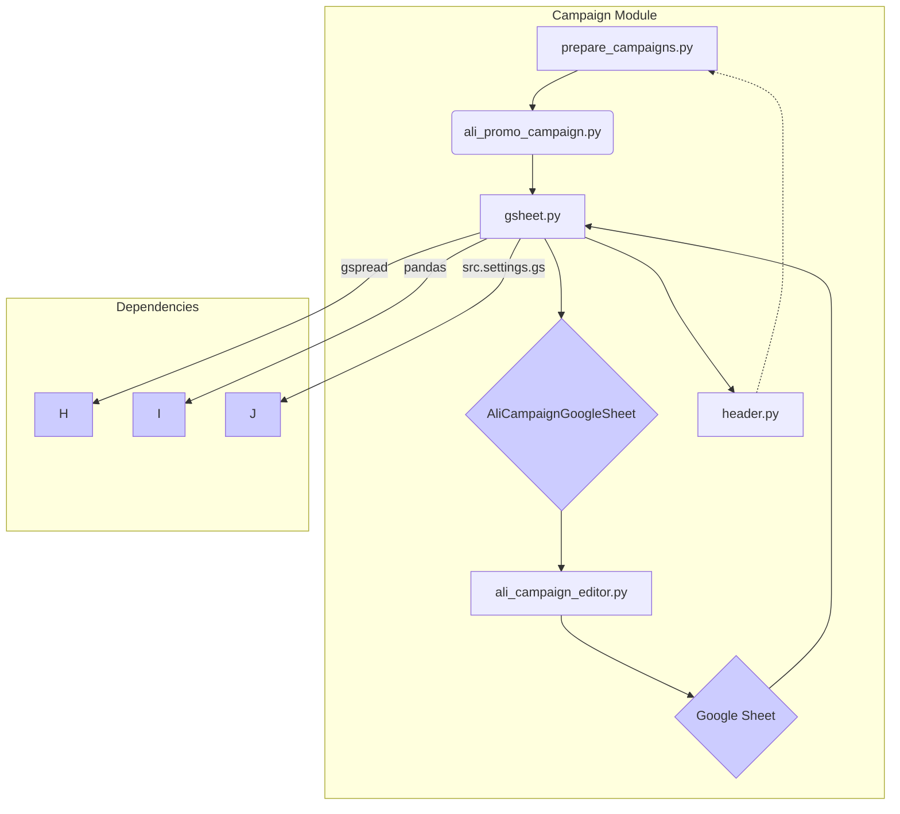

# AliExpress Campaign Management Module Dependencies

## <input code>

```
campaign/                                   # AliExpress campaign management module
├── __init__.py                             # Initializes the campaign module
├── ali_campaign_editor.py                  # Main logic for editing AliExpress campaigns
├── ali_promo_campaign.py                   # Manages promotional campaigns for AliExpress
│   ├── Dependencies:
│   │   └── from src.suppliers.aliexpress import AliCampaignGoogleSheet
├── gsheet.py                               # Handles interactions with Google Sheets for campaign data
│   ├── Dependencies:
│   │   └── gspread
│   │   └── pandas
│   │   └── src.settings.gs
├── header.py                               # Common functions or classes used across the campaign module
├── prepare_campaigns.py                    # Sets up and organizes necessary data for campaigns
├── ttypes.py                               # Defines types and structures used in the campaign module
├── version.py                              # Contains version information for the campaign module
├── _docs/                                  # Documentation directory
│   ├── campaign.md                         # Documentation for the campaign module
│   ├── code_instructions.md                # Instructions for coding and using the campaign module
│   ├── startup_optioins.md                 # Provides information on startup options for the campaign module
├── _dot/                                   # Graphical representations in DOT format
│   ├── aliexpress_campaign.dot             # DOT file representing the structure of the AliExpress campaign
├── _examples/                              # Example scripts directory
│   ├── _examle_prepare_campains.py         # Example script for preparing campaigns
│   ├── _example_ali_promo_campaign.py      # Example script for AliExpress promotional campaigns
│   ├── _example_edit_campaign.py           # Example script for editing campaigns
│   ├── header.py                           # Header example showing common imports and settings
├── _mermaid/                               # Graphical representations in Mermaid format
│   ├── AliAffiliatedProducts.mer           # Mermaid diagram file for affiliated products
│   ├── aliexpress_campaign.mer             # Mermaid diagram file for AliExpress campaign
├── _pytest/                                # Test scripts directory
│   ├── guide_test.md                       # Guide for testing the campaign module
│   ├── test_alipromo_campaign.py           # Test script for the ali_promo_campaign module
│   ├── test_campaign_integration.py        # Test script for integration testing of the campaign module
│   ├── test_edit_capmaign.py               # Test script for editing campaigns
│   ├── test_prepeare_campaigns.py          # Test script for preparing campaigns
```

## <algorithm>

The workflow can be described as a series of functions and classes interacting to manage AliExpress campaigns.  A simplified high-level block diagram is:

**1. Data Preparation:** `prepare_campaigns.py` fetches and prepares campaign data.  Example: Loads data from a CSV file, transforms it, and validates it. Data flow from a CSV/database to data structures.


**2. Campaign Management:**  `ali_promo_campaign.py` handles promotional campaign logic. It likely interacts with `AliCampaignGoogleSheet` for data storage and retrieval. Example: Creating a new promotional campaign, updating status, or calculating metrics. Data flow from `prepare_campaigns.py` into  `AliCampaignGoogleSheet` for saving.


**3. Editing Campaigns:** `ali_campaign_editor.py` manages the process of editing campaign settings, including potentially updating data on `AliCampaignGoogleSheet`.


**4. Google Sheet Interaction:** `gsheet.py` interacts with a Google Sheet for saving and retrieving campaign data. It is dependent on `gspread`, `pandas`, and `settings.gs`. Example: Saving campaign data to Google Sheets, reading updated campaign data from Google Sheets.


**5. Common Utilities:** `header.py` provides shared functionality. Example: logging, configurations, data validation, or helper functions used across other components.


## <mermaid>



**Analysis and Explanation:**

The diagram shows the dependency chain.  `prepare_campaigns.py` interacts with `ali_promo_campaign.py`, which then interacts with `gsheet.py` to handle Google Sheet interactions via `AliCampaignGoogleSheet` (likely a class).   The `gsheet.py` script uses libraries like `gspread` and `pandas` for Google Sheet manipulation and data analysis, and `settings.gs` (likely a configuration file in the `src.settings` package) for relevant settings.


## <explanation>

* **Imports:** The import statements are critical for specifying the necessary modules for functionality.  `gspread` is needed for interacting with Google Sheets, and `pandas` is often used for data manipulation. `src.settings.gs` likely contains configuration parameters for the Google Sheet application. `AliCampaignGoogleSheet` is imported from `src.suppliers.aliexpress` indicating a direct dependency on the specific AliExpress supplier module.


* **Classes:** `AliCampaignGoogleSheet` is a class handling interaction with the Google Sheet. It likely has methods for creating, updating, reading rows of data in the sheet, reflecting the specific data handling required.


* **Functions:** The `prepare_campaigns.py`, `ali_promo_campaign.py`, and `ali_campaign_editor.py` modules probably contain functions to prepare data, manage promotions, and edit campaigns respectively. Specific details about arguments, return values, and logic are not visible from the file structure alone.  Examples are needed.


* **Variables:** The type of variables will depend on the content of the Python files. They could hold campaign data (lists, dictionaries), configuration settings (strings, booleans), and intermediary results of calculations.

* **Potential Errors/Improvements:**  There's no explicit error handling visible in the file structure. It's crucial to add error handling (try-except blocks) to gracefully manage potential issues like network problems, incorrect data formats, or invalid user input.  Thorough input validation could improve the robustness of the entire process. Consider implementing logging for debugging purposes to trace potential issues or bottlenecks, e.g. in the interaction with the Google Sheet API.  Clearly defined error handling in the functions would be beneficial for maintainability.


* **Relationships:** The module structure strongly suggests a dependency structure. The campaign module relies on data sources from the `src.suppliers.aliexpress` module via `AliCampaignGoogleSheet` class, indicating a relationship between the campaign management system and the data source.  The workflow relies on data being correctly prepared, managed, and stored.