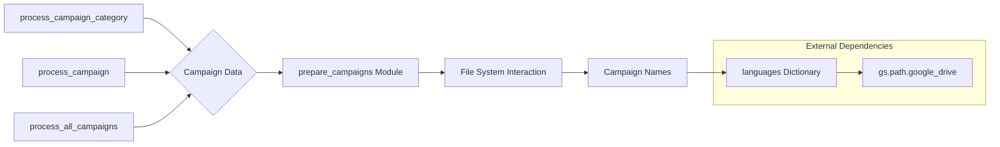

# Code Explanation for `hypotez/src/suppliers/aliexpress/campaign/_examples/_examle_prepare_campains.py`

## <input code>

```python
## \file hypotez/src/suppliers/aliexpress/campaign/_examples/_examle_prepare_campains.py
# -*- coding: utf-8 -*-\
#! venv/Scripts/python.exe
#! venv/bin/python/python3.12

"""
.. module: src.suppliers.aliexpress.campaign._examples 
	:platform: Windows, Unix
	:synopsis:

"""
MODE = 'dev'

"""
	:platform: Windows, Unix
	:synopsis:

"""


"""
	:platform: Windows, Unix
	:synopsis:

"""


"""
  :platform: Windows, Unix

"""
"""
  :platform: Windows, Unix
  :platform: Windows, Unix
  :synopsis:
"""MODE = 'dev'
  
""" module: src.suppliers.aliexpress.campaign._examples """


from ..prepare_campaigns import *

# Example 1: Process a Single Campaign Category
process_campaign_category("SummerSale", "Electronics", "EN", "USD", force=True)

# Example 2: Process a Specific Campaign
process_campaign("WinterSale", categories=["Clothing", "Toys"], language="EN", currency="USD", force=False)

# Example 3: Process All Campaigns
process_all_campaigns(language="EN", currency="USD", force=True)


campaigns_directory = Path(gs.path.google_drive,'aliexpress','campaigns')
campaign_names = get_directory_names(campaigns_directory)
languages = {'EN': 'USD', 'HE': 'ILS', 'RU': 'ILS'}
```

## <algorithm>

The code demonstrates how to interact with the `process_campaign_category`, `process_campaign`, and `process_all_campaigns` functions from the `prepare_campaigns` module.  It shows basic usage examples.  Data flow is primarily within the example calls, then to external functions in the `prepare_campaigns` module.

**Step 1:** Imports necessary modules/functions.

**Step 2:** Calls `process_campaign_category`, `process_campaign`, and `process_all_campaigns`.  These function calls likely perform the data processing operations and interact with the file system.

**Step 3:** Defines a `campaigns_directory` path and calls `get_directory_names` to get the campaign names within that directory.

**Step 4:** Defines a `languages` dictionary to map languages to currencies.

## <mermaid>



**Explanation of Dependencies:**

The code imports from `..prepare_campaigns`. This implies that the `prepare_campaigns` module (presumably in the same project hierarchy) contains the functions being used (`process_campaign_category`, `process_campaign`, `process_all_campaigns`, `get_directory_names`).  The `gs.path.google_drive` suggests a dependency on a module (`gs`) that manages Google Drive file paths.  Without seeing the `gs` module, it's unclear how it operates but the code assumes its existence to construct the `campaigns_directory`.  Thus, `gs` is an external dependency, though within the same project.


## <explanation>

### Imports:

- `from ..prepare_campaigns import *`: This imports all functions from the `prepare_campaigns` module within the parent directory. This is a common practice but can lead to potential name collisions if multiple modules from that package are used.  It is best practice to explicitly import only the necessary functions.  This is also slightly risky and needs a more thorough investigation into the codebase.


### Classes:

There are no classes defined in this example.


### Functions:

The code assumes the existence of these functions from the `prepare_campaigns` module:
- `process_campaign_category`: Processes a campaign category. Takes name, category, language, currency, and a `force` flag as arguments.
- `process_campaign`: Processes a specific campaign. Takes name, list of categories, language, currency, and a `force` flag as arguments.
- `process_all_campaigns`: Processes all campaigns. Takes language, currency, and a `force` flag as arguments.
- `get_directory_names`: Extracts the names of the directories (presumably campaigns) from a given directory. Likely interacts with the file system.

### Variables:

- `MODE = 'dev'`:  A constant string, likely used for configuration purposes.  It is poorly documented and is repeated.
- `campaigns_directory`: A `Path` object representing the directory on Google Drive holding the campaign data, likely using a library like `pathlib`.
- `campaign_names`: A list of campaign names extracted from the directory.
- `languages`: A dictionary mapping languages to currencies.

### Potential Errors/Improvements:

- **Implicit Imports:** Importing `*` from `prepare_campaigns` is problematic for maintainability. Explicitly importing the specific functions needed would be more robust.
- **Error Handling:**  The code lacks error handling. If the `campaigns_directory` doesn't exist, or if the `get_directory_names` function fails, or the `prepare_campaigns` functions raise exceptions, it'll crash. Robust error handling is essential.
- **Configuration:** The directory path (`gs.path.google_drive`) is hardcoded. It's better to use a configuration file to manage this sort of information. This makes the code more reusable in different environments.
- **Missing `Path` import:** The `Path` object is used but not explicitly imported. This assumes `from pathlib import Path` exists somewhere in the codebase.


### Relationships with other project parts:

The `prepare_campaigns` module clearly contains the core logic for manipulating campaign data.  This script is a testing/example module, used to demonstrate the functionality of those classes and functions, likely for the `aliexpress` supplier.  The `gs` library seems to interface with the Google Drive API for file system operations.  The entire module is part of the `hypotez` project, with a clear division of responsibilities between the examples scripts and the core `prepare_campaigns` module.