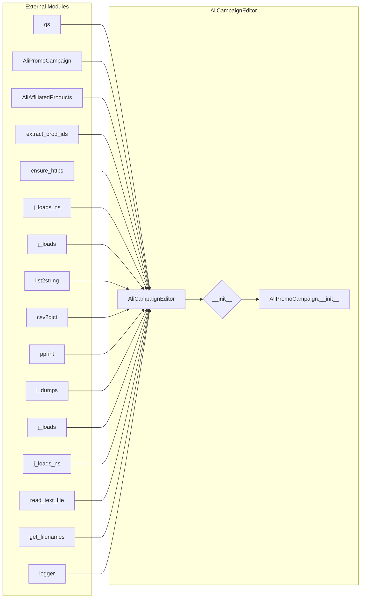

```MD
# Code Explanation for `hypotez/src/suppliers/aliexpress/campaign/_examples/_example_edit_campaign.py`

## <input code>

```python
## \file hypotez/src/suppliers/aliexpress/campaign/_examples/_example_edit_campaign.py
# -*- coding: utf-8 -*-\
#! venv/Scripts/python.exe
#! venv/bin/python/python3.12

"""
.. module: src.suppliers.aliexpress.campaign._examples 
	:platform: Windows, Unix
	:synopsis:

"""


"""
	:platform: Windows, Unix
	:synopsis:

"""


"""
	:platform: Windows, Unix
	:synopsis:

"""


"""
  :platform: Windows, Unix

"""
"""
  :platform: Windows, Unix
  :platform: Windows, Unix
  :synopsis:
"""
  
""" module: src.suppliers.aliexpress.campaign._examples """


""" Редактор рекламной кампании
"""
...
import re
import shutil
from pathlib import Path
from typing import List, Optional, Union
from types import SimpleNamespace
from src import gs
from src.suppliers.aliexpress.scenarios.campaigns import AliPromoCampaign
from src.suppliers.aliexpress.affiliated_products_generator import AliAffiliatedProducts
from src.suppliers.aliexpress.utils.extract_product_id import extract_prod_ids
from src.suppliers.aliexpress.utils.set_full_https import ensure_https
from src.utils.jjson import j_loads_ns, j_loads
from src.utils.convertors import list2string, csv2dict
from src.utils.printer import pprint
from src.utils.jjson import j_dumps, j_loads, j_loads_ns
from utils.interface import read_text_file, get_filenames
from src.logger import logger

class AliCampaignEditor(AliPromoCampaign):
    """ Редактор реклманой камапнии """
    ...

    def __init__(self, campaign_name: str, category_name: str, language: str = 'EN', currency: str = 'USD'):
        """"""
        ...
        super().__init__(campaign_name, category_name, language, currency)
        

```

## <algorithm>

A detailed block diagram of the algorithm isn't possible due to the incomplete code, specifically the `...` sections. These sections indicate missing implementation details. A full algorithm would require knowing the body of the `AliCampaignEditor` class and its methods.

## <mermaid>



**Dependencies Analysis:**

The diagram shows the `AliCampaignEditor` class, which depends on the following modules/classes:
* `gs`: Likely a module for Google Sheets interactions or a general utility.
* `AliPromoCampaign`: A class (likely from a `src.suppliers.aliexpress.scenarios.campaigns` module) related to campaigns.
* `AliAffiliatedProducts`: A class (from a module likely related to affiliated products).
* `extract_prod_ids`, `ensure_https`: Utility functions for product ID extraction and URL validation.
* `j_loads_ns`, `j_loads`, `j_dumps`: JSON handling functions.
* `list2string`, `csv2dict`:  Functions for string and CSV data conversion, likely for handling data formats.
* `pprint`: A pretty printing utility.
* `read_text_file`, `get_filenames`: File reading functions, possibly part of an input/output system.
* `logger`:  Likely a logging module to record events.

Other modules listed are inferred from their paths to be part of the project's internal utility/support libraries.

## <explanation>

**Imports:**

The code imports various modules needed for the campaign editing functionality:
- `re`, `shutil`: Likely for regular expressions and file manipulation.
- `pathlib`: Provides object-oriented way to work with paths.
- `typing`:  For type hinting, improving code readability and maintainability.
- `SimpleNamespace`: Useful for creating namespace-like objects.
- `src.gs`, `src.suppliers.aliexpress.*`: Internal modules related to Google Sheets integration, campaigns, affiliated products, utility functions, and data handling.
- `utils.interface`: Likely contains functions for interacting with file systems or other interfaces.
- `utils.jjson`:  Module responsible for JSON handling and manipulation.
- `src.logger`: Logger module for error and information logging, allowing for more structured reporting.


**Classes:**

- `AliCampaignEditor`: Inherits from `AliPromoCampaign`.  This class is designed to provide methods to edit campaigns. Its constructor takes campaign details. It's meant to encapsulate campaign editing logic. The `...` indicates missing method implementations.
- `AliPromoCampaign`:  Likely a base class defining common attributes and methods for campaign management.

**Functions:**


**Variables:**

- `MODE`:  A string variable likely for indicating the operating mode (e.g., 'dev', 'prod').

**Potential Errors and Improvements:**

- **Incomplete Implementation (`...`):** The `...` sections indicate that the core logic of the `AliCampaignEditor` class, such as its `__init__` method and other methods, are missing. Without this implementation, the class cannot perform any campaign editing tasks.


**Relationships:**

The code demonStartes a clear layered architecture, where `AliCampaignEditor` relies on utility functions (`extract_prod_ids`, `ensure_https`) and classes (`AliPromoCampaign`) within the `src.suppliers.aliexpress` package and  other utilities in `src.utils`. This suggests a well-structured project where functionality is organized into specialized components. Adding error handling (try-except blocks) and documentation would improve the code's robustness and maintainability.