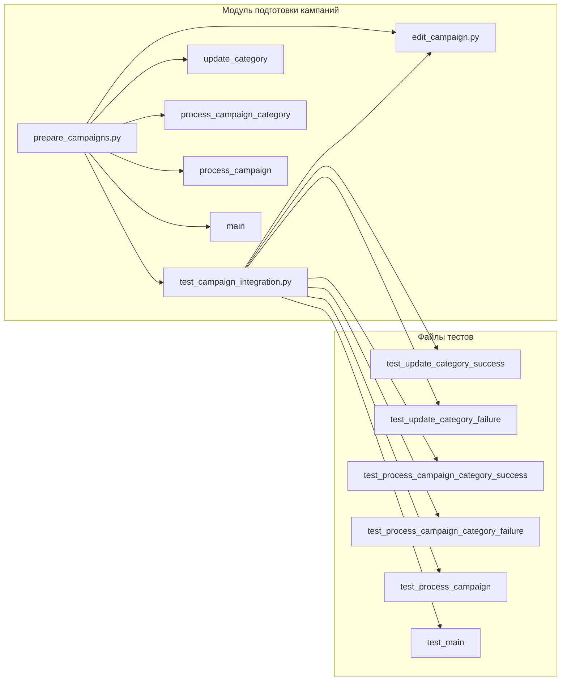

### Руководство для Тестера

#### Анализ кода

**1. <input code>**

```
### Руководство для Тестера

#### Введение
Данный документ предназначен для тестеров, которые будут проверять модуль, отвечающий за подготовку материалов для рекламных кампаний на платформе AliExpress. Модуль включает в себя три основных файла:

1. `edit_campaign.py` - управление рекламной кампанией.
2. `prepare_campaigns.py` - подготовка и обработка категорий кампании.
3. `test_campaign_integration.py` - тесты для проверки интеграции всех компонентов модуля.

#### Основные файлы

1. **`edit_campaign.py`**:
    - **Описание**: Этот файл содержит класс `AliCampaignEditor`, который наследует от `AliPromoCampaign`. Основная задача этого класса - управление рекламной кампанией.
    - **Основные функции**:
        - `AliCampaignEditor`: Инициализация и управление кампанией.

2. **`prepare_campaigns.py`**:
    - **Описание**: Этот файл содержит функции для подготовки материалов кампании, включая обновление категорий и обработку кампаний по категориям.
    - **Основные функции**:
        - `update_category`: Обновление категории в JSON файле.
        - `process_campaign_category`: Обработка конкретной категории в рамках кампании.
        - `process_campaign`: Обработка всей кампании по всем категориям.
        - `main`: Асинхронная основная функция для обработки кампании.

3. **`test_campaign_integration.py`**:
    - **Описание**: Этот файл содержит тесты, проверяющие взаимодействие всех компонентов модуля.
    - **Основные тесты**:
        - `test_update_category_success`: Проверка успешного обновления категории.
        - `test_update_category_failure`: Проверка обработки ошибки при обновлении категории.
        - `test_process_campaign_category_success`: Проверка успешной обработки категории.
        - `test_process_campaign_category_failure`: Проверка обработки ошибки при обработке категории.
        - `test_process_campaign`: Проверка обработки всех категорий в кампании.
        - `test_main`: Проверка основного сценария выполнения кампании.

#### Инструкции по тестированию

... (остальной текст)
```

**2. <algorithm>**

Данный документ описывает архитектуру модуля для подготовки рекламных кампаний на AliExpress, но не содержит кода.  Алгоритм работы представлен в виде описания функций и классов, а не пошаговой блок-схемой.  Описание функционала предполагает:

1. **`edit_campaign.py`**: Управление самой кампанией.
2. **`prepare_campaigns.py`**: Подготовка материалов для кампаний (обновление категорий, обработка кампаний по категориям).
3. **`test_campaign_integration.py`**: Проверка корректной работы модуля.


**3. <mermaid>**



**Описание зависимостей:**

Файлы `edit_campaign.py`, `prepare_campaigns.py` и `test_campaign_integration.py` взаимодействуют друг с другом.  Тесты в `test_campaign_integration.py` проверяют функциональность классов и функций из `edit_campaign.py` и `prepare_campaigns.py`.  Существует потенциальная зависимость от JSON-файлов, содержащих данные о категориях, которые обрабатываются в `prepare_campaigns.py`. Необходимы  зависимости для работы асинхронной части ( `main` в `prepare_campaigns.py`).

**4. <explanation>**

* **Импорты:**  Документ не содержит импортов.  Предполагается, что необходимые библиотеки (например, для работы с JSON, асинхронного кода, логгирования) импортированы в соответствующих файлах (`edit_campaign.py`, `prepare_campaigns.py`).

* **Классы:**
    * `AliCampaignEditor`: Класс для управления рекламной кампанией. Наследует от `AliPromoCampaign`, что указывает на наследование от базового класса для рекламных кампаний.  Подробности реализации отсутствуют.

* **Функции:**
    * `update_category`: Обновляет категорию в JSON файле.
    * `process_campaign_category`: Обрабатывает конкретную категорию.
    * `process_campaign`: Обрабатывает все категории кампании.
    * `main`: Асинхронная функция для обработки кампании.
    * Тестовые функции (например, `test_update_category_success`) реализуют проверки определённых операций.

* **Переменные:**  Подробности о переменных отсутствуют.  Предполагается, что используются переменные для хранения данных о категориях, кампаниях и результатов обработки.


* **Возможные ошибки и улучшения:**

    * Отсутствует код, поэтому сложно оценить конкретные ошибки.  Необходимы данные о типах используемых данных, а также о структуре JSON-файлов, которые обрабатываются.
    * Необходимо уточнить, как реализована асинхронность в функции `main`.
    * Документация не указывает, как именно происходит обновление данных. Отсутствует информация о логгировании и обработке ошибок.


**Связь с другими частями проекта:**

Документ описывает взаимодействие между тремя файлами: `edit_campaign.py`, `prepare_campaigns.py` и `test_campaign_integration.py`. Предполагается, что существует более широкий контекст проекта, содержащий классы и структуры данных, от которых зависят описанные компоненты.