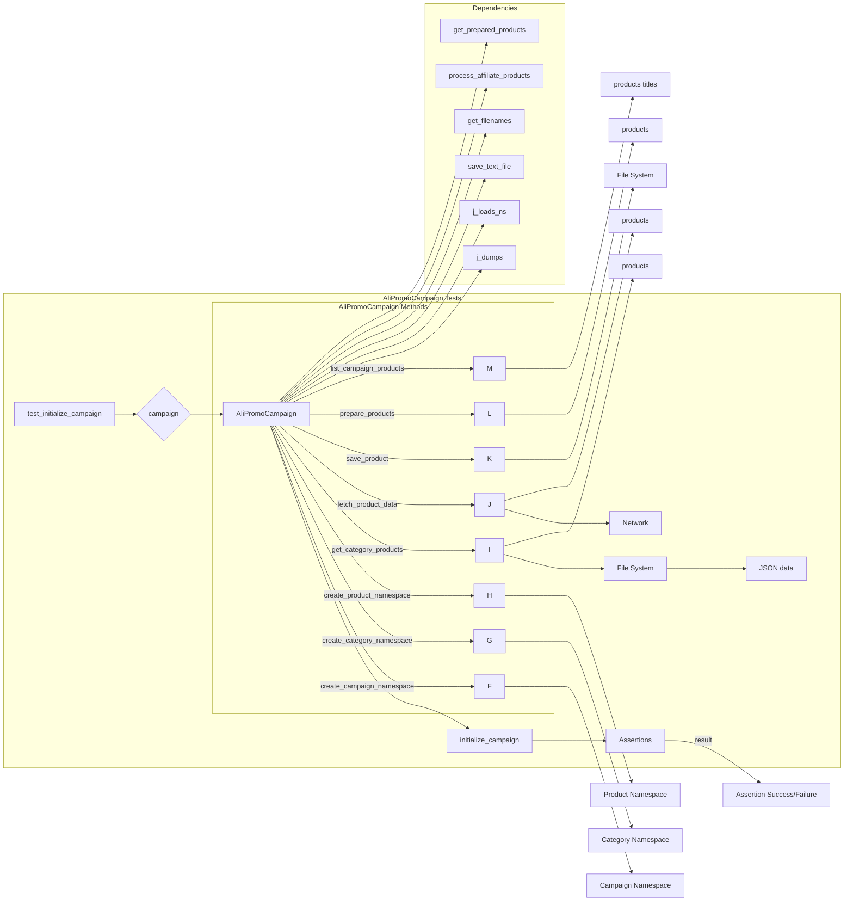

# <input code>

```python
## \file hypotez/src/suppliers/aliexpress/campaign/_pytest/test_alipromo_campaign.py
# -*- coding: utf-8 -*-\n\n#! venv/bin/python/python3.12\n\n"""\n.. module: src.suppliers.aliexpress.campaign._pytest \n\t:platform: Windows, Unix\n\t:synopsis:\n\n"""\nMODE = \'dev\'\n\n"""\n\t:platform: Windows, Unix\n\t:synopsis:\n\n"""\n\n"""\n\t:platform: Windows, Unix\n\t:synopsis:\n\n"""\n\n"""\n  :platform: Windows, Unix\n\n"""\n"""\n  :platform: Windows, Unix\n  :platform: Windows, Unix\n  :synopsis:\n"""MODE = \'dev\'\n  \n""" module: src.suppliers.aliexpress.campaign._pytest """\n\n\n\n#Fixtures:\n - campaign: Fixture to create an instance of AliPromoCampaign for use in tests.\n\n#Tests: \n - test_initialize_campaign: Tests if the initialize_campaign method correctly initializes the campaign data.\n - test_get_category_products_no_json_files: Tests get_category_products when no JSON files are present.\n - test_get_category_products_with_json_files: Tests get_category_products when JSON files are present.\n - test_create_product_namespace: Tests if create_product_namespace correctly creates a product namespace.\n - test_create_category_namespace: Tests if create_category_namespace correctly creates a category namespace.\n - test_create_campaign_namespace: Tests if create_campaign_namespace correctly creates a campaign namespace.\n - test_prepare_products: Tests if prepare_products calls process_affiliate_products.\n - test_fetch_product_data: Tests if fetch_product_data correctly fetches product data.\n - test_save_product: Tests if save_product correctly saves product data.\n - test_list_campaign_products: Tests if list_campaign_products correctly lists product titles.\n"""\n\nimport pytest\nfrom pathlib import Path\nfrom types import SimpleNamespace\nfrom src.suppliers.aliexpress.campaign.ali_promo_campaign import AliPromoCampaign\nfrom src.utils.jjson import j_dumps, j_loads_ns\nfrom src.utils.file import save_text_file\nfrom src import gs\n\n# Sample data for testing\ncampaign_name = "test_campaign"\ncategory_name = "test_category"\nlanguage = "EN"\ncurrency = "USD"\n\n@pytest.fixture\ndef campaign():\n    """Fixture for creating a campaign instance."""\n    return AliPromoCampaign(campaign_name, category_name, language, currency)\n\ndef test_initialize_campaign(mocker, campaign):\n    """Test the initialize_campaign method."""\n    # ... (rest of the code)
```

# <algorithm>

1. **Initialization:** Modules are imported, fixture `campaign` is defined to create an `AliPromoCampaign` instance. Sample data for campaign, category, language, and currency are defined.


2. **Testing `initialize_campaign`:** Mocks `j_loads_ns` to return pre-defined JSON data. The `initialize_campaign` method is called on the `campaign` instance. Assertions verify that the campaign and category names are correctly initialized.


3. **Testing `get_category_products` (no files):** Mocks `get_filenames` to return an empty list, and `fetch_product_data` to return an empty list. Calls `get_category_products` with `force=True`, asserting that an empty list is returned.


4. **Testing `get_category_products` (files present):** Mocks `get_filenames` to return a list containing a file name, and `j_loads_ns` to return mock product data. Calls `get_category_products`, asserts the number of returned products and their properties.


5. **Testing other methods:** Similar testing logic for `create_product_namespace`, `create_category_namespace`, `create_campaign_namespace`, `prepare_products`, `fetch_product_data`, `save_product`, `list_campaign_products`. Each method is tested with mocked dependencies and assertions are used to verify their proper functionality.


Data flow in each case is as follows:
 - Input data (e.g., JSON data, product data) is used to construct or modify objects.
 - Mocks are used to simulate interactions with external dependencies (e.g., file system, network).
 - Assertions are used to validate the results and ensure that the methods function correctly.


# <mermaid>


**Dependencies Analysis:**

* `pytest`:  Used for unit testing.
* `pathlib`: Provides object-oriented interfaces for interacting with the file system.  Crucial for handling file paths.
* `types.SimpleNamespace`:  Used for creating simple objects to represent data. Often useful for mocking or representing structured data.
* `src.suppliers.aliexpress.campaign.ali_promo_campaign`: This is the class under test; it defines the campaign logic.  Crucial dependency containing the methods being tested.
* `src.utils.jjson`:  Handles JSON operations, likely including `j_dumps` (for encoding to JSON) and `j_loads_ns` (for loading JSON into a namespace). Part of a supporting utility library for JSON interactions.
* `src.utils.file`: Likely contains functions related to file I/O. This is crucial for reading/writing JSON files. 
* `src`: Root package.  `gs` is likely a module within the `src` package, but without the full code it is hard to ascertain it's role.


# <explanation>

* **Imports:**
    - `pytest`: For running tests.
    - `pathlib`: For working with file paths (critical for test cases involving file operations).
    - `types.SimpleNamespace`:  For creating simple objects; helpful for mocking data.
    - `AliPromoCampaign`: The class under test from the `aliexpress` campaign supplier.
    - `j_dumps`, `j_loads_ns`:  Functions for handling JSON data, likely from `src.utils.jjson`.
    - `save_text_file`: Function for saving text files, probably from `src.utils.file`.
    - `gs`:  Likely a module related to the project's general settings or services.

* **Classes:**
    - `AliPromoCampaign`:  The main class being tested.  Methods like `initialize_campaign`, `get_category_products`, `fetch_product_data`, `save_product`, and `list_campaign_products` are implemented here.

* **Functions:**
    - `test_initialize_campaign`: Tests correct initialization of campaign data.
    - `test_get_category_products_no_json_files`, `test_get_category_products_with_json_files`: Test different scenarios for fetching product data.
    - `test_create_product_namespace`, `test_create_category_namespace`, etc.: Unit tests for the `AliPromoCampaign`'s internal methods.
    - `campaign`: Test fixture that creates an `AliPromoCampaign` instance.
    - `mocker`: Used for mocking dependencies in unit tests (e.g., `mocker.patch`).


* **Variables:**
    - `campaign_name`, `category_name`, etc.: Sample data used for testing the campaign logic.

* **Potential Errors/Improvements:**

    - **Mocking:** The heavy use of mocking (`mocker.patch`) is good for isolating the unit under test. However, consider if a more realistic mocking approach would be better (if possible) for a more robust test.
    - **Error Handling:** The tests lack error handling; if a file read fails or data is invalid, the program might crash.  Adding checks for these potential issues in the tested methods would enhance robustness.


**Relationship to other parts of the project:**

The code relies on functions and classes located within the `src.suppliers.aliexpress.campaign`, `src.utils.jjson`, and `src.utils.file` packages, indicating that the testing suite is integrated into a larger project structure.