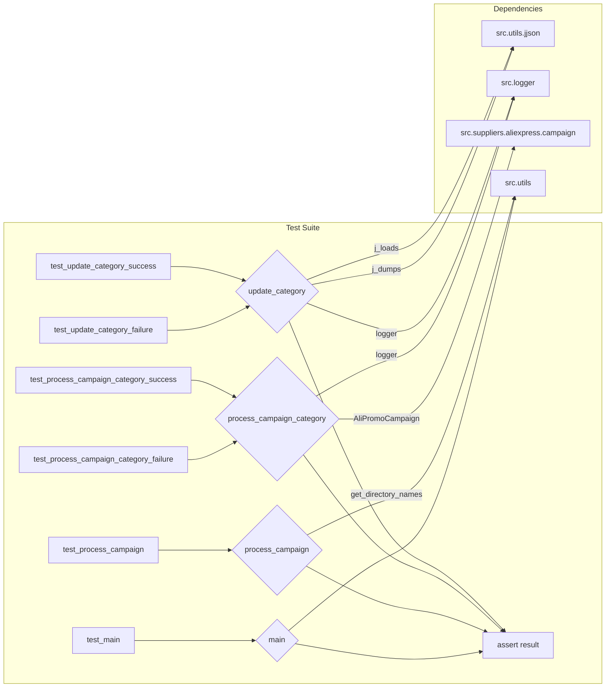

# Code Explanation: hypotez/src/suppliers/aliexpress/campaign/_pytest/test_prepeare_campaigns.py

## <input code>

```python
## \file hypotez/src/suppliers/aliexpress/campaign/_pytest/test_prepeare_campaigns.py
# -*- coding: utf-8 -*-
#! venv/Scripts/python.exe
#! venv/bin/python/python3.12

"""
.. module: src.suppliers.aliexpress.campaign._pytest 
	:platform: Windows, Unix
	:synopsis:

"""
MODE = 'dev'

"""
	:platform: Windows, Unix
	:synopsis:

"""


"""
	:platform: Windows, Unix
	:synopsis:

"""


"""
  :platform: Windows, Unix

"""
"""
  :platform: Windows, Unix
  :platform: Windows, Unix
  :synopsis:
"""MODE = 'dev'
  
""" module: src.suppliers.aliexpress.campaign._pytest """


import pytest
import asyncio
from pathlib import Path
from unittest.mock import patch, MagicMock
from types import SimpleNamespace
from src.suppliers.aliexpress.campaign.prepare_campaigns import (
    update_category,
    process_campaign_category,
    process_campaign,
    main,
)

# ... (rest of the code)
```

## <algorithm>

The code implements unit tests for functions within the `prepare_campaigns` module.  A step-by-step algorithm cannot be presented as a block diagram since the tests are focused on verifying the behavior of the functions rather than outlining their own steps.  Instead, the tests follow a common pattern:

1. **Setup:**  Mocks are created for various dependencies (e.g., `j_loads`, `j_dumps`, `logger`, `get_directory_names`, `AliPromoCampaign`).  Specific return values or side effects are set for the mocks.  Test data (e.g., campaign name, category name) are defined.
2. **Execution:** The function under test is called with the prepared mocks and data.
3. **Assertion:**  Assertions are made to verify the outcome of the function call. This includes checking return values, verifying method calls on mocks, and ensuring error handling mechanisms are working correctly.


## <mermaid>



**Explanation of Dependencies:**

* `src.utils.jjson`: Used for JSON encoding and decoding.
* `src.logger`:  Likely a logging module for recording events and errors.
* `src.suppliers.aliexpress.campaign`: Contains the `AliPromoCampaign` class, which is the main target for testing in `process_campaign_category`.
* `src.utils`:  Provides utility functions, including `get_directory_names` for file system operations.


## <explanation>

**Imports:**

* `pytest`: A testing framework for Python.
* `asyncio`: For asynchronous operations (used in some tests).
* `pathlib`: For working with file paths (e.g., `Path`).
* `unittest.mock`: For mocking dependencies.  `MagicMock` is used for more complex mock objects.
* `types`:  `SimpleNamespace` is used to create a simple object to represent data structures.
* `src.suppliers.aliexpress.campaign.prepare_campaigns`: Imports the functions being tested (`update_category`, `process_campaign_category`, `process_campaign`, `main`).  This suggests a clear modular structure within the project.

**Classes:**

* `SimpleNamespace`: A lightweight class used to create objects with attributes.  It is used here for providing mock data structures.


**Functions:**

* `update_category(mock_json_path, mock_category)`:  Attempts to update a JSON file (`mock_json_path`) with the specified `mock_category` data.  It demonStartes error handling, as evidenced by the use of `side_effect` in one of the tests.  This highlights the need for robust error management in the production code.
* `process_campaign_category(mock_campaign_name, mock_category_name, mock_language, mock_currency)`:  Processes campaign categories asynchronously. It interacts with `AliPromoCampaign` and demonStartes error handling through asynchronous nature (`@pytest.mark.asyncio`).
* `process_campaign(mock_campaign_name, mock_categories, mock_language, mock_currency, mock_force)`:  Processes a campaign and its categories. It shows how it iterates through categories retrieved via the `get_directory_names` method.
* `main(mock_campaign_name, mock_categories, mock_language, mock_currency, mock_force)`: The main function, handling overall campaign processing. It is tested using `asyncio`.

**Variables:**

* `MODE`: A global variable, probably for determining the execution mode (e.g., `dev`, `prod`).
* Mock variables (`mock_campaign_name`, `mock_categories`, etc.):  Used for passing data to the functions during testing.

**Potential Errors/Improvements:**

* The code lacks meaningful error handling within the `prepare_campaigns` module itself.  Catching exceptions, providing informative error messages, and logging errors appropriately will improve robustness.
* The `SimpleNamespace` objects could be replaced with more explicit data structures (e.g., dictionaries or classes) to enhance readability.
* Explicit type hinting can make the code more readable and maintainable.

**Relationship to other parts:**

The tests rely heavily on the `src.suppliers.aliexpress.campaign.prepare_campaigns` module. It's also interacting with `src.utils.jjson`, `src.utils` and potentially other `src` modules (e.g. for logging) through imports. This illuStartes a clear modular design approach.