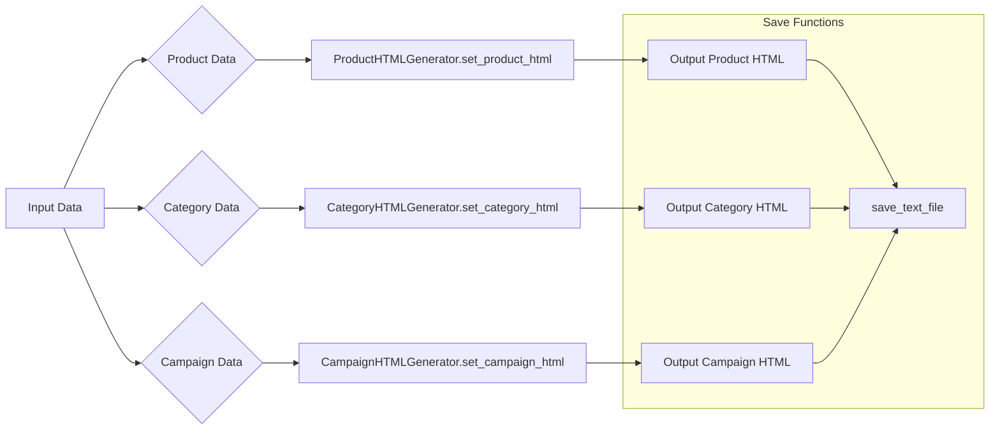

# Code Explanation for `html_generators.py`

## <input code>

```python
## \file hypotez/src/suppliers/aliexpress/campaign/html_generators.py
# -*- coding: utf-8 -*-\

#! venv/bin/python/python3.12

"""
.. module: src.suppliers.aliexpress.campaign 
	:platform: Windows, Unix
	:synopsis: Генератор HTML контента рекламной кампании

"""


import header   
from pathlib import Path
from types import SimpleNamespace
from src.utils.file import save_text_file
import html

class ProductHTMLGenerator:
    """ Class for generating HTML for individual products."""

    @staticmethod
    def set_product_html(product: SimpleNamespace, category_path: str | Path):
        """ Creates an HTML file for an individual product.

        @param product: The product details to include in the HTML.
        @param category_path: The path to save the HTML file.
        """
        category_name = Path(category_path).name
        html_path = Path(category_path) / 'html' / f"{product.product_id}.html"

        html_content = f"""<!DOCTYPE html>
... (HTML content for a product) ...
"""
        save_text_file(html_content, html_path)

class CategoryHTMLGenerator:
    """ Class for generating HTML for product categories."""

    @staticmethod
    def set_category_html(products_list: list[SimpleNamespace] | SimpleNamespace, category_path: str | Path):
        """ Creates an HTML file for the category.

        @param products_list: List of products to include in the HTML.
        @param category_path: Path to save the HTML file.
        """
        products_list = products_list if isinstance(products_list, list) else [products_list]
        category_name = Path(category_path).name
        html_path = Path(category_path) / 'html' / 'index.html'

        html_content = f"""<!DOCTYPE html>
... (HTML content for a category) ...
"""
        save_text_file(html_content, html_path)

class CampaignHTMLGenerator:
    """ Class for generating HTML for a campaign."""

    @staticmethod
    def set_campaign_html(categories: list[str], campaign_path: str | Path):
        """ Creates an HTML file for the campaign, listing all categories.

        @param categories: List of category names.
        @param campaign_path: Path to save the HTML file.
        """
        html_path = Path(campaign_path) / 'index.html'

        html_content = f"""<!DOCTYPE html>
... (HTML content for a campaign) ...
"""
        save_text_file(html_content, html_path)
```

## <algorithm>

1. **Input:** Product data (in `SimpleNamespace` format), category path, or list of products and category path, or list of category names and campaign path.
2. **ProductHTMLGenerator.set_product_html:**
   - Extracts category name from the path.
   - Constructs the full path to the output HTML file.
   - Creates an HTML string containing product details (title, price, image, etc., properly escaped).
   - Saves the HTML content to the file.
3. **CategoryHTMLGenerator.set_category_html:**
   - Handles single product or list of products input.
   - Extracts category name from the path.
   - Constructs the full path to the output HTML file (always `index.html` in the category folder).
   - Creates an HTML string with a grid layout containing product information, extracted from the product list.
   - Saves the HTML content to the file.
4. **CampaignHTMLGenerator.set_campaign_html:**
   - Constructs the full path to the output HTML file (always `index.html` in the campaign folder).
   - Creates an HTML string listing all the categories with links to their individual category pages.
   - Saves the HTML content to the file.


## <mermaid>



* **Dependencies:**
    * `header`:  Implied as a custom module used by the program.
    * `pathlib`: For working with file paths.
    * `SimpleNamespace`: For organizing product data in a structured way.
    * `save_text_file`: From `src.utils.file`, a utility function for saving text to files.
    * `html`: For escaping HTML content to prevent security vulnerabilities.


## <explanation>

* **Imports:**
    * `header`:  Purpose unknown without the `header.py` file.  It's likely related to general campaign setup or configurations.
    * `pathlib`: Used to manipulate file paths in a platform-independent way, avoiding issues related to different OS paths.
    * `SimpleNamespace`: Used to create an object containing product data, which is lightweight and easier to use than a dictionary.
    * `save_text_file`: From the `src.utils.file` module, this function saves the generated HTML to a file.  This indicates a well-defined file-handling structure within the project.
    * `html`:  Used to escape potentially harmful characters in the product and category data to prevent code injection vulnerabilities.  This is a crucial security measure when generating HTML dynamically.

* **Classes:**
    * `ProductHTMLGenerator`: Generates HTML for individual products.  Uses static methods for simplicity. Attributes are implied from product data passed in.
    * `CategoryHTMLGenerator`: Generates HTML for product categories. Accommodates a single product or a list of products.  Uses static methods for simplicity.
    * `CampaignHTMLGenerator`: Generates an overview HTML page for the campaign, including links to individual categories. Uses static methods for simplicity.

* **Functions:**
    * `set_product_html`: Takes a `product` and `category_path` as input, generates an HTML string for a single product and saves it.
    * `set_category_html`: Takes a `products_list` (list or single product) and `category_path`, generating HTML for a product category and saving it to an `index.html` file.
    * `set_campaign_html`: Takes a `categories` list (of category names) and `campaign_path`, generates an HTML overview of the campaign (listing all categories) and saves it to an `index.html` file.

* **Variables:**
    * `MODE`: A constant string defining the operational mode (`'dev'`).
    * `html_content`: String variables containing the HTML code to be written to the corresponding output files.  Dynamically constructed using string formatting.
    * `html_path`: Variable to store the path to the output HTML file.


* **Potential Errors/Improvements:**
    * Error handling: The code lacks error handling.  If `save_text_file` fails or if there's invalid input data, the script might crash without notification.  Add `try...except` blocks.
    * Input Validation:  Validate the input types and contents of `product`, `products_list`, and `categories` to prevent unexpected behavior or errors.
    * Dynamic CSS: It would be beneficial to use a CSS file directly and load it, instead of hardcoding the CSS URLs. This helps maintain flexibility and allows for customization of the site's style without modifying the code frequently.
    * Template Engine: Using a template engine (like Jinja2) would be much more efficient and maintainable for dynamically generating HTML, especially as the HTML structure becomes more complex.
    * Security: The code escapes HTML content, which is good practice. However, also ensure that the data being used comes from a trusted source, and verify the format of user input.
    * Logging: Add logging to track operations and potential issues during HTML generation.


* **Relationship Chain:**  This code appears to be part of a larger system for managing and displaying product data from AliExpress.  The `src.utils.file` module suggests that the file saving logic is part of a shared utility package.  The `header` import indicates a dependency on potentially another config or setup module.  The structure suggests a pipeline process: product data is processed, HTML is generated, and files are saved.  A central data source (e.g., an API call) likely feeds into the data preparation part before this script runs.