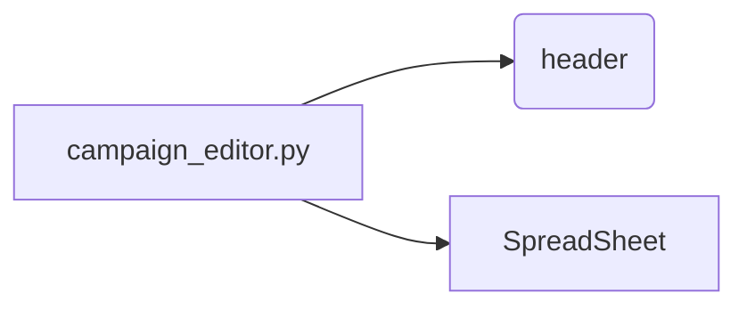

```MD
# Code Explanation for hypotez/src/suppliers/aliexpress/gapi/campaign_editor.py

## <input code>

```python
## \file hypotez/src/suppliers/aliexpress/gapi/campaign_editor.py
# -*- coding: utf-8 -*-\
#! venv/Scripts/python.exe
#! venv/bin/python/python3.12

"""
.. module: src.suppliers.aliexpress.gapi 
	:platform: Windows, Unix
	:synopsis:

"""
MODE = 'dev'


"""
	:platform: Windows, Unix
	:synopsis:

"""


"""
	:platform: Windows, Unix
	:synopsis:

"""


"""
  :platform: Windows, Unix

"""
"""
  :platform: Windows, Unix
  :platform: Windows, Unix
  :synopsis:
"""MODE = 'dev'
  
""" module: src.suppliers.aliexpress.gapi """


""" Редактор рекламных кампаний, товаров, категорий через таблицы гугл """


import header
from src.google import SpreadSheet
```

## <algorithm>

This code snippet is a Python file's preamble.  It doesn't contain any functional logic but sets up the environment for a larger program.  There's no algorithm to describe as no process is defined in the given code excerpt.

## <mermaid>



**Dependencies Analysis:**

* **`header`:** This likely represents a module containing essential import statements (e.g., for logging, configuration, or other common functionality) within the project's `src` package structure. Its specific contents are not visible within the snippet.  Dependency is implicit, implying the file `campaign_editor.py` needs some external modules.

* **`src.google.SpreadSheet`:**  This suggests a custom module or class (`SpreadSheet`) under the `src.google` package for interacting with Google Sheets API. The code imports this module to use Google SpreadSheet features for advertisement campaigns, goods, and category editing. The dependency shows that `campaign_editor.py` utilizes the functions/methods defined in the `SpreadSheet` class to work with the Google Spreadsheet.

## <explanation>

* **Imports:**
    * `header`: This import statement suggests the existence of a file named `header.py` (or similar) that likely contains foundational imports needed by other parts of the project.  Without seeing `header.py`, it's impossible to detail its contents. The precise purpose of the file is unclear without additional context.

    * `src.google import SpreadSheet`: This import statement indicates that the file `campaign_editor.py` needs the functionality of the `SpreadSheet` class which is likely defined in a file under the `src.google` package. This implies that the project uses a custom Google Sheets API wrapper (contained in `SpreadSheet`).


* **Classes:**
    * There are no class definitions in the provided code snippet. The `SpreadSheet` class is imported but not defined.

* **Functions:**
    * No functions are present.

* **Variables:**
    * `MODE = 'dev'`:  This is a global variable. Its use is likely in controlling the execution mode (e.g., development versus production) by altering configuration files, logs, or other program behavior.


* **Potential Errors/Improvements:**

    * The absence of error handling (e.g., `try...except` blocks) in the code segment. When dealing with external API calls like Google Sheets, exception handling is critical to gracefully manage potential issues (network problems, authentication errors, invalid inputs, etc.).


* **Relationships with Other Project Parts:**

   The code imports `SpreadSheet` from a `src.google` module.  This indicates a dependency on the `SpreadSheet` implementation for interacting with the Google Sheets API. Other parts of the project might use this class to manipulate data in the Google Spreadsheets, e.g., retrieving, inserting, updating data. The `header` file is likely containing common modules shared by other files to make their use simpler and improve modularity.

**In summary:** This code snippet is a setup for a program that will utilize the `SpreadSheet` class to work with Google Sheets. A `header` module is imported for pre-defined module usage. The code itself is incomplete and needs a main function, class implementations, and error handling to have complete functionality.