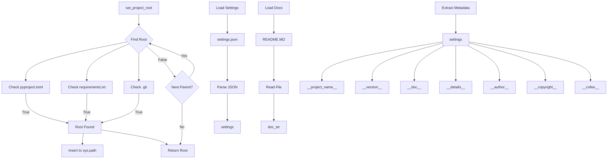

# Code Explanation for hypotez/src/suppliers/aliexpress/gapi/header.py

## <input code>

```python
## \file hypotez/src/suppliers/aliexpress/gapi/header.py
# -*- coding: utf-8 -*-\

#! venv/bin/python/python3.12

"""
module: src.suppliers.aliexpress.gapi 
	:platform: Windows, Unix
	:synopsis: Модуль определяющий корневой путь к проекту. Все импорты строятся относительно этого пути.
    :TODO: В дальнейшем перенести в системную переменную"""


import sys
import json
from packaging.version import Version

from pathlib import Path
def set_project_root(marker_files=('__root__','.git')) -> Path:
    """!
    Finds the root directory of the project starting from the current file's directory,
    searching upwards and stopping at the first directory containing any of the marker files.

    Args:
        marker_files (tuple): Filenames or directory names to identify the project root.
    
    Returns:
        Path: Path to the root directory if found, otherwise the directory where the script is located.
    """
    __root__:Path
    current_path:Path = Path(__file__).resolve().parent
    __root__ = current_path
    for parent in [current_path] + list(current_path.parents):
        if any((parent / marker).exists() for marker in marker_files):
            __root__ = parent
            break
    if __root__ not in sys.path:
        sys.path.insert(0, str(__root__))
    return __root__


# Get the root directory of the project
__root__ = set_project_root()
"""__root__ (Path): Path to the root directory of the project"""

from src import gs

settings:dict = None
try:
    with open(gs.path.root / 'src' /  'settings.json', 'r') as settings_file:
        settings = json.load(settings_file)
except (FileNotFoundError, json.JSONDecodeError):
    ...

doc_str:str = None
try:
    with open(gs.path.root / 'src' /  'README.MD', 'r') as settings_file:
        doc_str = settings_file.read()
except (FileNotFoundError, json.JSONDecodeError):
    ...


__project_name__ = settings.get("project_name", 'hypotez') if settings  else 'hypotez'
__version__: str = settings.get("version", '')  if settings  else ''
__doc__: str = doc_str if doc_str else ''
__details__: str = ''
__author__: str = settings.get("author", '')  if settings  else ''
__copyright__: str = settings.get("copyrihgnt", '')  if settings  else ''
__cofee__: str = settings.get("cofee", "Treat the developer to a cup of coffee for boosting enthusiasm in development: https://boosty.to/hypo69")  if settings else "Treat the developer to a cup of coffee for boosting enthusiasm in development: https://boosty.to/hypo69"
```

## <algorithm>

**Workflow Diagram:**

1. **`set_project_root()`:**
   - Takes a tuple of marker files as input (e.g., `('pyproject.toml', 'requirements.txt', '.git')`).
   - Starts from the current file's directory.
   - Iterates through parent directories.
   - Checks if any of the marker files exist in the current parent directory.
   - Returns the path to the parent directory where the marker files are found or the current file's directory if no marker files are found.

2. **Initialization:**
    - Calls `set_project_root()` to get the project root directory.

3. **Loading Settings:**
    - Tries to load settings from `gs.path.root / 'src' / 'settings.json'`.
    - Handles `FileNotFoundError` and `json.JSONDecodeError`.


4. **Loading Documentation:**
    - Tries to load documentation from `gs.path.root / 'src' / 'README.MD'`.
    - Handles `FileNotFoundError` and `json.JSONDecodeError`.

5. **Extracting Metadata:**
    - Extracts project name, version, documentation, author, copyright, and coffee link from the settings, using `settings.get()` to handle potential missing keys gracefully. Defaults are provided if settings are not found or a key is missing.


**Data Flow:**

- The `set_project_root()` function takes the current file's path and returns the path to the project root.
- The project root is stored in `__root__`.
- `__root__` is used in subsequent file operations.
- The `settings.json` and `README.MD` files are loaded based on the project root.
- The loaded data is used to populate project metadata variables.


## <mermaid>



**Dependencies Analysis:**

- `sys`: Provides access to system-specific parameters and functions, including the `sys.path` module for managing module search paths.
- `json`: Used for working with JSON data.
- `packaging.version`: For handling software versioning.
- `pathlib`: Provides objects for representing file paths in a way that's more object-oriented and platform-independent.
- `src.gs`:  This is a custom package likely containing utility functions related to file paths within the Hypotez project.

## <explanation>

- **Imports:**
    - `sys`: Used to manipulate the Python path.
    - `json`: For handling JSON files.
    - `packaging.version`: For handling software versioning.
    - `pathlib`: For path manipulation.
    - `src.gs`: Likely contains functions related to the project's file structure (e.g., finding the project root).


- **Classes:**  No classes are defined in this file.


- **Functions:**
    - `set_project_root(marker_files=...)`: This function is crucial for finding the project root directory. It iterates through parent directories from the current file's location looking for marker files like `pyproject.toml`, `requirements.txt`, and `.git`.  Crucially, it also adds the found root to `sys.path`.  This ensures Python can find modules within the project's packages.  If no markers are found, it defaults to the current directory. This is a good pattern for locating projects, especially in cases where the `setup.py` or `pyproject.toml` may not be directly within the code file's directory.
    - The rest of the functions are handling file IO and extracting values from `settings.json`, adding error handling to avoid crashes.


- **Variables:**
    - `MODE`: A string literal, likely for development mode vs. production mode.
    - `__root__`:  A Path object holding the project's root directory. It's crucial for locating various project resources like configuration files.
    - `settings`: A dictionary to store data from `settings.json`.
    - `doc_str`: A string variable to hold the project documentation.
    - `__project_name__`, `__version__`, etc.: Project metadata variables, derived from `settings.json`.


- **Potential Errors/Improvements:**
    - **Error Handling:** The `try...except` blocks for loading settings and documentation are good, but consider using more specific error handling.  You could log the error instead of just using `...` for cleaner debugging and better error reporting.
    - **`sys.path` Management:** Adding the root directory to `sys.path` can cause issues if a module has a conflicting path. Consider using absolute imports to avoid ambiguity.


**Relationship with Other Project Components:**

This file acts as an initializer for the project by:
- Setting up the project root path.
- Loading essential metadata (settings, documentation).

It has a dependency on `src.gs`, which likely handles file system operations within the project. This file, in turn, is likely used as an initialiser for any other modules in the `src.suppliers.aliexpress.gapi` package.  This is good module design because it creates a centralised method for finding the root and adds it to the path for easy module importing later in the project.