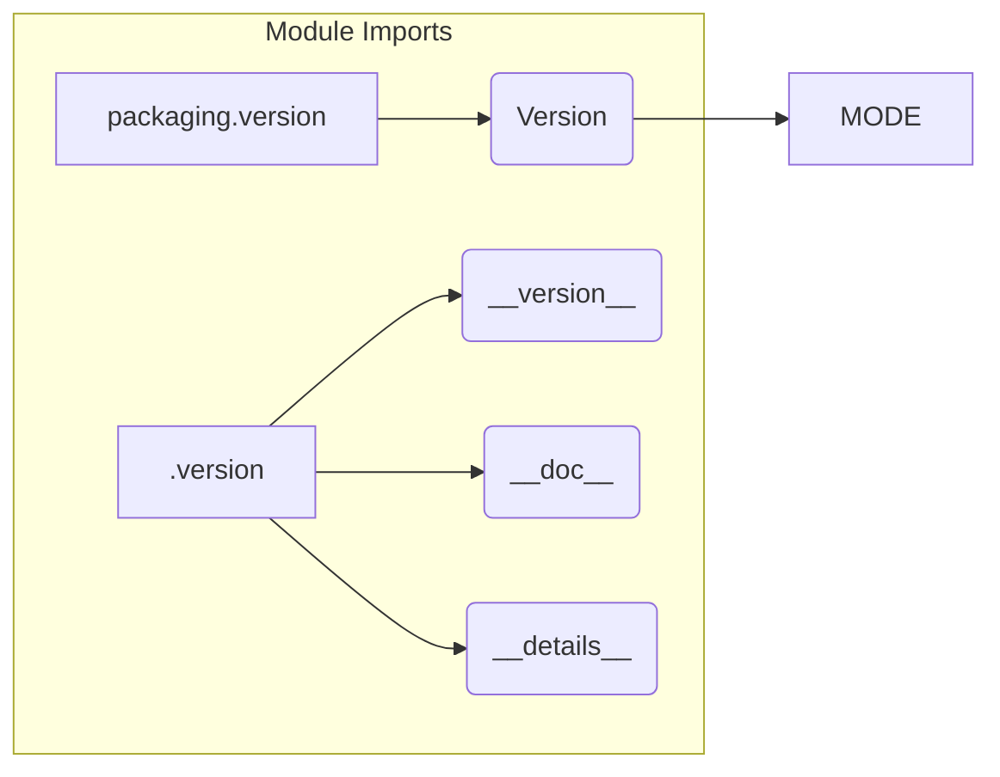

# Code Analysis of hypotez/src/suppliers/aliexpress/gui/__init__.py

## <input code>

```python
## \file hypotez/src/suppliers/aliexpress/gui/__init__.py
# -*- coding: utf-8 -*-\

#! venv/bin/python/python3.12

"""
.. module: src.suppliers.aliexpress.gui 
	:platform: Windows, Unix
	:synopsis:

"""


"""
	:platform: Windows, Unix
	:synopsis:

"""


"""
	:platform: Windows, Unix
	:synopsis:

"""


"""
  :platform: Windows, Unix

"""
"""
  :platform: Windows, Unix
  :platform: Windows, Unix
  :synopsis:
"""

""" module: src.suppliers.aliexpress.gui """


""" Разные сценарии Алиэхпресс """
...
from packaging.version import Version
from .version import __version__, __doc__, __details__ 
```

## <algorithm>

No algorithm can be determined from this code snippet. It's a very rudimentary Python file. It sets a variable `MODE`, includes docstrings that don't seem to be used, and imports from a `.version` file.  There's an ellipsis (`...`), indicating that there's more code not shown.


## <mermaid>



**Dependency Analysis:**

The mermaid diagram shows the imports from `packaging.version` and the internal `.version` module.  The diagram implies a dependency on the `packaging` library for versioning.  The `.version` module likely contains version information and documentation related to the `aliexpress` supplier. This is a typical structure for Python packages.  Without seeing the `.version` module's content, it's impossible to know its exact structure and how it's used.


## <explanation>

* **Imports:**
    * `from packaging.version import Version`: Imports the `Version` class from the `packaging.version` module. This is used for handling and comparing software version numbers. This is a standard library for Python packages,  indicating a concern for proper versioning management.
    * `from .version import __version__, __doc__, __details__`: Imports `__version__`, `__doc__`, and `__details__` from a module named `.version`.  This is likely a file named `version.py` within the `aliexpress/gui` directory, used for package metadata and version information.


* **Classes:** No classes are defined in this code snippet.


* **Functions:** No functions are defined in this code snippet.


* **Variables:**
    * ``: A string variable likely setting a mode for the `aliexpress` supplier. `dev` suggests a development mode, as opposed to a `prod` or similar production mode.
    * `__version__`, `__doc__`, `__details__`: These variables are imported from `src.suppliers.aliexpress.gui.version`. These are metadata associated with the package, critical for automated tools.


* **Potential Errors/Improvements:**
    * **Redundant Docstrings:** The multiple docstrings with identical information are redundant and should be consolidated.
    * **Missing Functionality:** The ellipsis (`...`) indicates missing code in the file. Without knowing the context of the complete file, it is impossible to assess potential functionality gaps.
    * **Explicit imports:** Instead of the `from .version import`  imports, it's often better to import using the module structure, for example, `import .version as v`, which is cleaner, if it's needed to call the functions in the external file.


* **Relationships with Other Parts of the Project:**
    * This module `aliexpress/gui/__init__.py` depends on the `version.py` module (or a similar file) for metadata and on the `packaging` library for version handling. The purpose of this package is to provide GUI elements or functionality specifically for the `aliexpress` supplier within the larger project. Without more context, it's hard to say whether it relies on other packages for data or services to function.


**Overall:** The code snippet provides basic configuration and imports for a Python package. More context (the rest of the file and the structure of `version.py`) is required to fully understand the purpose and function.