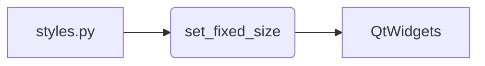

# Code Explanation: hypotez/src/suppliers/aliexpress/gui/styles.py

## <input code>

```python
## \file hypotez/src/suppliers/aliexpress/gui/styles.py
# -*- coding: utf-8 -*-
#! venv/Scripts/python.exe
#! venv/bin/python/python3.12

"""
.. module: src.suppliers.aliexpress.gui 
	:platform: Windows, Unix
	:synopsis:

"""


"""
	:platform: Windows, Unix
	:synopsis:

"""


"""
	:platform: Windows, Unix
	:synopsis:

"""


"""
  :platform: Windows, Unix

"""
"""
  :platform: Windows, Unix
  :platform: Windows, Unix
  :synopsis:
"""
  
""" module: src.suppliers.aliexpress.gui """


""" Common styling functions for UI elements """

from PyQt6 import QtWidgets

def set_fixed_size(widget: QtWidgets.QWidget, width: int, height: int):
    """ Set a fixed size for a given widget """
    widget.setFixedSize(width, height)
```

## <algorithm>

The code defines a single function `set_fixed_size`.  It does not contain a complex workflow, but rather a straightforward operation.

```
+-----------------+
| set_fixed_size  |
+-----------------+
| Input:          |
|  widget         |
|  width          |
|  height         |
+-----------------+
| Functionality:  |
| Set fixed size of |
| the widget      |
+-----------------+
| Output:         |
| None            |
+-----------------+
```

**Example:**

```python
# Assuming you have a QPushButton object called 'myButton'
button_width = 100
button_height = 50
set_fixed_size(myButton, button_width, button_height) 
```

## <mermaid>



**Dependencies:**

- `PyQt6`: This library provides the `QtWidgets` module, which contains classes for creating and manipulating graphical user interface (GUI) elements.  It is a crucial dependency for building GUI applications in Python.  The import `from PyQt6 import QtWidgets` states that the function `set_fixed_size` interacts directly with objects of the `QtWidgets` module.


## <explanation>

- **Imports:**
    - `from PyQt6 import QtWidgets`: Imports the necessary classes from the PyQt6 library for working with Qt widgets.  This import is essential for any PyQt6-based GUI application, making objects within the `QtWidgets` module available for use within the `styles.py` module.  This import indicates that the current file uses PyQt6 to build GUI elements.  It's a typical import for PyQt6 GUI applications. This import establishes a crucial dependency on the PyQt6 framework for creating GUI elements.


- **Classes:**
    - No classes are defined in this module. The only declared object is a function.


- **Functions:**
    - `set_fixed_size(widget: QtWidgets.QWidget, width: int, height: int)`: This function takes a widget object (`widget`) and its desired width (`width`) and height (`height`) as input. It then uses the `setFixedSize()` method of the `widget` to set its dimensions to the specified width and height. This results in a widget that won't change its size.  This function is intended for use in setting the dimensions of GUI elements in a PyQt6 application.


- **Variables:**
    - ``: This is a global variable likely used for configuration purposes (e.g., different modes for development versus production).  The `'dev'` value suggests this is a development-mode setting.   The variable's use remains unclear without more context. Its purpose is to serve as a configuration flag.


- **Potential Errors or Improvements:**
    - **Missing Docstrings:**  While the function `set_fixed_size` has a docstring, the overall module, and individual global variables (`MODE`) are lacking complete docstrings. This makes understanding the overall purpose and context of the module and variables more difficult. Comprehensive docstrings help other developers easily understand the code's purpose and intended behavior.
    - **Unnecessary Docstrings**: Multiple blocks of empty docstrings are present in the code.  They should be removed.
    - **Redundancy**: The multiple occurrences of `` should be consolidated.
    - **Code Style**: Using `#!` in the beginning of the file is generally not good practice, as it is not part of the Python language.


**Relationship with Other Project Parts:**

The `aliexpress` module is likely part of a larger project (called "hypotez" in this case) focused on interacting with the AliExpress online retail platform. The `gui` component suggests that this code interacts with GUI elements of the application. The code itself is fairly self-contained within the `styles.py` module. To understand its role fully, more context from other parts of the project (e.g., main application files, data processing scripts) is required.  For instance, the `widget` parameter in `set_fixed_size` needs to be created and populated elsewhere in the application.