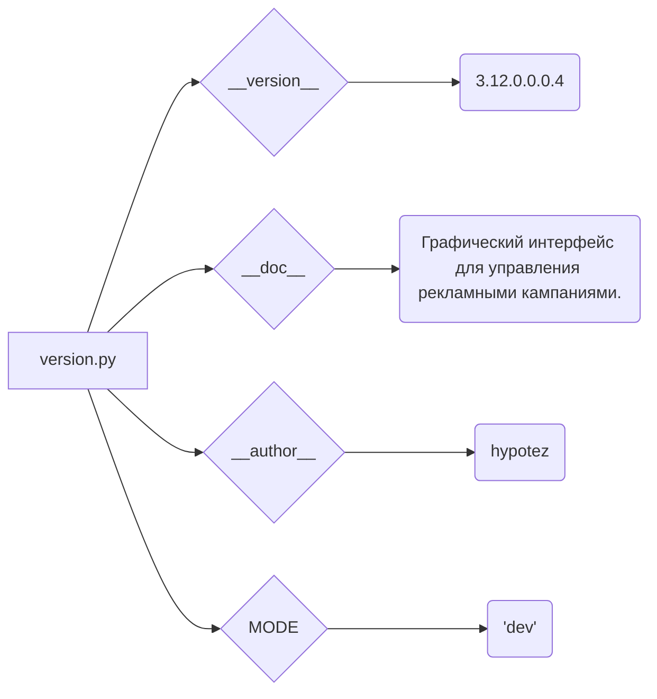

# Code Explanation for hypotez/src/suppliers/aliexpress/gui/version.py

## <input code>

```python
## \file hypotez/src/suppliers/aliexpress/gui/version.py
# -*- coding: utf-8 -*-\

#! venv/bin/python/python3.12

"""
.. module: src.suppliers.aliexpress.gui 
	:platform: Windows, Unix
	:synopsis:

"""


"""
	:platform: Windows, Unix
	:synopsis:

"""


"""
	:platform: Windows, Unix
	:synopsis:

"""


"""
  :platform: Windows, Unix

"""
"""
  :platform: Windows, Unix
  :platform: Windows, Unix
  :synopsis:
"""
  
""" module: src.suppliers.aliexpress.gui """


"""
- `__version__`: This variable holds the version of the module or package.
- `__name__`: Contains the name of the module. If the script is being run directly, the value will be `"__main__"`.
- `__doc__`: The module's documentation string.
- `__details__`: This variable likely contains additional details about the module, but the exact purpose depends on the specific module or package.
- `__annotations__`: Contains type annotations for variables and functions in the module.
- `__author__`: The name(s) of the author(s) of the module.
"""
__name__:str
__version__="3.12.0.0.0.4"
__doc__:str=f""" Графический интерфейс для управления рекламными кампаниями. """

__details__:str=f"""  """

__annotations__


__author__='hypotez '
```

## <algorithm>

This file appears to be a module's version file.  It doesn't contain executable code for a typical algorithm. It sets variables to hold metadata about the module.

The algorithm is essentially defining constants (variables with fixed values).


## <mermaid>



**Dependencies Analysis:**

The file doesn't import any other modules. The diagram shows only the internal variables and their values within the file.


## <explanation>

**Imports:**

No imports are present.  This is a configuration file rather than a program.

**Classes:**

There are no classes defined.

**Functions:**

There are no functions defined.

**Variables:**

* `__version__`: A string literal representing the version number of the module (e.g., `3.12.0.0.0.4`).
* `__doc__`: A formatted string literal containing a docstring describing the module.
* `__details__`: An empty formatted string literal likely for future use to provide module details.
* `__name__`: A string variable containing `"__main__"` if the file is executed directly; otherwise, it contains the module name.
* `__annotations__`:  A variable that is likely intended to store type hints but is currently empty.
* `__author__`: A string variable containing the author's name.
* `MODE`: A string variable with value `'dev'` which likely indicates the development mode.

**Relationship with other parts of the project:**

This file is likely part of a larger project.  The `src.suppliers.aliexpress.gui` path suggests it's related to a graphical user interface for managing advertising campaigns related to the AliExpress supplier. The version information in this file is critical for other parts of the project to know which version to expect and how to handle updates and compatibility issues.


**Potential Errors or Improvements:**

* **Missing `__name__` check**: While the file declares `__name__ : str`, the crucial check `if __name__ == "__main__":` is missing, which is essential if you ever intend to run code from this file directly.

* **Potential for inconsistent updates:** The `__details__` field could be updated with more information.

* **Redundant `MODE` definition:** There are multiple `` definitions; these should be consolidated.

* **Type hinting**:  The use of `__annotations__` is good practice to signal the types of variables and functions, and could be used to ensure type consistency and improve code readability and maintainability.  Type hints should be used in the code rather than simply annotating variable types.


In summary, this is a module definition file. The metadata in the file helps maintain versioning and documentation for the module `src.suppliers.aliexpress.gui`.  The file itself does not perform calculations or control flows in the way a typical function or class would.  It should be used in conjunction with other files that handle the program logic.