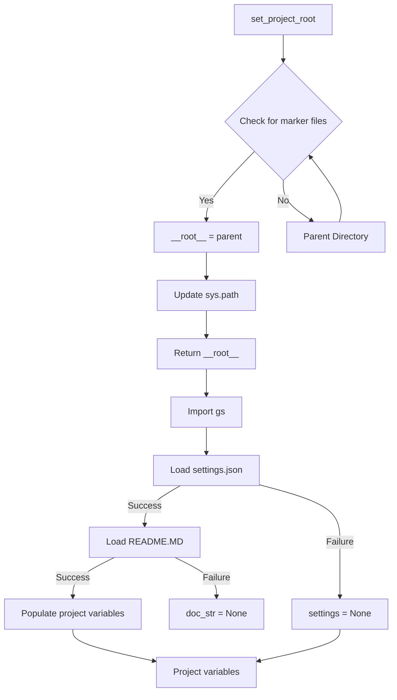

```MD
# Analysis of `hypotez/src/suppliers/aliexpress/header.py`

## <input code>

```python
## \file hypotez/src/suppliers/aliexpress/header.py
# -*- coding: utf-8 -*-\
#! venv/Scripts/python.exe
#! venv/bin/python/python3.12

"""
.. module: src.suppliers.aliexpress 
	:platform: Windows, Unix
	:synopsis:

"""


import sys
import json
from packaging.version import Version

from pathlib import Path
def set_project_root(marker_files=('__root__')) -> Path:
    """
    Finds the root directory of the project starting from the current file's directory,
    searching upwards and stopping at the first directory containing any of the marker files.

    Args:
        marker_files (tuple): Filenames or directory names to identify the project root.
    
    Returns:
        Path: Path to the root directory if found, otherwise the directory where the script is located.
    """
    __root__:Path
    current_path:Path = Path(__file__).resolve().parent
    __root__ = current_path
    for parent in [current_path] + list(current_path.parents):
        if any((parent / marker).exists() for marker in marker_files):
            __root__ = parent
            break
    if __root__ not in sys.path:
        sys.path.insert(0, str(__root__))
    return __root__


# Get the root directory of the project
__root__ = set_project_root()
"""__root__ (Path): Path to the root directory of the project"""

from src import gs

settings:dict = None
try:
    with open(gs.path.root / 'src' /  'settings.json', 'r') as settings_file:
        settings = json.load(settings_file)
except (FileNotFoundError, json.JSONDecodeError):
    ...

doc_str:str = None
try:
    with open(gs.path.root / 'src' /  'README.MD', 'r') as settings_file:
        doc_str = settings_file.read()
except (FileNotFoundError, json.JSONDecodeError):
    ...


__project_name__ = settings.get("project_name", 'hypotez') if settings  else 'hypotez'
__version__: str = settings.get("version", '')  if settings  else ''
__doc__: str = doc_str if doc_str else ''
__details__: str = ''
__author__: str = settings.get("author", '')  if settings else ''
__copyright__: str = settings.get("copyrihgnt", '')  if settings else ''
__cofee__: str = settings.get("cofee", "Treat the developer to a cup of coffee for boosting enthusiasm in development: https://boosty.to/hypo69")  if settings else "Treat the developer to a cup of coffee for boosting enthusiasm in development: https://boosty.to/hypo69"
```

## <algorithm>

**Step 1:** Define `set_project_root` function.
* **Input:** A tuple of file/directory names (`marker_files`) used to identify the project root.
* **Processing:** It starts from the current file's directory and traverses up the directory tree. For each parent directory, it checks if any of the `marker_files` exist. If a match is found, it updates the `__root__` variable and breaks the loop.
* **Output:** The path to the root directory (`__root__`).

**Step 2:** Call `set_project_root` to get the project root.

**Step 3:** Import `gs` from `src`.


**Step 4:** Attempt to load `settings.json` from `gs.path.root / 'src' / 'settings.json'`.
* **Input:** File path.
* **Processing:** The code tries to open and load the file as a JSON object.
* **Output:** The loaded settings as a dictionary, or `None` if an error occurs.

**Step 5:** Attempt to load `README.MD` from `gs.path.root / 'src' / 'README.MD'`.
* **Input:** File path.
* **Processing:** The code tries to open and read the file content.
* **Output:** The content of the file as a string, or `None` if an error occurs.


**Step 6:** Initialize project-related variables.
* **Input:** The loaded `settings` dictionary and `doc_str` string.
* **Processing:**  Extracts values from the `settings` dictionary for variables like `__project_name__`, `__version__`, etc. or sets default values if the dictionary or specific key is missing.
* **Output:** Populated project-related variables.


## <mermaid>



**Dependencies:**

- `sys`: For interacting with the Python interpreter, particularly `sys.path` for adding directories to the module search path.
- `json`: For encoding and decoding JSON data to load settings from the file.
- `packaging.version`: For handling software versioning. (Could be used for comparing different versions of packages)
- `pathlib`: For working with file paths in an object-oriented way.
- `src.gs`: A package likely containing functions and constants related to file paths and project structure. This is crucial for getting the project root directory and locating settings.

## <explanation>

**Imports:**

- `sys`: Used for manipulating the Python interpreter, such as adding directories to the module search path.  Crucial for importing modules from the project root.
- `json`: For working with JSON data, enabling the loading of configuration settings.
- `packaging.version`: Enables handling and comparing software version numbers.
- `pathlib`:  Provides a more object-oriented way to work with files and directories, simplifying path manipulation and avoiding string-based operations.
- `src.gs`:  This import is very important. It likely defines a `gs` module (or class) that contains functions for dealing with project-related paths and configurations, providing a way to access files and directories relative to the project root. It handles finding the project root automatically.

**Classes:**

- No classes are defined directly in this file.

**Functions:**

- `set_project_root(marker_files)`: This function is crucial for finding the project root directory. It takes a tuple of file names (`marker_files`) as input. Starting from the current file's directory, it iterates up the directory tree. It checks if any of the marker files exist in a parent directory. If one is found, it inserts the parent directory to `sys.path`, ensuring modules in the project root can be imported. It returns the absolute path to the project root.


**Variables:**

- `MODE`: A string variable, likely used for setting a development/production mode.
- `__root__`: A `Path` object, representing the root directory of the project. Crucial for relative pathing within the project.
- `settings`: A dictionary, containing project-related settings loaded from `settings.json`.
- `doc_str`: A string, containing the content of the `README.MD` file, if found.
- `__project_name__`, `__version__`, `__doc__`, `__details__`, `__author__`, `__copyright__`, `__cofee__`: Strings that extract and store configuration details from `settings.json`. Defaults are provided in case `settings.json` is missing or has incorrect format, essential for robustness.

**Potential Errors/Improvements:**

- **Error Handling:** The code uses `try...except` blocks to handle `FileNotFoundError` and `json.JSONDecodeError`. This is good practice to prevent crashes if the configuration files are missing or corrupted.
- **Robustness:** The use of `settings.get()` with default values for various project attributes improves the robustness of the code. If `settings.json` is missing or contains incorrect keys, the default values will be used.
- **Dependency Management:**  The code assumes `pyproject.toml` or `requirements.txt` exist to locate the project root.  Consider robustness if these files are absent.  Using `importlib.resources` could help to avoid file system interactions altogether.


**Relationship Chain:**

This file (`header.py`) likely serves as a starting point for other modules in the `hypotez` project. It sets up the project environment, ensures correct imports, and extracts necessary configuration values.  `gs` likely provides functions to manage paths to other project files (e.g., loading data or resources), and it connects to other parts of the project through imports.  Other modules will depend on the variables (`__root__`, `settings`, `__version__`) and functions defined here to properly initialize and operate.